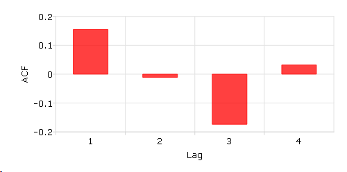
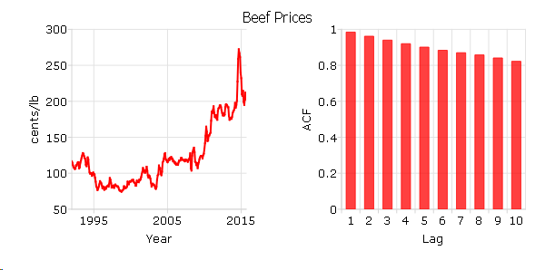

acf
==============================================

Purpose
----------------

Computes sample autocorrelations.

Format
----------------
.. function:: acf(y, k, d)

    :param y: univariate time series.
    :type y: Nx1 vector

    :param k: maximum number of autocorrelations to compute. 0 < *k* < *N*.
    :type k: scalar

    :param d: order of differencing.
        Set *d* equal to 0 to compute the autocorrelations from the original time series.
    :type d: scalar

    :returns: rk (*Kx1 vector*), sample autocorrelations.

Examples
----------------

Basic example
+++++++++++++

::

    // Short time-series
    x = { 12.92,
          14.28,
          13.31,
          13.34,
          12.71,
          13.08,
          11.86,
          9.000,
          8.190,
          7.970,
          8.350,
          8.200,
          8.120,
          8.390,
          8.660  };

    // Maximum number of lags
    k = 4;

    // Order of differencing
    d = 1;

    // Calculate and print result of autocorrelation function
    rk = acf(x, k, d);
    print rk;

The code above produces the following output:

::

    0.15488076
    -0.011078336
    -0.17367167
    0.031921209

Plot the ACF results with :func:`plotBar` function. The first input 0 means using sequence numbers to name elements in the *rk*.

::

    plotBar(0, rk);

Calculate the autocorrelation function and plot the results for "beef_prices" data.
+++++++++++++++++++++++++++++++++++++++++++++++++++++++++++++++++++++++++++++++++++

::

    // Get file name with full path
    file = getGAUSSHome() $+ "examples/beef_prices.csv";

    // Import data set starting with row 2 and column 2
    beef = csvReadM(file, 2, 2);

    // Max lags
    k = 10;

    // Order of differencing
    d = 0;

    // Call acf function
    beef_acf = acf(beef, k, d);

The following code can give the time plot and sample ACF plot based on the beef and beef_acf:

::

    /* 
    ** Time series plot
    */

    // Declare plotControl structure and
    // fill with default values for XY plots
    struct plotControl ctl;
    ctl = plotGetDefaults("xy");

    // Split canvas into a 1x2 grid.
    // Place next graph in first cell.
    plotLayout(1, 2, 1);

    // Labels and format setting based on 'beef' time series
    plotSetYLabel(&ctl, "cents/lb");
    plotSetXLabel(&ctl, "Year");
    plotSetXTicLabel(&ctl, "YYYY");
    plotSetXTicInterval(&ctl, 120, 199501);

    // Draw time series plot
    plotTS(ctl, 1992, 12, beef);

    // Split canvas into a 1x2 grid.
    // Place next graph in second cell.
    plotLayout(1, 2, 2);

    /* 
    ** ACF plot
    */

    // Fill 'ctl' structure with bar plot defaults
    ctl = plotGetDefaults("bar");

    // Set labels and format based on 'beef_acf' matrix
    plotSetYLabel(&ctl, "ACF");
    plotSetXLabel(&ctl, "Lag");

    // Draw ACF plot
    plotBar(ctl, seqa(1, 1, k), beef_acf);

The above code will create the followig plot:

Source
--------------

tsutil.src

.. seealso:: Functions :func:`pacf`
