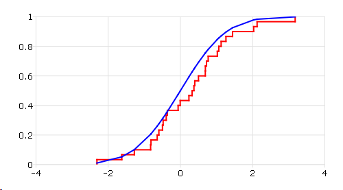

cdfEmpirical
==============================================

Purpose
----------------
Computes the cumulative distribution function
(cdf) of an empirical distribution.

Format
----------------
.. function:: { f, break_points } = cdfEmpirical(x[, bins])

    :param x: Data vector.
    :type x: Nx1 vector

    :param bins: Optional input. If scalar, an evenly spaced vector with *bins* elements is created between *x_min* and *x_max*. If vector, GAUSS uses the passed vector as the values at which to find empirical cdf.
    :type bins: scalar or vector

    :return f: cdf values, where *N* is equal to *bins* if *bins* is a scalar or number of rows in *bins* if *bins* is a vector.

    :rtype f: matrix), (N+1) x1 vector

    :return breakpoint: break points used to calculate cdf values.

    :rtype breakpoint: Nx1 vector

Examples
----------------

::

    new;
    cls;
    rndseed 2223;

    // Create a random vector
    x = rndn(30, 1);

    // Sort x  for the first column
    x = sortc(x, 1);

    // Get empirical cdf of x
    f = cdfEmpirical(x);

    // Add negative infinity (__INFN) for probability equal to 0.
    print (__INFN|x)~f;

    // Plot empirical distribution
    plotCDFEmpirical(x);

    // Get normal cdf of x
    fnormal = cdfN(x);

    // Plot theoretical distribution
    plotAddXY(x, fnormal);

After above code,

::

               -INF       0.00000000
         -2.3124206      0.033333333
         -1.6240227      0.066666667
         -1.2763153       0.10000000
        -0.82532512       0.13333333
        -0.81574278       0.16666667
        -0.64338729       0.20000000
        -0.59625173       0.23333333
        -0.49725006       0.26666667
        -0.47855430       0.30000000
        -0.39340284       0.33333333
        -0.36201638       0.36666667
       -0.063830011       0.40000000
      -0.0064523646       0.43333333
         0.23570074       0.46666667
         0.32355136       0.50000000
         0.37501508       0.53333333
         0.39847826       0.56666667
         0.50039685       0.60000000
         0.68900341       0.63333333
         0.69132515       0.66666667
         0.72246796       0.70000000
         0.76893134       0.73333333
          1.0221019       0.76666667
          1.0638924       0.80000000
          1.1274880       0.83333333
          1.2610791       0.86666667
          1.4445086       0.90000000
          2.0295113       0.93333333
          2.1240430       0.96666667
          3.1784008        1.0000000

The plot is

Remarks
-------

*f* is the integral from :math:`-\infty \text{ to } x` of the empirical distribution function.

.. seealso:: Functions :func:`plotCDFEmpirical`
