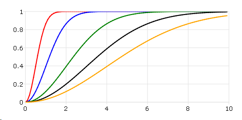

cdfRayleigh
==============================================

Purpose
----------------
Computes the Rayleigh cumulative distribution function.

Format
----------------
.. function:: cdfRayleigh(x, scale)

    :param x: Values at which to evaluate the cumulative distribution function for the Rayleigh distribution. :math:`x \geq 0`.
    :type x: NxK matrix, Nx1 vector or scalar

    :param scale: Scale parameter, ExE conformable with *x*. :math:`scale > 0`.
    :type scale: NxK matrix, Nx1 vector or scalar

    :returns: **p** (*NxK matrix, Nx1 vector or scalar*) - Each element in *p* is the cumulative distribution function of the Rayleigh distribution evaluated at the corresponding element in *x*.

Remarks
------------

The Rayleigh cumulative distribution function is defined as

.. math:: 1 − exp⁡(\frac{-x^2}{2\sigma^2})

Examples
----------------
Here is an example show the Rayleigh cumulative distribution plot with different scale parameters.

::

    // Values
    x = seqa(0, 0.1, 100);

    // Scale
    scale = 0.5~1~2~3~4;

    // Call Rayleigh function
    p = cdfRayleigh(x, scale);

    plotxy(x, p);

After running above code,

.. seealso:: Functions :func:`cdfRayleighInv`, :func:`pdfRayleigh`
