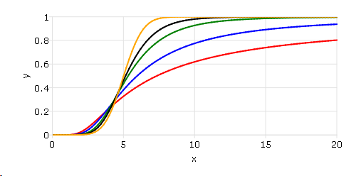
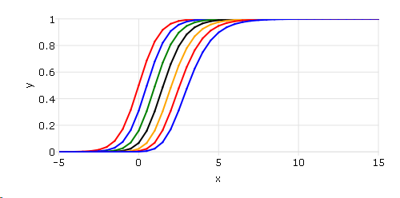

cdfTnc
==============================================

Purpose
----------------

The integral under the noncentral Student's :math:`t` distribution, from
:math:`-∞` to *x*. 

Format
----------------
.. function:: y = cdfTnc(x, df, nonc)

    :param x: values of upper limits of integrals.
    :type x: NxK matrix

    :param df: ExE conformable with *x*, the degrees of freedom, :math:`df > 0`.
    :type df: LxM matrix

    :param nonc: ExE conformable with *x*, the noncentrality parameter. This is the square root of the noncentrality parameter that sometimes goes under the symbol :math:`\lambda`.
    :type nonc: PxQ matrix

    :return p: Each element in *p* is the cumulative distribution function of the noncentral Student's t distribution evaluated at the corresponding element in *x*.

    :rtype p: max(N,L,P) by max(K,M,Q) matrix

Remarks
------------

:: 

    cdfTc(x, df) = 1 - cdfTnc(x, df, 0)

Examples
----------------

Noncentral t distributions with different parameters.
+++++++++++++++++++++++++++++++++++++++++++++++++++++

::

    // Values to find cdf at
    x = seqa(0, 0.2, 101);

    // Noncentrality parameter
    nonc = 5;

    // Degrees of freedom
    df = 1~2~5~10~100;

    // Call cdfTnc
    p = cdfTnc(x, df, nonc);
    plotxy(x, p);

After running above code,

Noncentral t distributions with different degree of freedoms.
+++++++++++++++++++++++++++++++++++++++++++++++++++++++++++++

::

    // Values to find cdf at
    x = seqa(-5, 0.5, 41);

    // Noncentrality parameter
    nonc = seqa(0, 0.5, 7);

    // Degrees of freedom
    df = 10;

    p = cdfTnc(x, df, nonc');
    plotxy(x, p);

After running above code,

.. seealso:: Functions :func:`cdfFnc`, :func:`cdfChinc`
