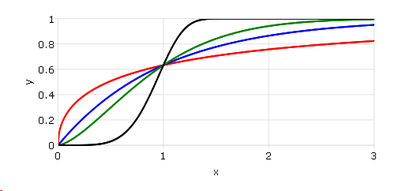

cdfWeibull
==============================================

Purpose
----------------

Computes the cumulative distribution function for the Weibull distribution.

Format
----------------
.. function:: y = cdfWeibull(x,shape,scale)

    :param x: Values at which to evaluate the cumulative distribution function for the Weibull distribution. :math:`x \geq 0`.
    :type x: NxK matrix, Nx1 vector or scalar

    :param shape: Shape parameter. ExE conformable with *x*. :math:`shape > 0`.
    :type shape: NxK matrix, Nx1 vector or scalar

    :param scale: Scale parameter, ExE conformable with *x*. :math:`scale > 0`.
    :type scale: NxK matrix, Nx1 vector or scalar

    :returns: **p** (*NxK matrix, Nx1 vector or scalar*) - Each element in *p* is the cumulative distribution function of the Weibull distribution evaluated at the corresponding element in *x*.

Remarks
------------

The Weibull cumulative distribution function is defined as:

.. math::  f(x; k, \lambda) = 1 - e^{-(x/\lambda)k}

Examples
----------------
Calculate the cdf for the Weibull distribution with different shape parameters.

::

    // Values
    x = seqa(0,0.01,301);

    // Shape parameter
    shape = 0.5~1~1.5~5;

    // Scale parameter
    scale = 1;

    p = cdfWeibull(x, shape, scale);
    plotxy(x, p);

After running above code,

.. seealso:: Functions :func:`pdfWeibull`, :func:`cdfWeibullInv`
