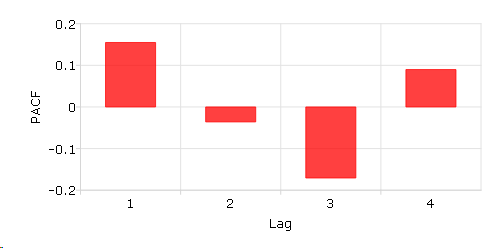
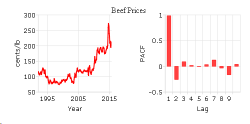
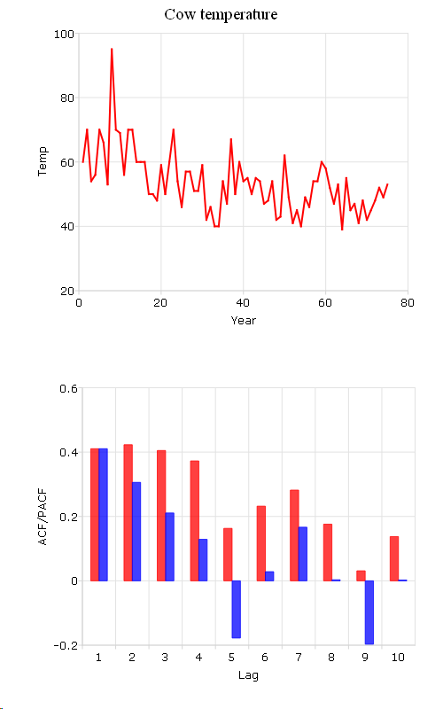

pacf
==============================================

Purpose
----------------

Computes sample partial autocorrelations.

Format
----------------
.. function:: rk = pacf(y, k, d)

    :param y: data
    :type y: Nx1 vector

    :param k: maximum number of partial autocorrelations to compute. :math:`0 < k < N`.
    :type k: scalar

    :param d: order of differencing. If only computing the autocorrelations from the original time series, then *d* equals 0.
    :type d: scalar

    :return rk: sample partial autocorrelations.

    :rtype rk: Kx1 vector

Examples
----------------

A sample partial autocorrelation function example.
++++++++++++++++++++++++++++++++++++++++++++++++++

::

    // Create short time-series column vector
    x = { 12.92,
          14.28,
          13.31,
          13.34,
          12.71,
          13.08,
          11.86,
          9.000,
          8.190,
          7.970,
          8.350,
          8.200,
          8.120,
          8.390,
          8.660  };

    // Maximum number of lags
    k = 4;

    // Order of differencing
    d = 1;

    // Calculate and print result of partial autocorrelation function
    rk = pacf(x, k, d);

    print rk;

::

      0.15488076
    -0.035928234
     -0.17063786
     0.089875096

Plot the PACF results with :func:`plotBar`. Passing in 0 as the first input tells GAUSS to create a sequential series from 1 to the number of elements in *rk* as the x-tic labels.

::

    plotBar(0, rk);

You can add labels for x-axis and y-axis interactively on the Graphics Page by selecting :menuselection:`View --> Graph Settings` from the main menu. The plot is shown below:

Calculate the partial autocorrelation function (PACF) and plot the results for "beef_prices" data.
++++++++++++++++++++++++++++++++++++++++++++++++++++++++++++++++++++++++++++++++++++++++++++++++++

::

    // Clear out variables in GAUSS workspace
    new;

    // Create file name with full path
    file = getGAUSSHome() $+ "examples/beef_prices.csv";

    // Import dataset starting with row 2 and column 2
    beef = csvReadM(file, 2, 2);

    // Max lags
    k = 10;

    // Order of differencing
    d = 0;

    // Call pacf function
    beef_pacf = pacf(beef, k, d);

Create a time series plot and sample partial autocorrelation (PACF) plot based on the *beef* and *beef_pacf* variables created above:

::

    // Time series plot
    // Declare a plotControl structure
    struct plotControl ctl;
    ctl = plotGetDefaults("xy");

    // Make a 1 by 2 plot with the time series
    // plot in the [1,1] location
    plotLayout(1, 2, 1);

    // Labels and format settings for 'beef' matrix plot
    plotSetYLabel(&ctl, "cents/lb");
    plotSetXLabel(&ctl, "Year");
    plotSetXTicLabel(&ctl, "YYYY");
    plotSetXTicInterval(&ctl, 120, 199501);

    // Time plot with plotTS function
    plotTS(ctl, 1992, 12, beef);

    // Making a 1 by 2 plot, the second plot is the PACF plot
    plotLayout(1, 2, 2);

    // ACF plot
    // Fill 'ctl' structure with defaults settings for bar plots
    ctl = plotGetDefaults("bar");

    // Setting labels and format based on 'beef_acf' matrix
    plotSetYLabel(&ctl, "PACF");
    plotSetXLabel(&ctl, "Lag");
    plotSetXTicInterval(&ctl, 1, 5);

    // PACF plot with plotBar function
    plotBar(ctl, seqa(1, 1, k), beef_pacf);

You can use 'Add Text' to type 'Beef Prices' as the title in the graphics window. The plot is:

Compare ACF and PACF for "cow" data.
++++++++++++++++++++++++++++++++++++

::

    new;
    cls;

    file = getGAUSSHome() $+ "examples/cows.fmt";

    // Import '.fmt' data
    load data = ^file;

    // Max lags
    k = 10;

    // Order of differencing
    d = 0;

    // call pacf function
    data_pacf = pacf(data, k, d);

    // call acf function
    data_acf = acf(data, k, d);

In this example, we compute the ACF and PACF for cow's temperature and save them in *data_acf* and *data_pacf*.

The following code plot autocorrelation (ACF) and sample partial autocorrelation (PACF):

::

    // Compare ACF and PACF for cow's temperature data
    // Create sequential numbers
    years = seqa(1, 1, rows(data));

    // Declare a plotControl structure
    struct plotControl cow_ctl;
    cow_ctl = plotGetDefaults("xy");

    // Set plot title for top graph
    plotSetTitle(&cow_ctl, "Cow Temperature");

    // Labels and format setting based on 'data_acf' matrix
    plotSetYLabel(&cow_ctl, "Temp");
    plotSetXLabel(&cow_ctl, "Year");

    // Making a 2 by 1 plot, the first plot is the time plot
    plotLayout(2, 1, 1);

    // Time plot
    plotXY(cow_ctl, years, data );

    // Change type of plotControl struct
    cow_ctl = plotgetdefaults("bar");

    // Setting labels and format based on 'data_pacf' matrix
    plotSetYLabel(&cow_ctl, "ACF/PACF");
    plotSetXLabel(&cow_ctl, "Lag");

    // Place the 2nd plot in the second cell of a 2 by 1 grid
    plotLayout(2, 1, );

    // ACF plot
    plotBar(cow_ctl, seqa(1, 1, k), data_acf);

    // PACF plot
    plotAddBar(seqa(1, 1, k), data_pacf);

    // Clear 2 by 1 plot layout for next plots
    plotClearLayout();

The plot produced by the code above should look like this:

Source
------

tsutil.src

.. seealso:: Functions :func:`acf`
