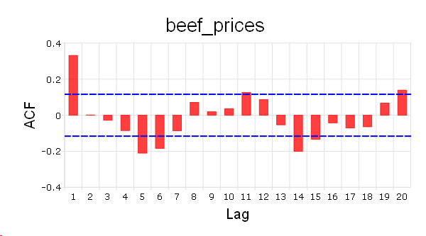

plotACF
==============================================

Purpose
----------------

Plot the autocorrelations function (ACF).

Format
----------------
.. function:: plotACF([myPlot, ]x, k, d) 

    :param myPlot: Optional argument, a :class:`plotControl` structure for acf
    :type myPlot: struct

    :param x: data.
    :type x: Nx1 vector

    :param k: maximum number of autocorrelations to compute.
    :type k: scalar

    :param d: order of differencing.
    :type d: scalar

Remarks
-------

To control the color and texture of the bars as well as whether they are
stacked or side by side:

If you are passing a :class:`plotControl` structure to your graph, you may use
the function :func:`plotGetDefaults` and :func:`plotSetBar`.

If you are not passing a :class:`plotControl` structure, these properties are set
in the Preferences. To access the Graphics Preferences, select
:menuselection:`Tools --> Preferences` from the GAUSS main menu. Select **Graphics** on
the left side of the preferences and then select **Bar** from the list
of graph types.

Examples
----------------

::

    // Clear out variables in GAUSS workspace
    new;
    
    // Create file name with full path
    file = getGAUSSHome() $+ "examples/beef_prices.csv";
    
    // Import dataset starting with row 2 and column 2
    x = csvReadM(file,2,2);
    
    // Max lags
    k = 20;
    
    // Order of differencing
    d = 1;
    
    // ACF plot
    struct plotControl mp;
    mp = plotGetDefaults("bar");
    
    plotSetTitle(&mp, "beef_prices", "Arial", 20);
    
    plotACF( mp, x, k, d);

The plot is:

.. seealso:: Functions :func:`plotPACF`, :func:`ACF`, :func:`PACF`

