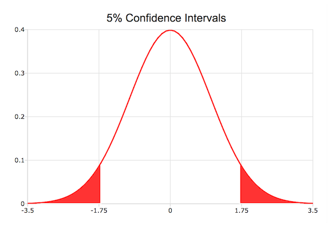

plotAddArea
==============================================

Purpose
----------------

Adds a cumulative area plot to an existing graph.

Format
----------------
.. function:: plotAddArea([myPlot, ]x, y[, base])

    :param myPlot: Optional argument, a :class:`plotControl` structure.
    :type myPlot: struct

    :param x: the X coordinates
    :type x: Nx1 vector

    :param y: Each column contains the height for the corresponding section of the graph.
        If y contains more than one column, each column will be stacked on top of the previous column.
    :type y: Nx1 or NxM matrix

    :param base: Optional argument. The height for the base of the added area plot. The default value is zero. :func:`plotAddArea` does not yet support a vector input for base.
    :type base: scalar

Examples
----------------

Creating confidence intervals
+++++++++++++++++++++++++++++

::

    // Create the 'x' and 'y' for the normal
    // probability density function
    x = seqa(-3.5, 0.1, 71);
    y = pdfn(x);

    // Create the 'x' and 'y' points
    // for the left tail
    edge = cdfni(0.05);
    x_ci = selif(x, (x .< edge));
    y_ci = y[1:rows(x_ci)];

    // Draw filled in left tail
    plotArea(x_ci, y_ci);

    // Create the 'x' and 'y' points
    // for the right tail
    edge = cdfni(0.95);
    x_ci = selif(x, (x .> edge));
    y_ci = y[rows(y)-rows(x_ci)+1:rows(y)];

    // Add right tail to graph
    plotAddArea(x_ci, y_ci);

    // Add pdfn line
    plotAddXY(x, y);

The code to create the graph below can be found in the file *plotaddci.e* in your GAUSS examples directory.

Creating confidence intervals with plotAddArea

Remarks
-------

:func:`plotAddArea` may only add curves to 2-D graphs.

This function will not change any of the current graph's settings other
than to resize the view as necessary to display the new curve.

.. seealso:: Functions :func:`plotAddBar`, :func:`plotAddHist`, :func:`plotAddHistF`, :func:`plotAddHistP`, :func:`plotAddPolar`
