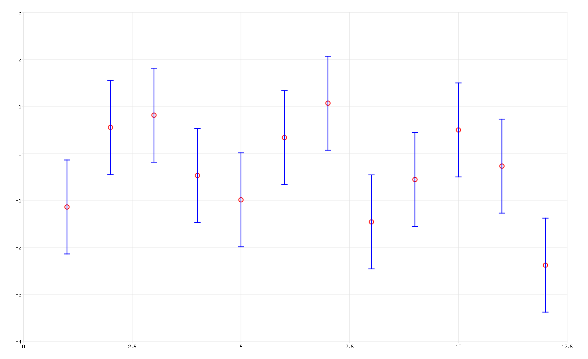
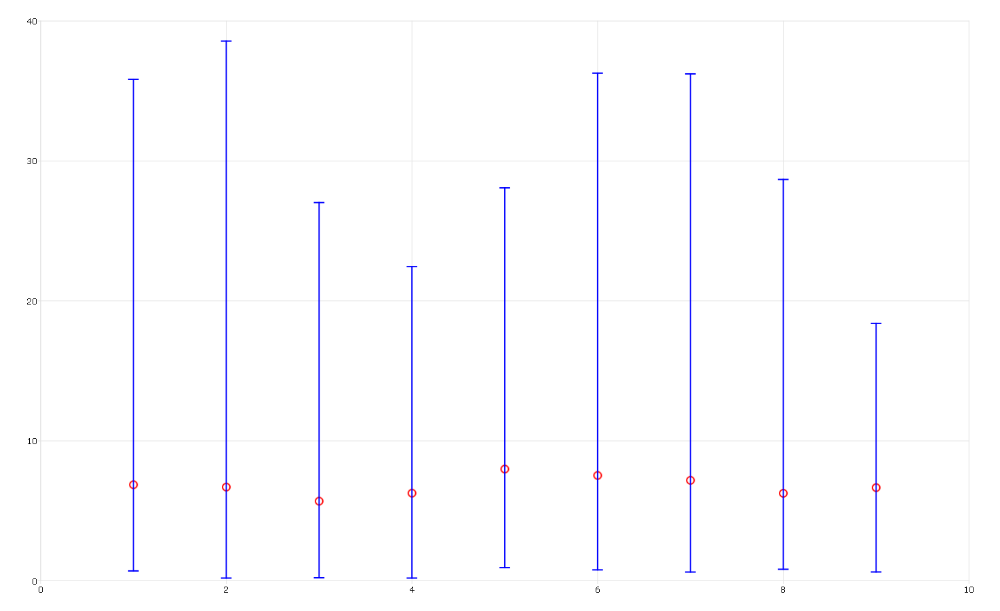
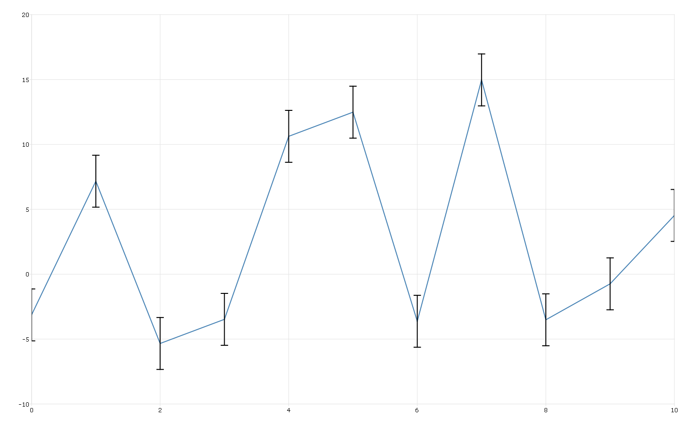
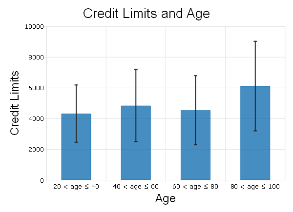

plotAddErrorBar
==============================================

Purpose
----------------
Adds an error bar or a set of bars to an existing 2-D graph.

Format
----------------
.. function:: plotAddErrorBar([myPlot, ]x, y, err)
              plotAddErrorBar([myPlot, ]x, y, lwr, uppr)

    :param myPlot: Optional argument. A :class:`plotControl` structure.
    :type myPlot: struct

    :param x: Each column contains the X values for a particular line.
    :type x: scalar or Nx1 or NxM matrix

    :param y: Each column contains the Y values for a particular line.
    :type y: scalar or Nx1 or NxM matrix

    :param err: Each column contains the error values for each Y column.
    :type err: scalar or Nx1 or NxM matrix

    :param lwr: Each column contains the lower bar heights for assymetrical error bars.
    :type lwr: Nx1 or NxM matrix

    :param uppr: Each column contains the upper bar heights for assymetrical error bars.
    :type uppr: Nx1 or NxM matrix

Examples
----------------

Basic addition of error bars to scatter plot
++++++++++++++++++++++++++++++++++++++++++++

::

    new;

    // Sequence 1, 2, 3...12
    x = seqa(1, 1, 12);

    // Create some random normal data, y ~ N(0, 1)
    y = rndn(12,1);

    // 12x1 vector of all 1's
    sd = ones(12,1);

    // Draw basic scatter plot, using default settings
    plotScatter(x, y);

    // Add error bars with height of 1
    plotAddErrorBar(x, y, sd);

The plot is

Assymetrical error bars to plot median and range
++++++++++++++++++++++++++++++++++++++++++++++++

::

    new;

    // Create the sequence 1, 2, 3...9
    x = seqa(1, 1, 9);

    // Create 9 gamma distributed column vectors
    y = rndGamma(100, 9, 2, 4);

    // Calculate medians of each column
    med = median(y);

    // Draw scatter plot of each median
    plotScatter(x, med);

    // Calculate the distance between the median
    // and the min and max for each column
    err_high = maxc(y) - med;
    err_low = (med - minc(y));

    // Add assymetrical error bars to span
    // the range of each column
    plotAddErrorBar(x, med, err_low, err_high);

The plot is

Add error bars to XY plot, using plotControl structure
++++++++++++++++++++++++++++++++++++++++++++++++++++++

::

    new;

    // Create x values
    x = seqa(0,1,11);

    // Create y values
    y = 10*rndn(11,1);

    // Define plotControl Structure
    struct plotControl myPlot;
    myPlot = plotGetDefaults("xy");

    // Set color for main line
    plotSetLineColor(&myPlot, "steel blue");

    // Plot line
    plotXY(myPlot, x, y);

    // Set error bar values
    err = ones(11,1)*2;

    // Set error bar color to be different than XY line
    plotSetLineColor(&myPlot, "black");

    // Add error bars
    plotAddErrorBar(myPlot, x,y,err);

The plot is

Add error bars to bar plot
++++++++++++++++++++++++++

::

    new;

    // Load 'Age' and 'Limit' variables
    // into a 2 column matrix
    file = getGAUSSHome() $+ "/examples/credit.dat";
    data = loadd(file, "Age + Limit");

    age = data[.,1];
    limit = data[.,2];

    num_ranges = 4;
    age_ranges = {  20 40,
                    40 60,
                    60 80,
                   80 100 };

    // Pre-allocate vector to hold means
    // and standard deviation of the samples
    mu = zeros(num_ranges,1);
    s = zeros(num_ranges,1);

    for i(1, num_ranges, 1);
        // Get the index for different age level
        level_idx = indexcat(age, age_ranges[i,.]');

        // mean of limit for different age level
        mu[i] = meanc(limit[level_idx]);

        // Calculate the standard deviation of the sample
        s[i] = stdc(limit[level_idx]);
    endfor;

    // Note: < is '<' in html
    // '$|' is string concatenation
    labels = "20 < age 	≤ 40" $|
             "40 < age 	≤ 60" $|
             "60 < age 	≤ 80" $|
             "80 < age 	≤ 100";

    // Declare 'myPlot' to be a plotControl structure
    // and fill with default settings for bar plots
    struct plotControl myPlot;
    myPlot = plotGetDefaults("bar");

    // Set bar fill to be: solid, 100% opaque and steel blue
    plotSetFill(&myPlot, 1, 1, "steel blue");

    // Set title and axes labels
    plotSetTitle(&myPlot, "Credit Limits and Age", "arial", 20);
    plotSetYLabel(&myPlot, "Credit Limits", "arial", 18);
    plotSetXLabel(&myPlot, "Age", "arial", 18);

    // Draw bar plot
    plotBar(myPlot, labels, mu);

    // File 'myPlot' plotControl structure with
    // default settings for 'xy' plots
    myPlot = plotGetDefaults("xy");

    plotSetLineColor(&myPlot, "black");

    //'x' location of error bars
    // 1 is first bar, 2 is second bar, etc
    x = seqa(1, 1, num_ranges);

    // Draw error bars on bar plot
    plotAddErrorBar(myPlot, x, mu, s);

The plot is

.. seealso:: Functions :func:`plotBar`
