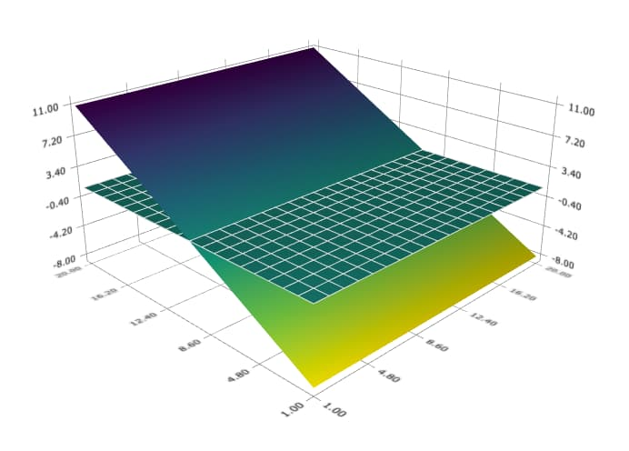
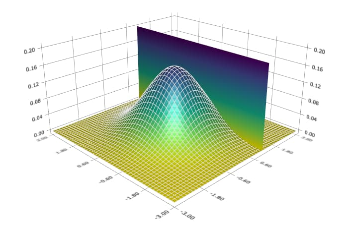

plotAddSurface
==============================================

Purpose
----------------
Add a surface plot to an existing plot.

Format
----------------
.. function:: plotAddSurface([myPlot, ]x, y, z)

    :param myPlot: Optional argument. A :class:`plotControl` structure.
    :type myPlot: struct

    :param x: the x-axis data.
    :type x: 1xK vector

    :param y: the y-axis data.
    :type y: Nx1 vector

    :param z: the matrix of height data to be plotted.
    :type z: NxK matrix

Examples
----------------

Basic case with default settings
++++++++++++++++++++++++++++++++

::

    new;
    cls;

    // n: Number of observation
    n = 20;

    // First Surface
    x = seqa(1, 1, n)';
    z = ones(n,n);

    // Plot surface
    plotSurface(x, x', z);

    // Second Surface
    z2 = reshape(seqa(-8, 1, n), n, n);

    // Plot the second surface
    plotAddSurface(x, x', z2');

The plot is

With a plotControl structure and color map
++++++++++++++++++++++++++++++++++++++++++

::

    new;
    cls;

    // n: Number of observation
    n = 50;

    // x: n * 1 vector from -3 to +3
    x = seqa(-3, 6/(n-1), n);

    // y: 1 * n row vector
    y = x';

    // z: Joint probability of 'x' and 'y'
    z = pdfn(x) .* pdfn(y);

    // Define plotControl structure
    struct plotcontrol myPlot;
    myPlot = plotGetDefaults("surface");

    // Set a color map
    plotSetColormap(&myPlot, "viridis");

    // Plot bivariate normal distribution
    plotSurface(myPlot, y, x, z);

    // Add a plane with the following 4 corners: (x,y,z)
    // (1, -3, 0),   (1, 3, 0)
    // (1, -3, 0.2), (1, 3, 0.2)
    x_plane = 1 ~ 1;
    y_plane = -3 | 3;
    z_plane = { 0 0.2,
                0 0.2 };

    // Add plane
    plotAddSurface(x_plane, y_plane, z_plane);

The plot is

Remarks
-------

If a :class:`plotControl` structure is passed in to :func:`plotAddSurface`, the only
settings that will be checked are:

-  The extent of the x, y and z axes (which may be expanded by the
   :class:`plotControl` structure).
-  The instructions for turning the wireframe on or off for the surface
   being added.

.. seealso:: Functions :func:`plotSurface`
