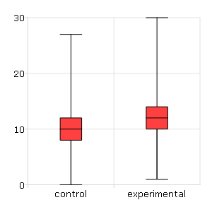

plotBox
==============================================

Purpose
----------------
Graphs data using the box graph percentile method.

Format
----------------
.. function:: plotBox([myPlot, ]group_id, y)

    :param myPlot: Optional argument, a :class:`plotControl` structure
    :type myPlot: struct

    :param group_id: This contains the group numbers or string labels corresponding to each column of *y* data. If scalar 0, a sequence from 1 to ``cols(y)`` will be generated automatically for the X axis.
    :type group_id: Mx1 vector or Mx1 string array

    :param y:  Each column represents the set of *y* values for an individual percentiles box symbol.
    :type y: NxM matrix

Remarks
-------

Note that numeric labels added to the X-axis are only labels for the
corresponding boxes. They do not imply any order or denote a particular
X-axis location.

If missing values are encountered in the *y* data, they will be ignored
during calculations and will not be plotted.

Examples
----------------

Use string labels
+++++++++++++++++

::

    //Create two columns of random data
    nobs = 1e5;
    y_1 = rndPoisson(nobs, 1, 10);
    y_2 = rndPoisson(nobs, 1, 12);
    
    //Create a 2x1 string array, using the
    //horizontal string concatenation operator
    labels = "control" $| "experimental";
    
    //Draw the two boxes
    plotBox(labels, y_1~y_2);

Using numeric labels
++++++++++++++++++++

::

    //Create two columns of random data
    nobs = 1e5;
    y_1 = rndn(nobs, 1);
    y_2 = rndn(nobs, 1);
    
    //Create a 2x1 vector of numeric labels
    labels = { 2000, 2010 };
    
    //Draw the two boxes
    plotBox(labels, y_1~y_2);

.. seealso:: Functions :func:`plotHistP`, :func:`plotScatter`

