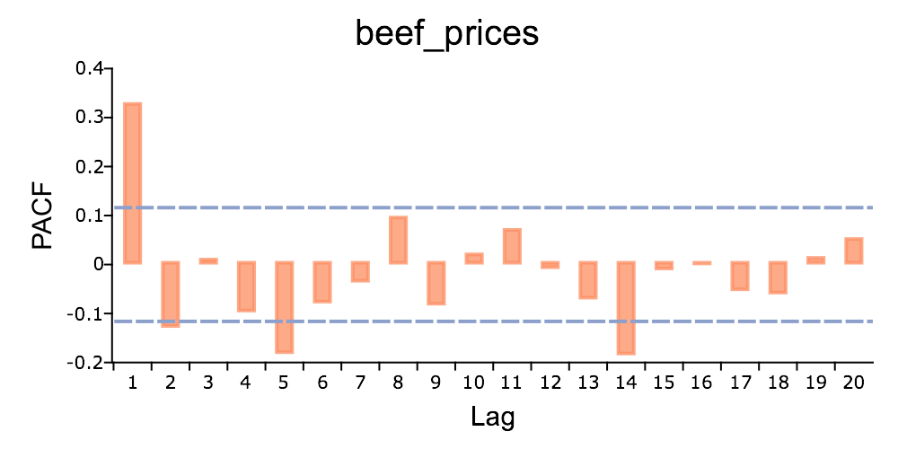

plotPACF
==============================================

Purpose
----------------

			Plot the partial autocorrelations function(PACF).

Format
----------------
.. function:: plotPACF( [myPlot, ]x, k, d)

    :param myPlot: Optional argument, a :class:`plotControl` structure
    :type myPlot: struct

    :param x: data.
    :type x: Nx1 vector

    :param k: maximum number of autocorrelations to compute.
    :type k: scalar

    :param d: order of differencing.
    :type d: scalar

Examples
----------------

::

    // Clear out variables in GAUSS workspace
    new;

    // Create file name with full path
    file = getGAUSSHome() $+ "examples/beef_prices.csv";

    // Import dataset starting with row 2 and column 2
    x = csvReadM(file, 2, 2);

    // Max lags
    k = 20;

    // Order of differencing
    d = 1;

    // PACF plot
    struct plotControl mp;
    mp = plotGetDefaults("bar");

    plotSetTitle(&mp, "beef_prices", "Arial", 20);

    plotPACF(mp, x, k, d);

The plot is

Remarks
-------

To control the color and texture of the bars:

* If you are passing a :class:`plotControl` structure to :func:`plotPACF`, you may use
  the function :func:`plotGetDefaults` and :func:`plotSetBar`.

* If you are not passing a :class:`plotControl` structure, these properties are set
  in the Preferences. To access the Graphics Preferences, select
  :menuselection:`Tools --> Preferences` from the GAUSS main menu. Select ''Graphics'' on
  the left side of the preferences and then select ''Bar'' from the list
  of graph types.

.. seealso:: Functions :func:`plotACF`, :func:`ACF`, :func:`PACF`
