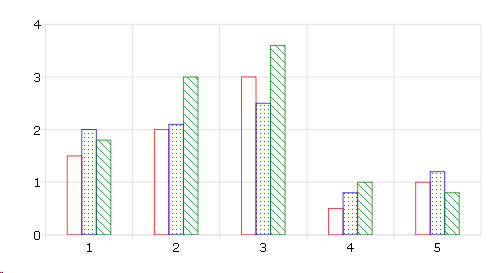

plotSetBar
==============================================

Purpose
----------------
Sets the fill style and format of bars in a histogram or bar graph.

Format
----------------
.. function:: plotSetBar(&myPlot, fillType, barStacked)

    :param &myPlot: A :class:`plotControl` structure pointer.
    :type &myPlot: struct pointer

    :param fillType: where *N* is the number of bar styles to set.

        .. csv-table::
            :widths: auto
    
            "0", "Solid, beveled edge"
            "1", "Solid"
            "2", "Dense 1"
            "3", "Dense 2"
            "4", "Dense 3"
            "5", "Dense 4"
            "6", "Dense 5"
            "7", "Dense 6"
            "8", "Horizontal lines"
            "9", "Vertical lines"
            "10", "Cross pattern"
            "11", "B diagonal pattern"
            "12", "F diagonal pattern"
            "13", "Diagonal Cross"

    :type fillType: Nx1 vector

    :param barStacked: 1 for stacked or 0 for side-by-side bars.
    :type barStacked: Scalar

Remarks
-------

When graphing without the use of a plotControl structure, these settings
may be chosen through the :menuselection:`Tools --> Preferences --> Graphics` menu, after
selecting the Bar radio button. See **GAUSS Graphics**, Chapter 1, for
more information on the methods available for customizing your graphs.

Examples
----------------

::

    // Declare plotControl structure
    struct plotControl myPlot;
    
    // Initialize plotControl structure
    myPlot = plotGetDefaults("bar");
    
    // Set the first set of bars to have a solid-fill, the
    // second set to have a fill of horizontal lines, the third 
    // to have a diagonal cross fill and set the bars to be
    // side-by-side.
    textures = { 0, 8, 13 };
    plotSetBar(&myPlot, textures, 0);
    
    // Create data
    x = seqa(1, 1, 5);
    y = {
    1.5       2    1.8,
      2     2.1      3,
      3     2.5    3.6, 
    0.5     0.8      1,
      1     1.2    0.8
    	};
    
    // Draw bar graph
    plotBar(myPlot, x, y);

.. seealso:: Functions :func:`plotBar`, :func:`plotGetDefaults`, :func:`plotHist`

