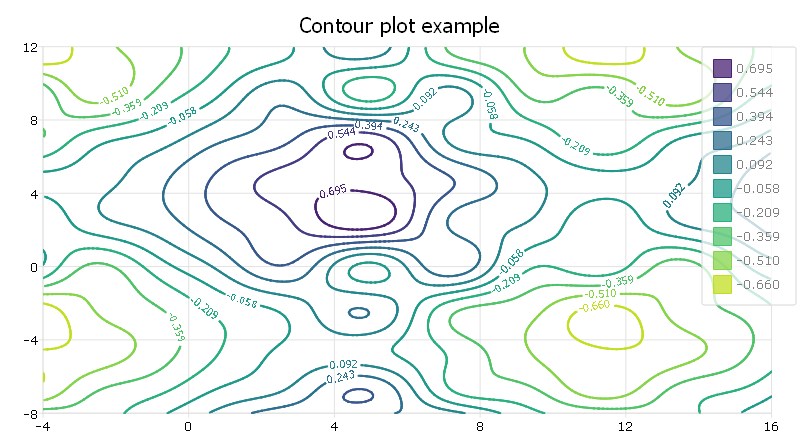

plotSetColorMap
==============================================

Purpose
----------------
Sets the color maps for a surface or contour plot.

Format
----------------
.. function:: plotSetColorMap(&myPlot, color_type)

    :param &myPlot: A :class:`plotControl` structure pointer.
    :type &myPlot: struct pointer

    :param color_type: name of color maps: 
    
        - "viridis"
        - "magma"
        - "inferno"
        - "plasma"

    :type color_type: string

Remarks
-------

This function sets an attribute in a :class:`plotControl` structure. It does not
affect an existing graph, or a new graph drawn using the default
settings that are accessible from the :menuselection:`Tools --> Preferences --> Graphics`
menu. See **GAUSS Graphics**, Chapter 1, for more information on the
methods available for customizing your graphs.

Examples
----------------

::

    // Clear out variables in GAUSS workspace
    new;
    
    // Create data
    x = seqa(-4,.125,161)';
    y = seqa(-8,.125,161);
    z = sin(x) .* cos(y) * .5;
    z = z .* sin(x/3) .* cos(y/3);
    z = z .* sin(x/5) + sin(y/2.5)/3 + sin(x/2.5)/3;
    
    // Set up control structure with defaults
    // for surface plots
    struct plotControl myPlot;
    myPlot = plotGetDefaults("surface");
    
    // Set title and Z axis label
    plotSetTitle(&myPlot, "Contour plot example", "arial", 16, "black");
    
    // Set color map for contour
    plotSetColormap(&myplot, "viridis");
    
    // Draw graph using plotcontrol structure
    plotContour(myPlot, x, y, z);

The plot is

.. seealso:: Functions :func:`plotGetDefaults`, :func:`plotSetContourLabels`, :func:`plotSetZLevels`

