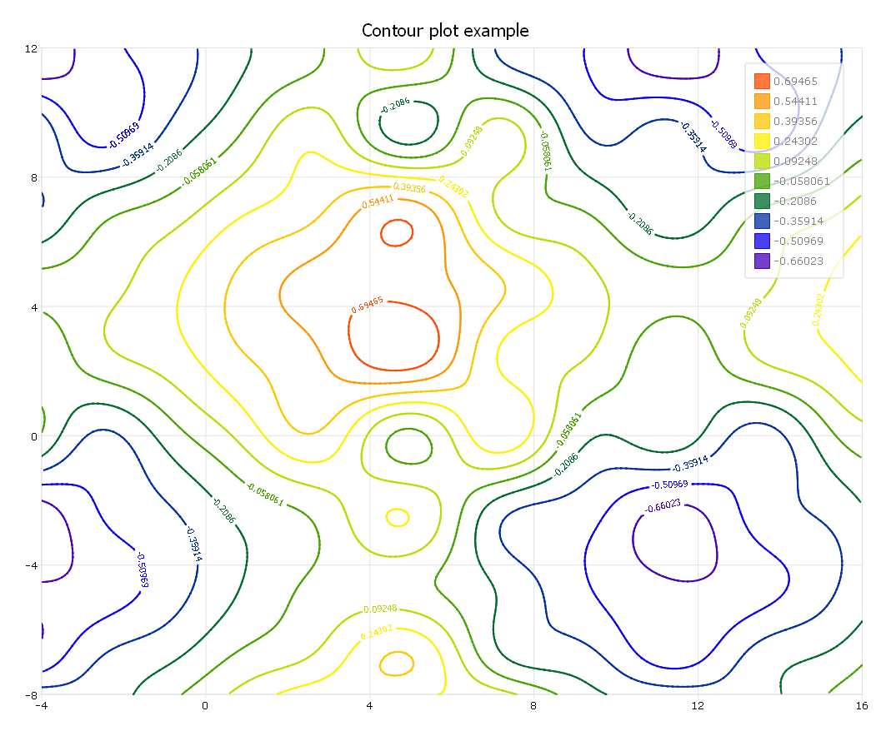

plotSetContourLabels
==============================================

Purpose
----------------
Sets the contour label for a graph.

Format
----------------
.. function:: plotSetContourLabels(&myPlot, show_labels[, label_format[, label_precision]])

    :param &myPlot: A :class:`plotControl` structure pointer.
    :type &myPlot: struct pointer

    :param show_labels: 0 or 1. The flag of show labels on contours.
    :type show_labels: scalar

    :param label_format: Optional argument. Format options:

        === =================
        "D" e.g. 1.234567;
        "E" e.g.1.23E1;
        "G" "G" is either "D" or "E", whichever is more compact
        === =================

    :type label_format: string

    :param label_precision: Optional argument, precision of contour label.
    :type label_precision: scalar

Examples
----------------

::

    // Clear out variables in GAUSS workspace
    new;

    // Create data
    x = seqa(-4,.125,161)';
    y = seqa(-8,.125,161);
    z = sin(x) .* cos(y) * .5;
    z = z .* sin(x/3) .* cos(y/3);
    z = z .* sin(x/5) + sin(y/2.5)/3 + sin(x/2.5)/3;

    // Set up control structure with defaults
    // for surface plots
    struct plotControl myPlot;
    myPlot = plotGetDefaults("surface");

    // Set title and Z axis label
    plotSetTitle(&myPlot, "Contour plot example", "arial", 16, "black");

    // Set color map for contour
    plotSetColorMap(&myplot, "viridis");

    // Set up flag of show label for contour
    showLabels = 1;

    // Set up format for contour label
    label_format = "G";

    // Set up precision for contour label
    label_precision = 5;

    // Use function to set up contour labels
    plotSetContourLabels(&myplot, showlabels, label_format, label_precision);

    // Draw graph using plotcontrol structure
    plotContour(myPlot, x, y, z);

The plot is

Remarks
-------

This function sets an attribute in a :class:`plotControl` structure. It does not
affect an existing graph, or a new graph drawn using the default
settings that are accessible from the :menuselection:`Tools --> Preferences --> Graphics`
menu. See **GAUSS Graphics**, Chapter 1, for more information on the
methods available for customizing your graphs.

.. seealso:: Functions :func:`plotGetDefaults`, :func:`plotSetColorMap`, :func:`plotSetZLevels`
