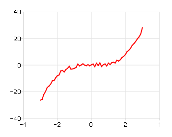
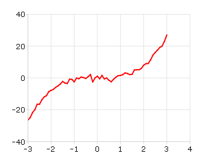

plotSetXTicCount
==============================================

Purpose
----------------
Controls the number of major tics on the X-axis of a 2-D plot.

Format
----------------
.. function:: plotSetXTicCount(&myPlot, num_tics)

    :param &myPlot: A :class:`plotControl` structure pointer.
    :type &myPlot: struct pointer

    :param num_tics: the number of major tics to place on the X-axis.
    :type num_tics: Scalar

Remarks
-------

Note that :func:`plotSetXTicInterval` does not provide complete control over the
x-axis tics. If the number of x-tics requested would cause an odd x-tic
interval, GAUSS will create a number of tics that will provide more even
spacing. For instance, in the example above, 8 tics gave a space between
tics of 1. If we chose 9 tics, the spacing between tics would be 0.889.
In that case, GAUSS would instead draw 8 tics for a more even
appearance.

For more control over the x-axis of time series plots, use
:func:`plotSetXTicInterval` instead.

This function sets an attribute in a :class:`plotControl` structure. It does not
affect an existing graph, or a new graph drawn using the default
settings that are accessible from the **Tools > Preferences > Graphics**
menu. See **GAUSS Graphics**, Chapter 1, for more information on the
methods available for customizing your graphs.

Examples
----------------

::

    //Create some data to plot
    x = seqa(-3, 0.1, 61);
    y = x.^3 + rndn(rows(x), 1);
    
    //Plot the data
    plotXY(x, y);

    5 tic marks

will produce a graph that looks similar to the one above, with 5 major tic marks on the x-axis. If we use 8 tic marks, there will be one
major tic for every integer on the x-axis. We can make that change like this:

::

    //Declare and initialize plotControl structure
    struct plotControl myPlot;
    myPlot = plotGetDefaults("xy");
    
    //Set the x-axis to have 8 tic marks
    plotSetXTicCount(&myPlot, 8);
    
    //Plot the data, using the plotControl structure
    plotXY(myPlot, x, y);

    8 tic marks

.. seealso:: Functions :func:`plotSetXTicInterval`, :func:`plotSetXLabel`

