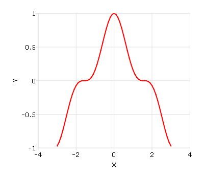
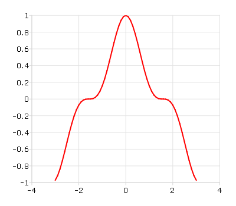

plotSetYTicCount
==============================================

Purpose
----------------
Controls the number of major tics on the y-axis of a 2-D plot.

Format
----------------
.. function:: plotSetYTicCount(&myPlot, num_tics)

    :param &myPlot: A :class:`plotControl` structure pointer.
    :type &myPlot: struct pointer

    :param num_tics: the number of major tics to place on the y-axis.
    :type num_tics: scalar

Examples
----------------

::

    // Create some data to plot
    x = seqa(-3, 0.1, 61);
    y = x.^3 + rndn(rows(x), 1);
    
    // Plot the data
    plotXY(x, y);

    5 tic marks

will produce a graph that looks similar to the one above, with 5 major tic marks on the y-axis. If we use 11 tic marks, there will be one
major tic for 0.2 on the y-axis. We can make that change like this:

::

    // Declare and initialize plotControl structure
    struct plotControl myPlot;
    myPlot = plotGetDefaults("xy");
    
    // Set the y-axis to have 11 tic marks
    plotSetYTicCount(&myPlot, 11);
    
    // Plot the data, using the plotControl structure
    plotXY(myPlot, x, y);

    11 tic marks

Remarks
-------

Note that :func:`plotSeTYticCount` does not provide complete control over the
y-axis tics. If the number of y-tics requested would cause an odd tic
interval, GAUSS will create a number of tics that will provide more even
spacing. For instance, in the example above, 11 tics gave a space
between tics of 0.2. If we chose 10 tics, the spacing between tics would
be 0.222. In that case, GAUSS would instead draw 10 tics for a more even
appearance.

This function sets an attribute in a :class:`plotControl` structure. It does not
affect an existing graph, or a new graph drawn using the default
settings that are accessible from the :menuselection:`Tools --> Preferences --> Graphics`
menu. See **GAUSS Graphics**, Chapter 1, for more information on the
methods available for customizing your graphs.

.. seealso:: Functions :func:`plotSetXTicInterval`, :func:`plotSetXLabel`

