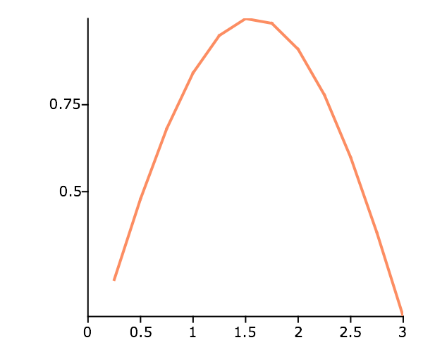

plotSetYTicInterval
==============================================

Purpose
----------------
Controls the interval between Y-axis tick labels and also allows the user to specify the first tick to be labeled.

Format
----------------
.. function:: plotSetYTicInterval(&myPlot, ticInterval[, firstLabeled])

    :param &myPlot: A :class:`plotControl` structure pointer.
    :type &myPlot: struct pointer

    :param ticInterval: the distance between Y-axis tick labels.
    :type ticInterval: scalar

    :param firstLabeled: Optional input, the value of the first Y-value on which to place a tick label.
    :type firstLabeled: scalar

Examples
----------------

XY plot
+++++++

::

    // Create the sequence 0.25, 0.5, 0.75...3
    x = seqa(0.25, 0.25, 12);
    y = sin(x);
    
    // Declare plotControl structure
    // and fill with default settings for XY plots
    struct plotControl myPlot;
    myPlot = plotGetDefaults("xy");
    
    // Place the first Y-tick label at 0.5
    // and place additional ticks every 0.25 after
    plotSetYTicInterval(&myPlot, 0.25, 0.5);
    
    // Draw plot with applied Y-tick settings
    plotXY(myPlot, x, y);

Remarks
-------

* :func:`plotSetYTicInterval` is supported for use with all plot types except for PQG graphics and :func:`plotSurface`.
* This function sets an attribute in a :class:`plotControl` structure. It does not
  affect an existing graph, or a new graph drawn using the default
  settings that are accessible from the :menuselection:`Tools --> Preferences --> Graphics`
  menu. See **GAUSS Graphics**, Chapter 1, for more information on the
  methods available for customizing your graphs.

.. seealso:: Functions :func:`plotSetYLabel`, :func:`plotSetYTicLabel`, :func:`plotSetXTicInterval`, :func:`plotSetTicLabelFont`

