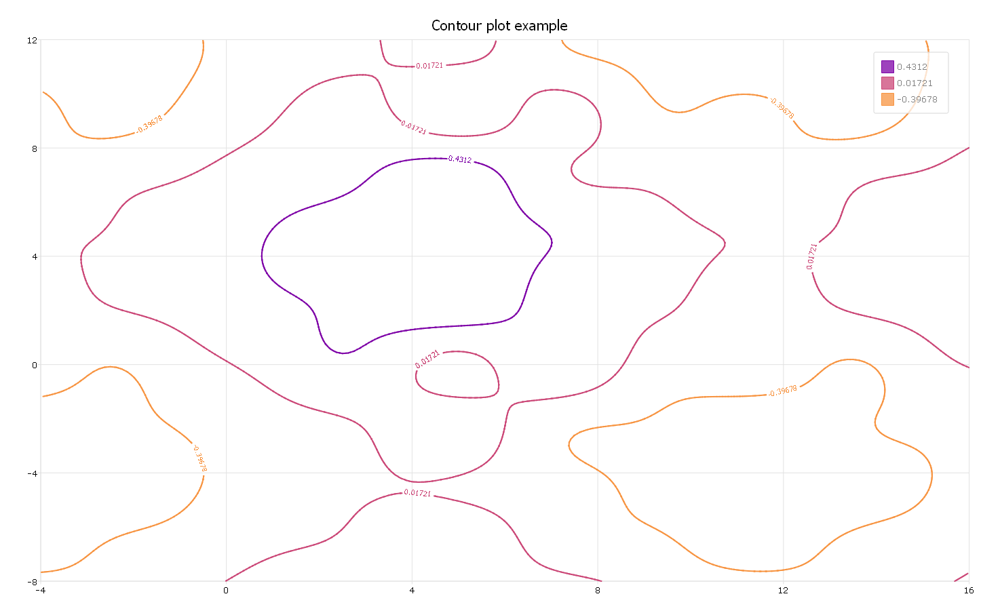

plotSetZLevels
==============================================

Purpose
----------------
Controls the heights at which lines are drawn on a contour plot.

Format
----------------
.. function:: plotSetZLevels(&myPlot, zlevels)

    :param &myPlot: A :class:`plotControl` structure pointer.
    :type &myPlot: struct pointer

    :param zlevels: If *zlevels* is a scalar, *zlevels* represents the number of different heights at which to draw contour lines (from ``MIN(Z)`` to ``MAX(Z)``). If *zlevels* is an Nx1 vector, *zlevels* indicates the heights at which to draw the contour lines.
    :type zlevels: scalar or Nx1 vector

Remarks
-------

-  To indicate a single Z-level, pass in a 2x1 vector with the same value for both elements:

   ::

      single_level = { 1.5, 1.5 };
      plotSetLevels(&myPlot, single_level);

-  This function sets an attribute in a :class:`plotControl` structure. It does
   not affect an existing graph, or a new graph drawn using the default
   settings that are accessible from the
   **Tools > Preferences > Graphics** menu. See **GAUSS Graphics**,
   Chapter 1, for more information on the methods available for
   customizing your graphs.

Examples
----------------

Basic example setting number of lines
+++++++++++++++++++++++++++++++++++++

::

    //Linear sequence from -3 to +3
    y = seqa(-3, 0.1, 61);
    x = y';
    
    //Joint probability of 'x' and 'y'
    z = pdfn(x) .* pdfn(y);
    
    //Declare plotControl structure
    //and fill in with defaults for surface/contour
    struct plotControl myPlot;
    myPlot = plotGetDefaults("surface");
    
    //Set number of lines to be drawn
    //MIN(Z) < Line 1 < Line 2 < Line 3 < Line 4 < MAX(Z)
    plotSetZLevels(&myPlot, 4);
    
    //Draw contour plot with 4 lines
    plotContour(myPlot, x,y,z);

Basic example setting heights of lines
++++++++++++++++++++++++++++++++++++++

Continuing with the data and plotControl structure created in the example above:

::

    //Draw lines at z == 0.05 and when z == 0.1
    plotSetZLevels(&myPlot, 0.05 | 0.1);
    
    //Draw contour plot with lines at 0.05 and 0.1
    plotContour(myPlot, x,y,z);

Example 3
+++++++++

::

    //Clear out variables in GAUSS workspace
    new;
    
    //Create data
    x = seqa(-4,.125,161)';
    y = seqa(-8,.125,161);
    z = sin(x) .* cos(y) * .5;
    z = z .* sin(x/3) .* cos(y/3);
    z = z .* sin(x/5) + sin(y/2.5)/3 + sin(x/2.5)/3;
    
    //Set up control structure with defaults
    //for surface plots
    struct plotControl myPlot;
    myPlot = plotGetDefaults("surface");
    
    //Set title and Z axis label
    plotSetTitle(&myPlot, "Contour plot example");
    
    //Set color map for contour
    plotSetColorMap(&myplot, "plasma");
    
    //Set up flag of show label for contour
    showLabels = 1; 
    
    //Set up format for contour label
    labelFormat = "g";
    
    //Set up precision for contour label
    labelPrecision = 5; 
    
    //Use function to set up contour labels
    plotSetContourLabels(&myplot, showlabels, labelFormat, labelPrecision);
    				
    //Use function to set up contour z levels = 3
    plotSetZLevels(&myplot, 3);
    
    //Draw graph using plotcontrol structure
    plotContour(myPlot, x, y, z);

The plot is

.. seealso:: Functions :func:`plotGetDefaults`, :func:`plotSetColorMap`, :func:`plotSetContourLabels`

