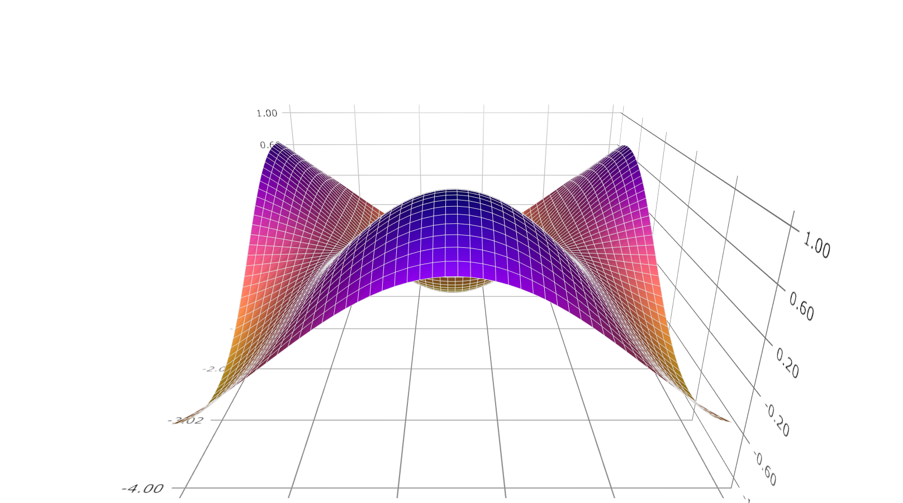

plotSurface
==============================================

Purpose
----------------

Graphs a 3-D surface.

Format
----------------
.. function:: plotSurface([myPlot, ]x, y, z)

    :param myPlot: A :class:`plotControl` structure
    :type myPlot: struct

    :param x: the X axis data.
    :type x: 1xK vector

    :param y: the Y axis data.
    :type y: Nx1 vector

    :param z: the matrix of height data to be plotted.
    :type z: NxK matrix

Examples
----------------

::

    // Clear out variables in GAUSS workspace
    new;
    				
    // Create contour data 
    x = seqa(-4, 0.1, 50)';
    y = x';
    z = sin(y) .* cos(x) ;
    
    // Set up control structure with defaults 
    // for surface plots
    struct plotControl myPlot;
    myPlot = plotGetDefaults("surface");
    
    // Set color map 
    plotSetColormap(&myPlot, "plasma");
    
    // Draw graph using plotcontrol structure
    plotSurface(myPlot, x, y, z);

.. seealso:: Functions :func:`plotSetColorMap`, :func:`plotContour`, :func:`plotSetBkdColor`

