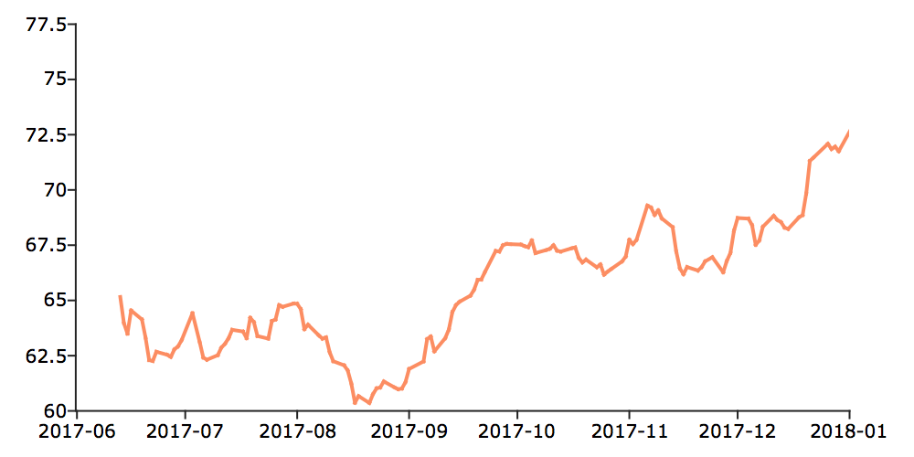

plotTS
==============================================

Purpose
----------------

Creates a graph of time series data.

Format
----------------
.. function:: plotTS([myPlot, ]dtstart, frequency, y)
              plotTS([myPlot, ]date_vec, label_unit, y)

    :param myPlot: Optional argument, a :class:`plotControl` structure.
    :type myPlot: struct

    :param dtstart: starting date in DT scalar format. This input is used when the data is evenly
        spaced and yearly, quarterly or monthly.
    :type dtstart: scalar

    :param frequency: frequency of the data per year.

        .. NOTE:: This option is only used with the scalar *dtstart* input. Valid options include:

            .. csv-table::
                :widths: auto

                "1", "Yearly"
                "4", "Quarterly"
                "12", "Monthly"

    :type frequency: scalar

    :param date_vec: containing the dates for each observation in the *y*. The dates in *date_vec* are **required** to be:

        - In DT Scalar format.
        - Sequential.

        However, the dates in *date_vec* **may be**:

        - Irregularly spaced
        - Any freqency which can be represented by DT Scalar format, such as by year, quarter, month, week, day, hour, minute and second.

    :type date_vec: Nx1 vector

    :param label_unit: containing the frequency with which to display the X axis tick labels.

        .. NOTE:: This input is only used with a full length *date_vec* vector. Valid options include:

            - "seconds"
            - "minutes"
            - "hours"
            - "days"
            - "months"
            - "quarters"
            - "years"

    :type label_unit: string

    :param y:  Each column contains the Y values for a particular line.
    :type y: Nx1 or NxM matrix

Examples
----------------

Basic time series plot with start date
++++++++++++++++++++++++++++++++++++++

::

    // Create some data to plot
    y = rndn(100, 1);

    // The first input starts the series in January of 1982
    // The second input specifies the data to be monthly
    plotTS(1982, 12, y);

T-bill plot with scalar start date
++++++++++++++++++++++++++++++++++

::

    // Create file name with full path
    file = getGAUSSHome() $+ "examples/tbill_3mo.xlsx";

    // Load scalar starting date
    date_1 = xlsReadM(file, "A2:A2");

    // Load the first 20 observations from the time series
    y = xlsReadM(file, "B2:B20");

    // Specify the data is monthly
    freq = 12;

    // Draw the time series plot
    plotTS(date_1, freq, y);

T-bill plot with full date vector
+++++++++++++++++++++++++++++++++

::

    // Create file name with full path
    file = getGAUSSHome() $+ "examples/tbill_3mo.xlsx";

    // Load date vector and tbill data
    x = loadd(file, "obs_date + tbill_3m");

    // Separate date vector and tbill data
    date_vec = x[.,1];
    y = x[.,2];

    // Specify that tick labels should be
    // on years, even though the data is monthly
    label_unit = "years";

    // Draw the time series plot
    plotTS(date_vec, label_unit, y);

Daily data with full date vector
++++++++++++++++++++++++++++++++

::

    // Fully pathed file name
    fname = getGAUSSHome() $+ "examples/xle_daily.xlsx";

    // Load all observations from variables,
    // 'Date' and 'Adj Close'
    data = loadd(fname, "Date + Adj Close");

    // Select the first 150 observations
    // from the date vector and the adjusted close
    nobs = 150;
    date_vec = data[1:nobs,1];
    closing_price = data[1:nobs,2];

    // Draw plot of this daily data, specifying
    // that the X-tick labels should be set in
    // terms of months
    plotTS(date_vec, "months", closing_price);

Time Series Plot With Custom X-tics
+++++++++++++++++++++++++++++++++++

.. figure:: _static/images/plotts_mac_tbill_400px.png

::

    // Create file name with full path
    file = getGAUSSHome() $+ "examples/tbill_3mo.xlsx";

    // Load date of observation 20 (header is row 1)
    date_1 = xlsReadM(file, "A21:A21");

    // Load 28 observations
    y = xlsReadM(file, "B21:B49");

    // Declare 'myPlot' to be a plotControl structure
    // and fill it with 'xy' default settings
    struct plotControl myPlot;
    myPlot = plotGetDefaults("xy");

    // Place first 'X' tick mark at 1984 month 1 and draw one every 6 months
    plotSetXTicInterval(&myPlot, 6, 1984);

    // Display only 4 digit year on 'X' tick labels
    plotSetXTicLabel(&myPlot, "YYYY-QQ");

    // Draw time series plot, using settings in 'myPlot'
    plotTS(myPlot, date_1, 12, y);

Example 6
+++++++++

In DT Scalar format, quarters are represented by supplying the first month of the quarter for
the sixth and seventh leading digits. As we see below, 200504 represents April of 2005, but it
also represents the second quarter of April 2005.

::

    // The first input starts the series in the second quarter of 2005
    // The second input specifies the data to be quarterly
    plotTS(200504, 4, y);

Remarks
-------

Formatting for the X-tick labels can be set with the function
:func:`plotSetXTicLabel`. If a :class:`plotControl` structure is not passed in to :func:`plotTS`,
or the format specifier is not set with :func:`plotSetXTicLabel` the default
formatting: for annual data is ``"YYYY"``, for quarterly data ``"YYYY-QQ"`` and
for monthly data is ``"YYYY-MO"``.

.. NOTE:: By default missing values in the *y* variable will be represented as gaps in the line.

.. seealso:: Functions :func:`plotSetXTicLabel`, :func:`plotSetXTicInterval`, :func:`plotScatter`, :func:`plotTSHF`, :func:`plotTSLog`
