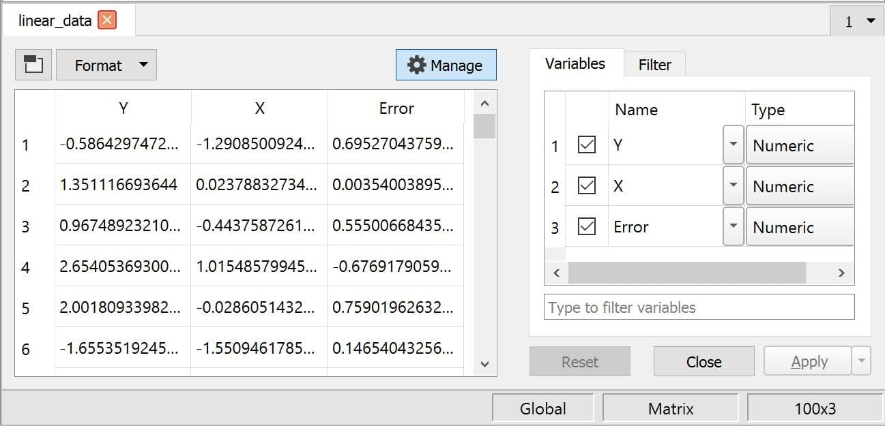
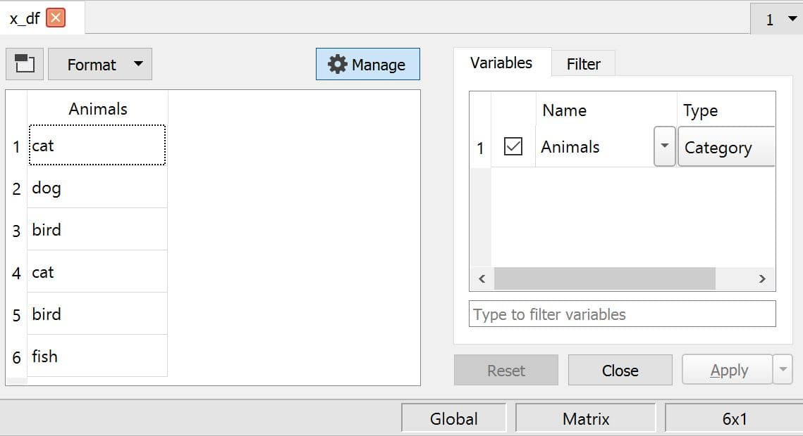

asDF
==============================================

Purpose
----------------

Adds metadata to a matrix or string array and returns a dataframe.

Format
----------------
.. function:: x_meta = asDF(x[, varname_1[, varname_2[ , ...]]])

    :param x: data.
    :type x: NxK matrix or string array

    :param ...: Optional arguments, comma separated list of variable names.
    :type  ...: string

    :return x_meta: data.
    :rtype x_meta: NxK dataframe

Examples
----------------

Example 1
+++++++++

::

  // Randomly generate linear data
  nobs = 100;
  x_t = rndn(nobs, 1);
  e_t = rndn(nobs, 1);
  y_t = 1.3 + 2*x_t + e_t;

  // Convert to a dataframe
  // and name the variable `Animals`
  linear_data = asDF(y_t~x_t~e_t, "Y", "X", "Error");

After the above code, ``linear_data`` is a dataframe with three numeric variables named ``Y``, ``X``, and ``Error``:

Example 2
+++++++++++

::

  // Create string array of data
  string x_sa = {"cat", "dog", "bird", "cat", "bird", "fish"};

  // Convert to a dataframe
  // and name the variable `Animals`
  x_df = asDF(x_sa, "Animals");

After the above code, ``x_df`` is a dataframe with one categorical variable named ``Animals``:

Remarks
--------------

.. seealso:: Functions :func:`asMatrix`, :func:`asDate`, :func:`setcolnames`, :func:`setcoltypes`
