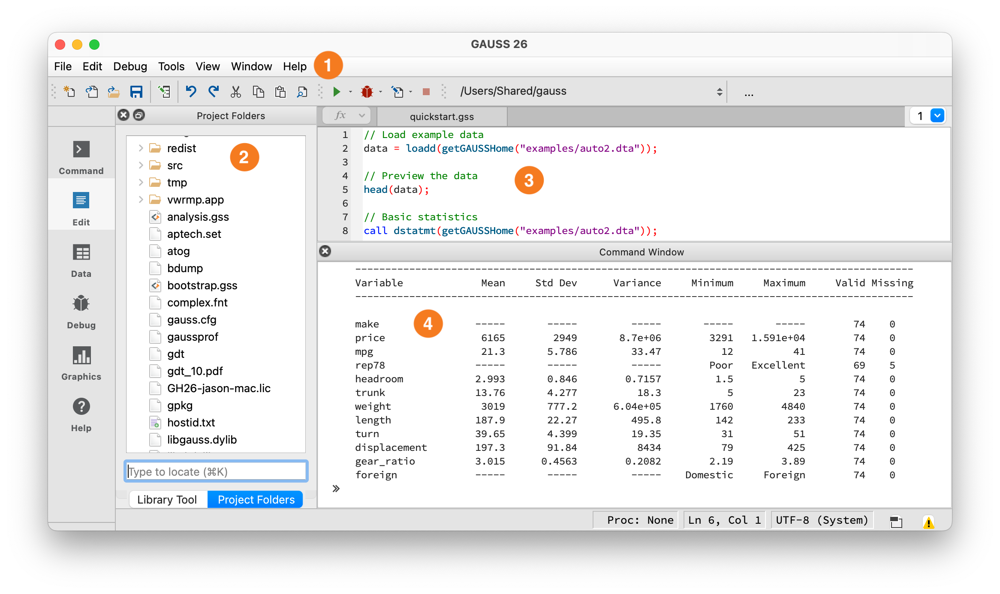

Introduction to GAUSS for R Users
=================================

This guide assumes you know R and shows you how to do the same things in GAUSS.

.. note::

    This guide is written for GAUSS 26.

How GAUSS Differs from R
-------------------------

- **Core statistics are built in**: OLS, GLM, quantile regression, optimization, plotting, and file I/O ship with base GAUSS. No ``install.packages()``, no dependency conflicts. Time series methods (ARIMA, VAR, GARCH) are available as add-ons.
- **Dataframes are matrices**: Named columns and typed variables, but you can do matrix algebra on them directly -- no ``as.matrix()`` conversion step. String columns are stored as integers with a lookup table, so they participate in matrix operations too.
- **Columns are variables**: Statistical functions operate on columns by default. R's ``colMeans(X)`` is ``meanc(X)``, ``apply(X, 2, sd)`` is ``stdc(X)``, ``colSums(X)`` is ``sumc(X)``.
- **Results come back in structures**: Estimation output is a structure with named members (``out.b``, ``out.stderr``), similar to R's named lists.

**Where to type code:**

         folders on the left, and command output below.

   The GAUSS IDE workspace.

① **Toolbar** — Shows your current working directory and the **Run button** (green arrow). Click it or press F5 to execute. ② **Project Folders** — File browser, similar to RStudio's Files pane. ③ **Editor** — Write programs here, similar to RStudio's Source pane. ④ **Command Window** — Output appears here, similar to the R Console. You can also type single lines at the ``>>`` prompt.

**Debugging:** Errors appear in the Output window with a line number -- click it to jump to the error. Use the Variables panel (View > Variables) to inspect values at runtime. You can set breakpoints by clicking in the left margin of the editor, then step through code with the Debug menu. For quick debugging, insert ``print varname;`` statements.

**Inspecting structures:** To see what fields an output structure contains, use ``print`` -- for example, ``print out;`` displays all members and their values. To see just the field names, check the structure definition in the Command Reference (press F1 on the function name).

Key Syntax Differences
----------------------

+-------------------+---------------------------+---------------------------+
| Feature           | R                         | GAUSS                     |
+===================+===========================+===========================+
| Indexing          | 1-based                   | 1-based (same)            |
+-------------------+---------------------------+---------------------------+
| Assignment        | ``<-`` or ``=``           | ``=`` only                |
+-------------------+---------------------------+---------------------------+
| Matrix delimiter  | ``matrix(c(...))``        | ``{ }``                   |
+-------------------+---------------------------+---------------------------+
| String quotes     | ``" "`` or ``' '``        | ``" "`` only              |
+-------------------+---------------------------+---------------------------+
| Statement end     | Optional ``;``            | Required ``;``            |
+-------------------+---------------------------+---------------------------+
| All rows/cols     | leave blank or ``,``      | ``.``                     |
+-------------------+---------------------------+---------------------------+
| String concat     | ``paste()``               | ``$+``                    |
+-------------------+---------------------------+---------------------------+
| Pipe              | ``%>%`` or ``|>``         | None (use intermediate    |
|                   |                           | variables)                |
+-------------------+---------------------------+---------------------------+

Operators
---------

**Arithmetic operators:**

.. code-block:: r

    # R
    A %*% B       # Matrix multiplication
    A * B         # Element-wise multiplication
    t(A)          # Transpose

::

    // GAUSS
    A * B;        // Matrix multiplication (R uses %*%)
    A .* B;       // Element-wise multiplication (R uses *)
    A';           // Transpose

.. warning::

    **Operators are reversed!** R's ``*`` is element-wise; GAUSS's ``*`` is matrix multiplication. R's ``%*%`` is matrix multiply; GAUSS uses plain ``*``. This will produce wrong results silently if you forget.

**GAUSS has two forms of comparison operators.** Without a dot, ``A > 0`` returns a scalar -- like R's ``all(A > 0)``. With a dot, ``A .> 0`` returns an element-wise result -- like R's ``A > 0``:

.. code-block:: r

    # R
    A > 0         # Element-wise comparison
    A == B        # Element-wise equality
    A != B        # Element-wise not-equal
    A & B         # Element-wise AND
    A | B         # Element-wise OR

::

    // GAUSS
    A .> 0;       // Element-wise comparison (like R's A > 0)
    A .== B;      // Element-wise equality
    A .!= B;      // Element-wise not-equal (.ne also works)
    A .and B;     // Element-wise AND
    A .or B;      // Element-wise OR

.. warning::

    **Two forms of comparison.** ``A > 0`` returns a scalar (1 if all elements satisfy the condition) -- equivalent to R's ``all(A > 0)``. ``A .> 0`` returns an element-wise vector -- equivalent to R's ``A > 0``. Both forms exist for all comparison operators: ``>``/``.>``, ``<``/``.<``, ``>=``/``.>=``, ``<=``/``.<=``, ``==``/``.==``, ``!=``/``.!=``.

.. warning::

    **R's ``|`` is OR. GAUSS's ``|`` is vertical concatenation.** Writing ``condition1 | condition2`` in GAUSS does NOT give you logical OR -- it stacks the two vectors vertically. Use ``.or`` for element-wise OR and ``.and`` for element-wise AND. This will silently produce wrong results, not an error.

Concatenation
-------------

.. code-block:: r

    # R
    cbind(A, B)       # Horizontal (column bind)
    rbind(A, B)       # Vertical (row bind)
    paste(a, b)       # String concatenation

::

    // GAUSS
    A ~ B;            // Horizontal concatenation (tilde)
    A | B;            // Vertical concatenation (pipe)
    a $+ b;           // String concatenation

For string arrays, use ``$~`` (horizontal) and ``$|`` (vertical): ``"Domestic" $| "Foreign"`` creates a 2x1 string array.

.. note::

    Most examples below use the ``auto2`` dataset bundled with GAUSS. To run them, load it first:

    ::

       auto2 = loadd(getGAUSSHome("examples/auto2.dta"));

Data Frames
-----------

R's ``data.frame`` and GAUSS dataframes are similar -- tabular data with named columns of different types.

**Creating:**

.. code-block:: r

    # R
    df <- data.frame(
        name = c("Alice", "Bob", "Charlie"),
        age = c(25, 30, 35),
        score = c(85.5, 92.0, 78.5)
    )

::

    // GAUSS
    name = "Alice" $| "Bob" $| "Charlie";
    age = { 25, 30, 35 };
    score = { 85.5, 92.0, 78.5 };

    // Build a dataframe by concatenating single-column dataframes
    df = asDF(name, "name") ~ asDF(age, "age") ~ asDF(score, "score");

**Loading data:** GAUSS's :func:`loadd` reads CSV, Excel, Stata, SAS, SPSS, and HDF5 files -- see `Data Import/Export`_ below.

**Viewing:**

.. code-block:: r

    # R
    head(df)
    str(df)
    names(df)
    nrow(df); ncol(df)

::

    // GAUSS
    head(df);                    // First 5 rows (same as R)
    print df[1:6, .];           // First 6 rows (manual)
    print rows(df) cols(df);    // Dimensions
    print getcolnames(df)';     // Column names (transposed for horizontal display)

:func:`getGAUSSHome` returns the path to GAUSS's installation directory. Use it to access bundled datasets: ``loadd(getGAUSSHome("examples/auto2.dta"))``.

Column and Row Selection
------------------------

.. code-block:: r

    # R
    df$price              # Column by name
    df[, "price"]         # Column by name
    df[, 3]               # Column by position
    df[, c("a", "b")]     # Multiple columns

::

    // GAUSS
    df[., "price"];       // Column by name (dot = all rows)
    df[., "price"];       // Same
    df[., 3];             // Column by position
    df[., "a" "b"];       // Multiple columns (space-separated names)

.. code-block:: r

    # R
    df[1:5, ]                 # First 5 rows
    df[df$age > 30, ]         # Filter by condition
    df[c(1, 3, 5), ]          # Specific rows

::

    // GAUSS
    df[1:5, .];                          // First 5 rows
    selif(df, df[., "age"] .> 30);       // Filter by condition (use selif, not brackets)
    df[1|3|5, .];                        // Specific rows (| concatenates index values)

.. warning::

    **GAUSS does not support boolean indexing in brackets.** In R, ``df[condition, ]`` filters rows using a logical vector. In GAUSS, you must use :func:`selif`: ``selif(df, condition)``. Passing a boolean vector to brackets will not filter -- it will try to use the 0s and 1s as row numbers.

**Key difference:** R uses blank or ``,`` for "all", GAUSS uses ``.`` (dot). R's ``df$col`` becomes ``df[., "col"]``.

Data Manipulation
-----------------

**No pipes -- use intermediate variables.** R users chain operations with ``%>%`` or ``|>``. GAUSS has no pipe operator. Store intermediate results in variables:

.. code-block:: r

    # R (tidyverse)
    result <- auto2 %>%
        filter(foreign == 0) %>%
        mutate(price_k = price / 1000) %>%
        arrange(mpg) %>%
        select(mpg, price_k, weight)

::

    // GAUSS -- same workflow, intermediate variables
    domestic = selif(auto2, auto2[., "foreign"] .== 0);
    domestic = dfaddcol(domestic, "price_k", domestic[., "price"] ./ 1000);
    domestic = sortc(domestic, "mpg");
    result = domestic[., "mpg" "price_k" "weight"];

**Tidyverse verb mapping:**

.. list-table::
    :widths: auto
    :header-rows: 1

    * - R (dplyr)
      - GAUSS
    * - ``filter(df, x > 5)``
      - ``selif(df, df[., "x"] .> 5)``
    * - ``select(df, a, b)``
      - ``df[., "a" "b"]``
    * - ``mutate(df, c = a + b)``
      - ``dfaddcol(df, "c", sumr(df[., "a" "b"]))`` (``sumr`` = row-wise sum)
    * - ``arrange(df, x)``
      - ``sortc(df, "x")``
    * - ``group_by + summarize``
      - ``aggregate(df, "mean", "group")``
    * - ``bind_rows(a, b)``
      - ``a | b``
    * - ``bind_cols(a, b)``
      - ``a ~ b``

Data Import/Export
------------------

.. code-block:: r

    # R
    df <- read.csv("file.csv")
    df <- haven::read_dta("file.dta")
    df <- haven::read_sas("file.sas7bdat")
    write.csv(df, "output.csv")

::

    // GAUSS - one function reads everything
    data = loadd("file.csv");
    data = loadd("file.dta");               // Stata
    data = loadd("file.sas7bdat");           // SAS
    data = loadd("file.xlsx");               // Excel

    // Load specific variables with a formula string
    data = loadd("auto2.dta", "mpg + rep78 + price");

    // Load all variables except one
    data = loadd("auto2.dta", ". -rep78");

    // Export
    saved(data, "output.csv");
    saved(data, "output.xlsx");

**Formula string quick reference:** GAUSS uses formula strings in several contexts with different syntax:

.. list-table::
    :widths: auto
    :header-rows: 1

    * - Context
      - Example
      - Separator
    * - :func:`loadd` (loading)
      - ``"mpg + weight + price"``
      - ``+`` lists variables
    * - :func:`olsmt` (models)
      - ``"price ~ mpg + weight"``
      - ``~`` separates y from X
    * - Bracket indexing
      - ``auto2[., "mpg" "wt"]``
      - Space separates names
    * - Type overrides
      - ``"date($Date) + cat(x)"``
      - Keywords wrap variable names

.. note::

    GAUSS formula strings are **quoted strings** (``"y ~ x1 + x2"``), not bare expressions like R formulas (``y ~ x1 + x2``). The ``~`` separator works the same way in model formulas, but ``+`` in :func:`loadd` means "include this variable," not "add to model."

Missing Values
--------------

R uses ``NA``; GAUSS uses ``.`` (dot).

.. code-block:: r

    # R
    is.na(x)              # Element-wise check
    any(is.na(x))         # Any missing?
    na.omit(df)           # Drop rows with any NA
    x[!is.na(x)]          # Keep non-missing
    x[is.na(x)] <- 0      # Replace NA with 0

::

    // GAUSS
    x .== miss();     // Element-wise check (returns 1/0 vector)
    ismiss(x);            // Any missing? (returns scalar 1 or 0)
    packr(df);            // Drop rows with any missing value
    selif(x, x .!= miss());  // Keep non-missing
    missrv(x, 0);         // Replace missing with 0

.. warning::

    **ismiss is NOT element-wise.** R's ``is.na(x)`` returns a vector. GAUSS's ``ismiss(x)`` returns a **scalar** (1 if any element is missing, 0 otherwise). For element-wise missing detection, use ``x .== miss()``.

Statistics
----------

.. code-block:: r

    # R
    mean(x)
    sd(x)
    sum(x)
    min(x); max(x)
    median(x)
    var(x)
    cor(x, y)

::

    // GAUSS
    meanc(x);     // Column mean (the 'c' suffix = column-wise)
    stdc(x);      // Column std dev
    sumc(x);      // Column sum
    minc(x);      // Column min
    maxc(x);      // Column max
    median(x);    // Median
    stdc(x)^2;    // Column variance (scalar, like R's var(x) for a vector)
    vcx(x);       // Full variance-covariance matrix (like R's cov(X) for a matrix)

**Correlation:**

.. code-block:: r

    # R
    cor(x, y)             # Scalar correlation
    cor(X)                # Correlation matrix of all columns

::

    // GAUSS
    corrx(x ~ y);         // 2x2 correlation matrix (~ is horizontal concat here, not a formula)
    corrx(X);             // Full correlation matrix of all columns

.. note::

    Unlike R's ``cor(x, y)`` which returns a scalar, :func:`corrx` always returns a matrix. To get a single correlation coefficient: ``corrx(x ~ y)[1, 2]``.

Linear Regression
-----------------

.. code-block:: r

    # R
    model <- lm(price ~ mpg + weight, data = auto2)
    summary(model)

::

    // GAUSS - print formatted summary (like summary(model) in R)
    call olsmt(auto2, "price ~ mpg + weight");

.. tip::

    Use ``call olsmt(...)`` (with ``call``) to print a formatted summary table to the screen without saving results to a variable. This is the GAUSS equivalent of ``summary(lm(...))``. The ``call`` keyword discards return values.

**Accessing results:**

.. code-block:: r

    # R
    coef(model)
    summary(model)$coefficients[, "Std. Error"]
    summary(model)$r.squared
    residuals(model)
    vcov(model)

::

    // GAUSS
    struct olsmtOut out;
    out = olsmt(auto2, "price ~ mpg + weight");

    print out.b;          // Coefficient estimates (like coef(model))
    print out.stderr;     // Standard errors
    print out.rsq;        // R-squared
    print out.resid;      // Residuals
    print out.vc;         // Variance-covariance of estimates (like vcov(model))

Key :class:`olsmtOut` members: ``b`` (coefficients), ``stderr`` (standard errors), ``vc`` (variance-covariance matrix), ``rsq`` (R-squared), ``resid`` (residuals), ``dwstat`` (Durbin-Watson), ``sigma`` (residual std dev), ``stb`` (standardized coefficients). To compute t-statistics and p-values: ``t = out.b ./ out.stderr``. See the :func:`olsmt` reference for the full list.

For robust or clustered standard errors, pass an :class:`olsmtControl` structure -- see the :func:`olsmt` reference for details.

Logistic regression (GLM):

.. code-block:: r

    # R
    model <- glm(admit ~ gre + gpa + rank, data = df, family = binomial)

::

    // GAUSS
    struct glmOut out;
    out = glm(data, "admit ~ gre + gpa + rank", "binomial");

Quantile regression:

.. code-block:: r

    # R
    library(quantreg)
    rq(y ~ x1 + x2, data = df, tau = c(0.25, 0.5, 0.75))

::

    // GAUSS (no package install needed)
    struct qfitOut out;
    out = quantileFit(data, "y ~ x1 + x2", 0.25 | 0.5 | 0.75);  // | builds a vector

Plotting
--------

R users expect rich plotting. GAUSS has a full graphics library:

.. code-block:: r

    # R (base)
    plot(x, y)
    hist(x, breaks = 20)
    boxplot(value ~ group, data = df)

    # R (ggplot2)
    ggplot(df, aes(x, y)) + geom_point() + labs(title = "Title")

::

    // GAUSS
    plotXY(x, y);
    plotScatter(x, y);
    plotHist(x, 20);
    plotBox(data, "value ~ group");
    plotBar(labels, heights);
    plotSurface(x, y, z);

**Setting titles, labels, and legends** uses a :class:`plotControl` structure. Think of it as GAUSS's equivalent of ggplot's ``+ labs() + theme()``, but configured before the plot call:

::

    // Create a plot with title, labels, and legend
    struct plotControl myPlot;
    myPlot = plotGetDefaults("scatter");

    plotSetTitle(&myPlot, "MPG vs Weight");
    plotSetXLabel(&myPlot, "Weight (lbs)");
    plotSetYLabel(&myPlot, "Miles per gallon");
    plotSetLegend(&myPlot, "Domestic" $| "Foreign");

    plotScatter(myPlot, auto2[., "weight"], auto2[., "mpg"]);

**Subplots and saving:**

.. code-block:: r

    # R
    par(mfrow = c(2, 1))   # 2 rows, 1 column
    ggsave("plot.png")

::

    // GAUSS
    plotLayout(2, 1, 1);   // 2 rows, 1 col, position 1
    plotSave("plot.png");

Linear Algebra
--------------

.. code-block:: r

    # R
    solve(A)          # Inverse
    det(A)            # Determinant
    eigen(A)          # Eigenvalues and vectors
    svd(A)            # Singular value decomposition
    chol(A)           # Cholesky decomposition
    qr.solve(A, b)    # QR-based solve
    solve(A, b)       # Solve Ax = b

::

    // GAUSS
    inv(A);
    invpd(A);             // Inverse (positive definite, faster)
    det(A);
    eig(A);               // Eigenvalues only
    { val, vec } = eigv(A);  // Eigenvalues and vectors
    { u, s, v } = svdcusv(A);
    chol(A);
    olsqr(b, A);          // QR-based solve (note: argument order is reversed from R)
    b / A;                // Solve Ax = b

.. warning::

    **eigv return order differs from R.** R's ``eigen(A)`` returns ``$vectors`` then ``$values``. GAUSS's ``{ val, vec } = eigv(A)`` returns eigenvalues first, then eigenvectors. Swapping these produces wrong results silently.

.. warning::

    **``/`` is matrix division, not element-wise division.** ``b / A`` solves the system ``Ax = b``. For element-wise division, use ``./``. R's ``/`` is always element-wise; GAUSS's ``/`` is not.

Optimization
------------

R users doing custom MLE use ``optim()``. GAUSS includes unconstrained and constrained optimization in the base package:

.. list-table::
    :widths: auto
    :header-rows: 1

    * - R
      - GAUSS
    * - ``optim(par, fn)``
      - ``minimize(&fn, par)``
    * - ``optim(..., method="L-BFGS-B", lower=..., upper=...)``
      - ``sqpSolve(&fn, par)``
    * - ``nleqslv(par, fn)``
      - ``eqSolve(&fn, par)``

**Key difference:** R uses anonymous functions or named functions passed directly. GAUSS uses the ``&`` operator to pass a *pointer* to a named procedure. The ``&`` tells GAUSS to pass the procedure itself, not its result, so the optimizer can call it repeatedly with different parameter values:

.. code-block:: r

    # R
    my_obj <- function(beta) {
        resid <- Y - X %*% beta
        return(sum(resid^2))
    }
    result <- optim(x0, my_obj)

::

    // GAUSS -- named procedure; extra data passed as arguments
    proc (1) = myObj(beta, Y, X);
        local resid;
        resid = Y - X * beta;
        retp(resid'resid);    // resid' * resid = sum of squared residuals
    endp;

    struct minimizeOut out;
    out = minimize(&myObj, x0, Y, X);

For maximum likelihood estimation, see :func:`maxlikmt`, which provides a full MLE framework with standard errors, constraints, and convergence diagnostics.

Functions and Procedures
------------------------

.. code-block:: r

    # R
    my_func <- function(x, y) {
        result <- x + y
        return(result)
    }

::

    // GAUSS
    proc (1) = my_func(x, y);
        local result;
        result = x + y;
        retp(result);
    endp;

**Key differences from R:**

- ``proc (n) =`` declares the number of return values
- ``local`` declares variables scoped to this procedure (required -- see warning below)
- ``retp()`` returns values
- ``endp`` ends the procedure
- No default argument values. All arguments are positional.

**Multiple outputs:**

.. code-block:: r

    # R
    my_func <- function(x) list(a = x + 1, b = x - 1)
    result <- my_func(5)
    result$a; result$b

::

    // GAUSS
    proc (2) = my_func(x);
        local a, b;
        a = x + 1;
        b = x - 1;
        retp(a, b);
    endp;

    { result_a, result_b } = my_func(5);

.. warning::

    **Variables are global by default.** In R, function variables are automatically local. In GAUSS, you must declare them with ``local`` inside ``proc`` or they become globals that persist after the procedure returns. Forgetting ``local`` creates hard-to-find bugs where procedures silently read or modify variables from the calling scope.

Control Flow
------------

.. code-block:: r

    # R
    for (i in 1:10) {
        print(i)
    }

    if (x > 0) {
        print("positive")
    } else if (x < 0) {
        print("negative")
    } else {
        print("zero")
    }

    while (x > 0) {
        x <- x - 1
    }

::

    // GAUSS
    for i (1, 10, 1);
        print i;
    endfor;

    if x > 0;
        print "positive";
    elseif x < 0;
        print "negative";
    else;
        print "zero";
    endif;

    do while x > 0;
        x = x - 1;
    endo;

**Note:** GAUSS requires semicolons after control statements (``if``, ``for``, ``else``, etc.). Inside a ``proc``, remember to declare loop variables with ``local`` (see the warning above) or they become globals: ``local i; for i (1, 10, 1); ... endfor;``

Common Function Translations
-----------------------------

.. list-table::
    :widths: auto
    :header-rows: 1

    * - Description
      - R
      - GAUSS
    * - Natural log
      - ``log(x)``
      - ``ln(x)``
    * - Log base 10
      - ``log10(x)``
      - ``log(x)``
    * - Column mean
      - ``mean(x)``
      - ``meanc(x)``
    * - Row mean
      - ``rowMeans(X)``
      - ``meanr(X)``
    * - Column sum
      - ``sum(x)``
      - ``sumc(x)``
    * - Cumulative sum
      - ``cumsum(x)``
      - ``cumsumc(x)``
    * - Sort by column
      - ``df[order(df$x), ]``
      - ``sortc(df, "x")``
    * - Find indices
      - ``which(x > 0)``
      - ``findIdx(x .> 0)``
    * - Filter rows
      - ``df[condition, ]``
      - ``selif(df, condition)``
    * - Remove missing rows
      - ``na.omit(df)``
      - ``packr(df)``
    * - Replace missing
      - ``x[is.na(x)] <- 0``
      - ``missrv(x, 0)``
    * - Check NaN (any)
      - ``any(is.na(x))``
      - ``ismiss(x)``
    * - Check NaN (element)
      - ``is.na(x)``
      - ``x .== miss(1,1)``
    * - Flip rows
      - ``rev(x)``
      - ``rev(x)``
    * - Create diagonal matrix
      - ``diag(v)``
      - ``diagmat(v)``
    * - Full SVD
      - ``svd(A)``
      - ``{ u,s,v } = svdcusv(A)``
    * - Number to string
      - ``as.character(x)``
      - ``ntos(x)``
    * - String compare
      - ``a == b``
      - ``a $== b``
    * - Formatted output
      - ``sprintf(fmt, x)``
      - ``sprintf(fmt, x)``
    * - Random uniform
      - ``runif(n)``
      - ``rndu(n, 1)``
    * - Random normal
      - ``rnorm(n)``
      - ``rndn(n, 1)``
    * - Set seed
      - ``set.seed(42)``
      - ``rndseed 42``
    * - Print
      - ``print(x)``
      - ``print x;``
    * - Comment
      - ``# comment``
      - ``// comment``

.. warning::

    **log vs ln**: In R, ``log`` is the natural logarithm. In GAUSS, ``log`` is base 10 and ``ln`` is natural. This will silently give wrong results if you don't catch it.

R Package to GAUSS Mapping
---------------------------

R assembles workflows from packages. GAUSS includes most of this in the base installation:

.. list-table::
    :widths: auto
    :header-rows: 1

    * - R Package
      - GAUSS Equivalent
    * - ``stats`` (lm, glm, optim)
      - Base GAUSS (``olsmt``, ``glm``, ``minimize``)
    * - ``quantreg``
      - Base GAUSS (``quantileFit``)
    * - ``sandwich`` / ``lmtest``
      - Base GAUSS (``olsmtControl.cov``)
    * - ``haven`` / ``foreign``
      - Base GAUSS (``loadd`` reads Stata/SAS/SPSS)
    * - ``ggplot2``
      - Base GAUSS (``plotXY``, ``plotControl``)
    * - ``Matrix`` (linear algebra)
      - Base GAUSS (``eigv``, ``svdcusv``, ``chol``)
    * - ``vars`` / ``forecast``
      - TSMT add-on
    * - ``rugarch`` / ``rmgarch``
      - TSMT add-on
    * - ``urca`` (unit root, cointegration)
      - TSMT add-on

**Time series users:** If your work involves ARIMA, VAR, GARCH, impulse response functions, or forecasting, you will use the **TSMT** add-on. Key functions: :func:`arimaFit`, :func:`svarFit` (structural VAR), :func:`varmaFit`, :func:`varmaPredict`. For maximum likelihood estimation, see :func:`maxlikmt`. See the `time series blog <https://www.aptech.com/blog/category/time-series/>`__ for complete worked examples.

Common Gotchas
--------------

1. **Semicolons are required.** Every statement must end with ``;``

2. **Assignment uses ``=`` not ``<-``.** GAUSS does not support ``<-``.

3. **Dot not colon for "all".** "All rows" is ``df[., 1]`` not ``df[, 1]``. But ``:`` works for ranges: ``df[1:5, .]``.

4. **String quotes.** Only double quotes ``"string"`` work.

5. **No piping.** No ``%>%`` or ``|>`` -- use intermediate variables or nested calls.

6. **The ``call`` keyword.** Use ``call functionName(...)`` to run a function and discard its return value. This is the GAUSS equivalent of running ``summary(lm(...))`` in R without assigning it.

For operator gotchas (``*`` vs ``.*``, ``|`` vs ``.or``, dotted comparisons, ``log`` vs ``ln``), variable scoping (``local``), boolean indexing (``selif``), and procedure ordering, see the inline warnings throughout this guide.

Putting It Together
-------------------

Here is a complete, runnable example that loads data, filters it, plots it, runs a regression, and prints the results. Running this prints the OLS summary to the Output window and opens a scatter plot.

::

    // Load the auto2 dataset bundled with GAUSS
    auto2 = loadd(getGAUSSHome("examples/auto2.dta"));

    // Keep only domestic cars (foreign == 0)
    domestic = selif(auto2, auto2[., "foreign"] .== 0);

    // Quick scatter plot with title and labels
    struct plotControl myPlot;
    myPlot = plotGetDefaults("scatter");
    plotSetTitle(&myPlot, "Weight vs MPG (Domestic Cars)");
    plotSetXLabel(&myPlot, "Weight (lbs)");
    plotSetYLabel(&myPlot, "Miles per gallon");
    plotScatter(myPlot, domestic[., "weight"], domestic[., "mpg"]);

    // Run OLS: how does weight affect fuel efficiency?
    struct olsmtOut out;
    out = olsmt(domestic, "mpg ~ weight");

    // Print key results
    print out.b;         // Coefficient estimates
    print out.stderr;    // Standard errors
    print out.rsq;       // R-squared

What's Next?
------------

- :doc:`../getting-started/quickstart` -- 10-minute introduction to GAUSS basics
- :doc:`../getting-started/running-existing-code` -- If you inherited GAUSS code and need to get it running
- :doc:`../data-management` -- Loading, cleaning, and reshaping data
- :doc:`../textbook-examples/index` -- Worked examples from Greene (*Econometric Analysis*) and Brooks (*Introductory Econometrics for Finance*)
- `Command Reference <../command-reference.html>`__ -- Browse all 1,000+ built-in functions
- `Econometrics blog <https://www.aptech.com/blog/category/econometrics/>`__ -- Fully worked examples covering regression, panel data, hypothesis testing, and more
- `Time series blog <https://www.aptech.com/blog/category/time-series/>`__ -- ARIMA, VAR, GARCH, cointegration, and forecasting tutorials with complete code

.. seealso::

    :func:`loadd`, :func:`olsmt`, :func:`glm`, :func:`quantileFit`, :func:`minimize`, :func:`plotXY`, :func:`packr`, :func:`selif`
