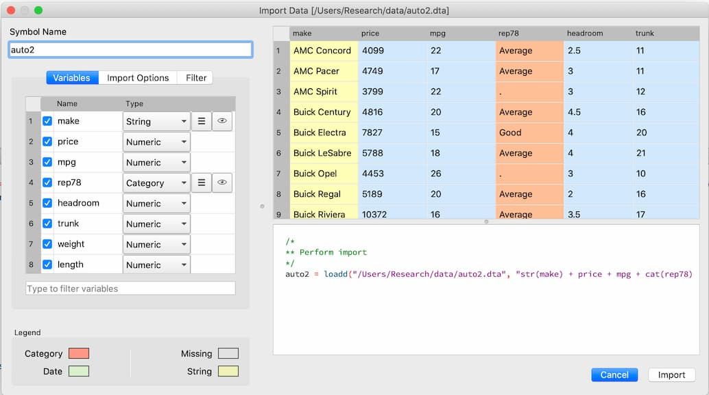
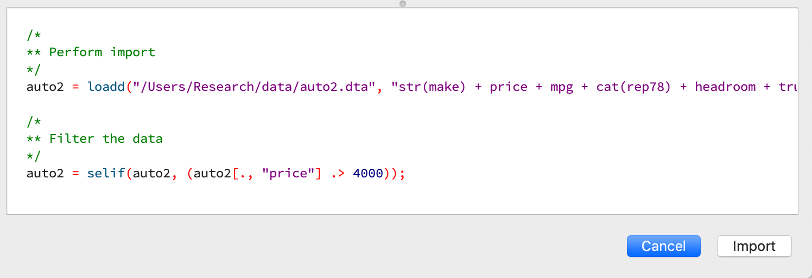
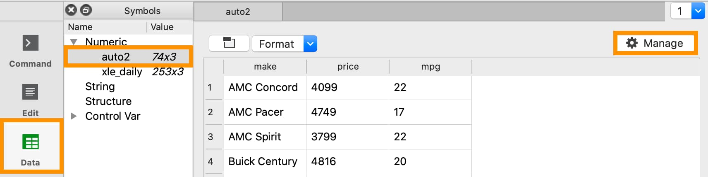
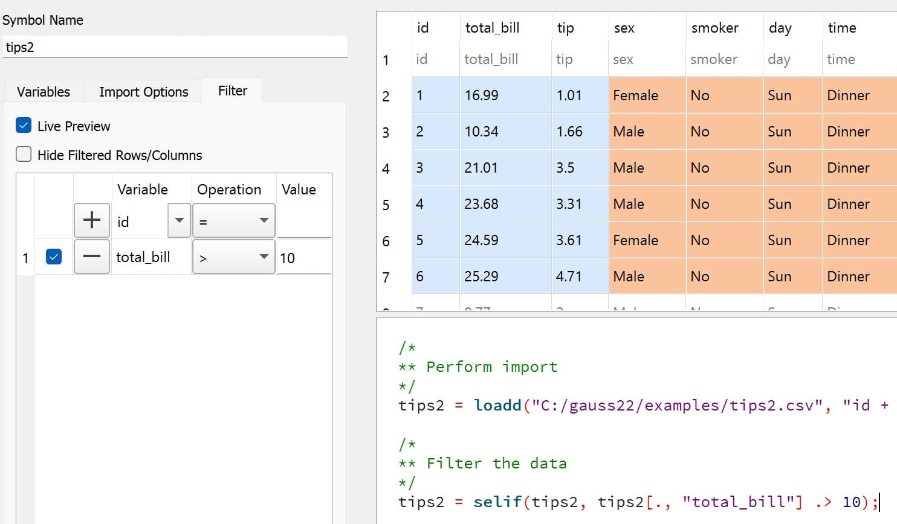
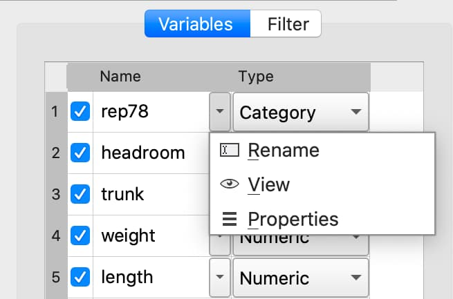
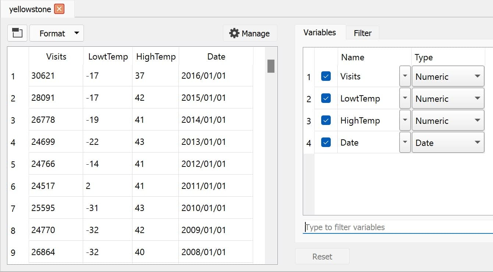
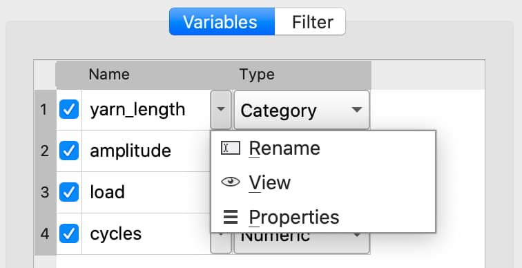
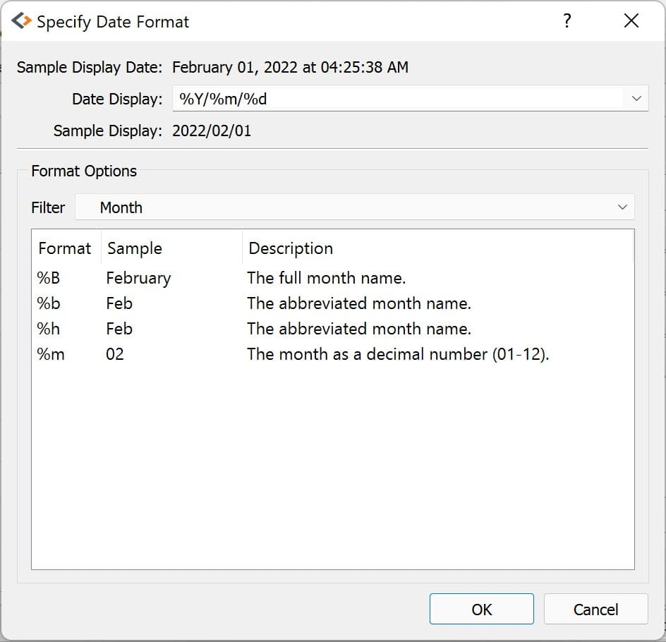

Introduction to GAUSS for Stata Users
=======================================
A practical guide to doing common Stata operations in GAUSS, with references for deeper exploration.

   GAUSS auto-detects variable types, previews your data, and generates reusable code. `Watch the video <https://www.youtube.com/watch?v=0Q0xnbix_Rc>`__ to see a full workflow from data import through ARIMA estimation.

Key Syntax Differences
-----------------------------------------------------------
Before diving in, here are a few syntax rules that apply to all GAUSS code:

**Semicolons are required.** Every GAUSS statement ends with a semicolon ``;``. This includes block-closing keywords like ``endfor;``, ``endif;``, and ``endo;``. Forgetting a semicolon causes a syntax error.

::

    // Every statement ends with a semicolon
    x = 5;
    print x;

**String operators use a** ``$`` **prefix.** GAUSS uses separate operators for string operations. The most common are:

+--------------------+---------------------------------------------+
| Operator           | Purpose                                     |
+====================+=============================================+
| ``$+``             | Concatenate two strings.                    |
+--------------------+---------------------------------------------+
| ``$|``             | Vertically concatenate strings into a list. |
+--------------------+---------------------------------------------+

::

    // Build a file path
    fname = getGAUSSHome() $+ "examples/auto2.dta";

    // Build a list of variable names (like Stata's varlist)
    vars = "mpg" $| "weight" $| "price";

**Multiple datasets in memory.** Unlike Stata, GAUSS does not have a single active dataset. You can load multiple datasets into separate variables and use them all at once.

Data Storage
-----------------------------------------------------------
GAUSS stores data in matrices, string arrays, and dataframes.

+--------------------+-----------------------+--------------------+
| Reference          | GAUSS                 | Stata              |
+====================+=======================+====================+
|Data structure      | Dataframe or matrix   | Data set           |
+--------------------+-----------------------+--------------------+
|Series of data      | Column                | Variable           |
+--------------------+-----------------------+--------------------+
|Single occurrence   | Row                   | Observation        |
+--------------------+-----------------------+--------------------+
|Missing Values      |  `.`                  |     `.`            |
+--------------------+-----------------------+--------------------+

What is a GAUSS dataframe?
++++++++++++++++++++++++++++++
A GAUSS dataframe stores data in rows and columns like a Stata dataset, but carries type information (string, numeric, category, date) that estimation functions use automatically — for example, :func:`olsmt` creates dummy variables for categorical predictors and labels output with variable names.

The key difference from Stata: since GAUSS can hold multiple datasets at once, you always specify *which* dataframe a variable belongs to. Reference variables by name or column number:

::

    // By name (the . means "all rows")
    auto2[., "mpg"];

    // By column number
    auto2[., 4];

    // A specific row
    auto2[4, .];

Data Input/Output
--------------------

Constructing a dataframe from values
+++++++++++++++++++++++++++++++++++++
In Stata, the ``input`` statement is used to build datasets from specified values and column names:

.. code-block:: Stata

  input  x y
  1 2
  3 4
  5 6
  end

In GAUSS, a dataframe can be created from a manually entered matrix and variable names using the :func:`asDF` procedure:

::

  // Create a 3 x 2 matrix
  mat = { 1 2,
          3 4,
          5 6 };

  // Convert matrix to a dataframe
  // and name the first column "X"
  // and the second column "Y"
  df = asDF(mat, "X", "Y");

Reading external datasets
+++++++++++++++++++++++++++++++++++++
In Stata, different commands are needed for different file types — ``use`` for ``.dta``, ``import delimited`` for CSV, ``import excel`` for spreadsheets — and each requires ``clear`` to replace the current dataset:

.. code-block:: Stata

  import delimited "tips2.csv", clear

In GAUSS, the :func:`loadd` procedure handles all common formats (CSV, Excel, Stata, SAS, SPSS, HDF5) with the same syntax, and there is no need to clear — you can have multiple datasets loaded at once:

::

  // Get the full file path to the example dataset
  fname = getGAUSSHome("examples/auto2.dta");

  // Load all variables, auto-detecting their types
  auto2 = loadd(fname);

To load only specific variables, use a formula string with ``+`` to list the ones you want:

::

  // Load only three variables from tips2.csv
  tips2 = loadd(getGAUSSHome("examples/tips2.csv"), "total_bill + tip + sex");

.. note::

   Most examples below use ``auto2`` and ``tips2``. To run them all in order, load both datasets first:

   ::

      auto2 = loadd(getGAUSSHome("examples/auto2.dta"));
      tips2 = loadd(getGAUSSHome("examples/tips2.csv"));

GAUSS auto-detects variable types in most cases. If you need to override the type — most commonly for dates in non-standard formats — use the ``date()``, ``cat()``, or ``str()`` keywords in the formula string:

::

  // Load ‘Date’ as a date variable (the $ indicates it is stored as a string in the file)
  yellowstone = loadd(getGAUSSHome("examples/yellowstone.csv"), "Visits + HighTemp + date($Date)");

**Formula string quick reference:** GAUSS uses formula strings in several contexts. The syntax varies slightly:

+--------------------------+----------------------------+--------------------------------+
| Context                  | Example                    | Separator                      |
+==========================+============================+================================+
| :func:`loadd` (loading)  | ``"mpg + weight + price"`` | ``+`` lists variables          |
+--------------------------+----------------------------+--------------------------------+
| :func:`olsmt` (models)   | ``"price ~ mpg + weight"`` | ``~`` separates y from X       |
+--------------------------+----------------------------+--------------------------------+
| Bracket indexing          | ``auto2[., "mpg" "wt"]``   | Space separates names          |
+--------------------------+----------------------------+--------------------------------+
| Type overrides            | ``"date($Date) + cat(x)"`` | Keywords wrap variable names   |
+--------------------------+----------------------------+--------------------------------+

For a complete guide to formula strings and data import options, see `Programmatic Data Import <https://docs.aptech.com/gauss/data-management/programmatic-import.html#>`_.

Interactively loading data
+++++++++++++++++++++++++++++++++++++
The GAUSS **Data Import** window is a completely interactive environment for loading data and performing preliminary data cleaning. It can be used to:

* Select variables and change types.
* Select observations by range or logic filtering.
* Manage date formats and category labels.
* Preview data.

Like Stata’s menu-driven import, the **Data Import** window auto-generates reusable code:

You can open the **Data Import** window in three ways:

* Select **File > Import Data** from the main GAUSS menu bar.
* From the **Project Folders** window:

    * Double-click on the name of the data file.
    * Right-click the file and select **Import Data**.

A complete `guide to interactively loading data <https://docs.aptech.com/gauss/data-management/data-cleaning.html#interactive-data-cleaning>`_ is available in the GAUSS Data Management guide.

Viewing Data
+++++++++++++++++
View data in GAUSS with the **Data Editor**, a floating **Symbols Editor** (``Ctrl+E``), or by printing to the **Command Window**.

Print rows to screen with indexing (like Stata's ``list``):

::

  // First 5 rows, all columns
  auto2[1:5, .];

  // First 5 rows, one variable
  auto2[1:5, "mpg"];

Or use :func:`head` and :func:`tail` for a quick preview. Pass an optional row count (default is 5):

::

  head(auto2[., "make" "price" "mpg"]);

::

            make            price              mpg
     AMC Concord        4099.0000        22.000000
       AMC Pacer        4749.0000        17.000000
      AMC Spirit        3799.0000        22.000000
   Buick Century        4816.0000        20.000000
   Buick Electra        7827.0000        15.000000

Data Operations
--------------------

Indexing matrices and dataframes
++++++++++++++++++++++++++++++++++++

GAUSS uses square brackets ``[]`` for indexing matrices. The indices are listed row first, then column, with a comma separating the two. For example, to index the element in the 3rd row and 7th column of the matrix ``x``, we use:

::

  x[3, 7];

To select a range of columns or rows with numeric indices, GAUSS uses the `:` operator:

::

  x[3:6, 7];

GAUSS also allows you to use variable names in a dataframe for indexing. As an example, if we want to access the 3rd observation of the variable ``mpg`` in the ``auto2`` dataframe, we use:

::

  auto2[3, "mpg"];

You can also select multiple variables using a space separated list:

::

  auto2[3, "mpg" "make"];

Finally, GAUSS allows you index an entire column or row using the ``.`` operator. For example, to see all observations of the variable ``mpg`` in the ``auto2`` dataframe, we use:

::

  auto2[., "mpg"];

Operations on variables
+++++++++++++++++++++++++
In Stata, ``generate`` and ``replace`` are required to either transform existing variables or generate new variables using existing variables:

.. code-block:: Stata

  replace total_bill = total_bill - 2
  generate new_bill  = total_bill / 2

In GAUSS, use standard operators and assign back to the dataframe column:

::

  // Replace: subtract 2 from total_bill
  tips2[., "total_bill"] = tips2[., "total_bill"] - 2;

To create a new variable (Stata's ``generate``), use :func:`insertcols` to insert a named column at a specific position:

::

  // Generate: create new_bill as total_bill / 2, inserted after total_bill
  new_col = dfname(tips2[., "total_bill"] / 2, "new_bill");
  tips2 = insertcols(tips2, "total_bill", new_col);

Or append to the end with ``~`` (horizontal concatenation):

::

  tips2 = tips2 ~ dfname(tips2[., "total_bill"] / 2, "new_bill");

Matrix operations
+++++++++++++++++++

**Common Matrix Operators**

+--------------------+-----------------------+-------------------------+
|Description         | GAUSS                 | Stata                   |
+====================+=======================+=========================+
|Matrix multiply     | ``z = x * y;``        | ``matrix z = x*y``      |
+--------------------+-----------------------+-------------------------+
|Solve system of     | ``b = y / x;``        | ``matrix b = y*inv(x)`` |
|linear equations    |                       |                         |
+--------------------+-----------------------+-------------------------+
|Kronecker product   | ``z = x .*. y;``      | ``matrix z = x#y``      |
+--------------------+-----------------------+-------------------------+
|Matrix transpose    |  ``z = x';``          | ``matrix z = x’``       |
+--------------------+-----------------------+-------------------------+

When dealing with matrices, it is important to distinguish matrix operations from element-by-element operations. In Stata, element-by-element operations are specified with a colon ``:``. In GAUSS, element-by-element operations are specified by a dot ``.``.

**Element-by-element (ExE) Operators**

+---------------------------------+-----------------------+-------------------------+
|Description                      | GAUSS                 | Stata                   |
+=================================+=======================+=========================+
|Element-by-element multiply      | ``z = x .* y;``       | ``matrix z = x:*y``     |
+---------------------------------+-----------------------+-------------------------+
|Element-by-element divide        | ``z = y ./ x;``       | ``matrix z = y:/x``     |
+---------------------------------+-----------------------+-------------------------+
|Element-by-element exponentiation| ``z = x .^ y;``       | ``matrix z = x:^y``     |
+---------------------------------+-----------------------+-------------------------+
|Element-by-element addition      | ``z = x + y;``        | ``matrix z = x + y``    |
+---------------------------------+-----------------------+-------------------------+
|Element-by-element subtraction   | ``z = x - y;``        | ``matrix z = x - y``    |
+---------------------------------+-----------------------+-------------------------+

For more on matrix operations in GAUSS:

* `GAUSS Basics 3: Intro to Matrices <https://www.aptech.com/blog/gauss-basics-3-introduction-to-matrices/>`_
* `GAUSS Basics 4: Matrix Operations <https://www.aptech.com/blog/gauss-basics-4-matrix-operations/>`_
* `GAUSS Basics 5: Element-by-Element Conformability <https://www.aptech.com/blog/gauss-basics-5-element-by-element-conformability/>`_

Filtering
+++++++++++++++++++
In Stata, data is filtered using an ``if`` clause when using other commands. For example, to keep all observations where ``total_bill`` is greater than 10 we use:

.. code-block:: Stata

  keep if total_bill > 10

In GAUSS this can be done interactively with the **Data Management Tool**:

Programmatically, use :func:`selif`. The ``.>`` operator is an element-by-element comparison — the dot means "compare each row individually":

::

  tips2 = selif(tips2, tips2[., "total_bill"] .> 10);

More information about filtering data can be found in:

* The `Interactive Data Cleaning section <https://docs.aptech.com/gauss/data-management/data-cleaning.html#filtering-observations-of-a-dataframe>`_ of the Data Management Guide.
* `Preparing and Cleaning FRED data in GAUSS <https://www.aptech.com/blog/preparing-and-cleaning-data-fred-data-in-gauss/#filtering-dates>`_
* `Getting to Know Your Data with GAUSS 22 <https://www.aptech.com/blog/getting-to-know-your-data-with-gauss-22/>`_

Selection of data
+++++++++++++++++++
Stata allows you to select, drop, or rename columns using command line keywords:

.. code-block:: Stata

  keep sex total_bill tip

  drop sex

  rename total_bill total_bill_2

In GAUSS, the same can be done using the **Data Management** pane.

To open the **Data Management** pane:

1. Double-click the name of the dataframe in the **Symbols** window on the **Data** page.
2. Click the **Manage** button with the cog icon on the top right of the open **Symbol Editor** window.

Select columns from a dataframe
^^^^^^^^^^^^^^^^^^^^^^^^^^^^^^^^^
Columns can be selected or removed from the dataframe using the **Variables** list.

*  If a variable has a check box next to the name of the variables it is included in the dataframe.
*  To clear the variable from the dataframe clear the check box next to the variable name.

These changes will not be made until you click **Apply**.

Changing variable names
^^^^^^^^^^^^^^^^^^^^^^^^^^^^^^^^^^^^^^^^^^^^^
Variable names can also be changed from the **Variables** list.

1. Double-click the dataframe you want to modify in the **Symbols** pane of the **Data** page.
2. Click the **Manage** button at the top right of the open **Symbol Editor**.
3. Click downward pointing triangle button to the right of the name of the variable name you want to change and select **Rename**.
4. Enter the new name in the **Name** text box.

These changes will not be made until you click **Apply**.

GAUSS also offers programmatic options for selecting data and changing variable names:

::

  // Keep only 'total_bill' 'tip' and 'sex'
  tips2 = tips2[., "total_bill" "tip" "sex"];

  // Drop sex variable
  tips2 = delcols(tips2, "sex");

  // Rename variable 'total_bill' to 'total_bill_2'
  tips2 = dfname(tips2, "total_bill_2", "total_bill");

Sorting
++++++++++++++++
In Stata the ``sort`` command is used for sorting data:

.. code-block:: Stata

  sort sex total_bill

In GAUSS, use :func:`sortc`:

::

  tips2 = sortc(tips2, "sex" $| "total_bill");

Collapsing / aggregating by group
++++++++++++++++++++++++++++++++++++
In Stata, ``collapse`` computes group-level statistics:

.. code-block:: Stata

  collapse (mean) tip (sum) total_bill, by(day)

In GAUSS, use :func:`aggregate`:

::

  // Mean of all numeric columns by 'day'
  tips_mean = aggregate(tips2, "mean", "day");

  // Aggregate by multiple grouping variables
  tips_grp = aggregate(tips2, "max", "day" $| "time");

Supported methods: ``"mean"``, ``"median"``, ``"sum"``, ``"min"``, ``"max"``, ``"sd"``, ``"variance"``, ``"mode"``.

Reshaping: wide to long and long to wide
+++++++++++++++++++++++++++++++++++++++++++
In Stata, ``reshape`` converts between wide and long formats:

.. code-block:: Stata

  reshape long Cars_, i(Years) j(type) string
  reshape wide num_nests, i(region) j(year)

In GAUSS, use :func:`dfLonger` (wide → long) and :func:`dfWider` (long → wide):

::

  // Wide to long
  df_wide = loadd(getGAUSSHome("examples/tiny_car_panel.csv"));
  columns = "Cars_compact" $| "Cars_truck" $| "Cars_SUV";
  df_long = dfLonger(df_wide, columns, "type", "count");

::

  // Long to wide
  df_long = loadd(getGAUSSHome("examples/eagle_nests_long.csv"));
  df_wide = dfWider(df_long, "year", "num_nests");

By-group operations
++++++++++++++++++++++
Stata's ``bysort`` runs commands group by group:

.. code-block:: Stata

  bysort day: summarize tip

In GAUSS, use :func:`aggregate` with a grouping column:

::

  // Mean tip by day (Stata's bysort day: summarize tip)
  tip_by_day = aggregate(tips2[., "day" "tip"], "mean", "day");

Estimation
--------------------

OLS Regression
+++++++++++++++++++
In Stata, linear regression is run using the ``regress`` command:

.. code-block:: Stata

  regress price mpg weight

In GAUSS, OLS is run using :func:`olsmt`. GAUSS estimation functions use **formula strings** to specify models: the ``~`` separates the dependent variable (left) from predictors (right).

Results are stored in a **structure** — GAUSS's equivalent of Stata's ``e()`` results. You declare the structure type before calling the function, then access members with dot notation. The pattern is the same for every estimation function: declare, call, access with dots.

::

    // Load data
    auto2 = loadd(getGAUSSHome("examples/auto2.dta"));

    // Declare output structure (like Stata's e() but typed)
    struct olsmtOut out;

    // Run OLS: price on mpg and weight
    out = olsmt(auto2, "price ~ mpg + weight");

This prints a familiar-looking regression table:

::

    Ordinary Least Squares
    ====================================================================================
    Valid cases:                       74          Dependent variable:             price
    Missing cases:                      0          Deletion method:                 None
    Total SS:                    6.35e+08          Degrees of freedom:                71
    R-squared:                      0.293          Rbar-squared:                   0.273
    Residual SS:                 4.49e+08          Std. err of est:             2.51e+03
    F(2,71):                         14.7          Probability of F:            4.42e-06
    ====================================================================================
                                Standard                    Prob       Lower       Upper
    Variable        Estimate       Error     t-value        >|t|       Bound       Bound
    ------------------------------------------------------------------------------------

    CONSTANT          1946.1        3597     0.54102     0.59019     -5104.1      8996.3
    mpg              -49.512      86.156    -0.57468     0.56732     -218.38      119.35
    weight            1.7466     0.64135      2.7232   0.0081298     0.48951      3.0036
    ====================================================================================

To access individual results programmatically — the equivalent of Stata's ``_b[mpg]`` and ``_se[mpg]`` — use the output structure members:

::

    print out.b;        // Coefficient estimates
    print out.stderr;   // Standard errors
    print out.rsq;      // R-squared

For robust or clustered standard errors (Stata's ``, robust`` and ``, cluster()``), pass an :class:`olsmtControl` structure — see the :func:`olsmt` reference for details.

Logistic Regression
++++++++++++++++++++++
In Stata, logistic regression is run using the ``logit`` command:

.. code-block:: Stata

  logit foreign mpg weight

In GAUSS, this is done using :func:`glm` with the ``"binomial"`` distribution:

::

    struct glmOut gOut;
    gOut = glm(auto2, "foreign ~ mpg + weight", "binomial");

This prints:

::

    Generalized Linear Model
    ===================================================================
    Valid cases:              74           Dependent variable:  foreign
    Degrees of freedom:       71           Distribution        binomial
    Deviance:               54.4           Link function:         logit
    ===================================================================
                                       Standard                    Prob
    Variable               Estimate       Error     z-value        >|z|
    -------------------------------------------------------------------

    CONSTANT                 13.708      4.5187      3.0337   0.0024158
    mpg                    -0.16859    0.091917     -1.8341    0.066637
    weight               -0.0039067   0.0010116     -3.8618  0.00011253
    ===================================================================

Descriptive Statistics
++++++++++++++++++++++++
In Stata, ``summarize`` provides descriptive statistics:

.. code-block:: Stata

  summarize price mpg weight

In GAUSS, this is done using :func:`dstatmt`:

::

    call dstatmt(auto2[., "price" "mpg" "weight"]);

This prints:

::

    ----------------------------------------------------------------------------------------
    Variable        Mean     Std Dev      Variance     Minimum     Maximum     Valid Missing
    ----------------------------------------------------------------------------------------

    price           6165        2949       8.7e+06        3291   1.591e+04        74    0
    mpg             21.3       5.786         33.47          12          41        74    0
    weight          3019       777.2      6.04e+05        1760        4840        74    0

.. seealso:: Functions :func:`olsmt`, :func:`glm`, :func:`quantileFit`, :func:`dstatmt`, :func:`frequency`

For more fully worked estimation examples, see the `Econometrics blog <https://www.aptech.com/blog/category/econometrics/>`__.

Loops and Control Flow
------------------------

Loops
++++++++++++++++
In Stata, loops are written using ``forvalues`` and ``foreach``:

.. code-block:: Stata

  forvalues i = 1/5 {
      display `i'
  }

  foreach var of varlist mpg weight price {
      summarize `var'
  }

In GAUSS, numeric loops use ``for`` and looping over items uses ``for`` with indexing:

::

    // Numeric loop (equivalent of forvalues)
    for i(1, 5, 1);
        print i;
    endfor;

    // Loop over a list of variable names
    vars = "mpg" $| "weight" $| "price";

    for i(1, rows(vars), 1);
        call dstatmt(auto2[., vars[i]]);
    endfor;

GAUSS also supports ``do while`` and ``do until`` loops:

::

    // Do while loop
    j = 1;
    do while j <= 5;
        print j;
        j = j + 1;
    endo;

Conditional Statements
++++++++++++++++++++++++
In Stata, ``if``/``else`` is used for control flow in programs:

.. code-block:: Stata

  if `x' > 10 {
      display "large"
  }
  else {
      display "small"
  }

In GAUSS:

::

    if x > 10;
        print "large";
    else;
        print "small";
    endif;

Writing Procedures
+++++++++++++++++++++
In Stata, reusable code is wrapped in programs or ado-files:

.. code-block:: Stata

  program define demean
      args varname
      quietly summarize `varname'
      replace `varname' = `varname' - r(mean)
  end

In GAUSS, reusable code is written as a **procedure** using ``proc`` and ``endp``. Variables inside a procedure must be declared ``local`` to avoid conflicts with the global workspace:

::

    proc (1) = demean(x);
        local m;
        m = meanc(x);
        retp(x - m);
    endp;

    // Use the procedure
    x_demeaned = demean(auto2[., "price"]);

The ``(1)`` after ``proc`` indicates the procedure returns one value. GAUSS procedures can return multiple values:

::

    proc (2) = meanAndSD(x);
        retp(meanc(x), stdc(x));
    endp;

    // Capture both return values
    { m, s } = meanAndSD(auto2[., "price"]);

To call a procedure that returns nothing (like Stata's ``program`` without ``rclass``), use the ``call`` keyword:

::

    proc (0) = printHeader(title);
        print "==================================";
        print title;
        print "==================================";
    endp;

    call printHeader("My Analysis");

For more on loops, string handling, and general GAUSS programming, see the `Programming blog <https://www.aptech.com/blog/category/programming/>`__.

Date Functionality
--------------------
Creating usable dates from raw data
++++++++++++++++++++++++++++++++++++++
In Stata, dates are imported as strings and must be manually converted and formatted:

.. code-block:: Stata

    generate date_var = date(date, "YMD")
    format date_var %d.

In GAUSS, :func:`loadd` auto-detects common date formats — just use the ``date`` keyword in the formula string:

::

  fname = getGAUSSHome("examples/yellowstone.csv");
  yellowstone = loadd(fname, "Visits + LowTemp + HighTemp + date($Date)");

Creating dates from existing strings
++++++++++++++++++++++++++++++++++++++
The GAUSS :func:`asDate` procedure works similarly to the Stata ``date()`` function and can be used to convert strings to dataframe dates.

For example, suppose we want to convert the string ``"2002-10-01"`` to a date in Stata:

.. code-block:: Stata

  generate date_var = date("2002-10-01", "YMD")

When we do this in Stata the data is displayed in the date numeric format and we have to use the ``format`` command to change the display format:

.. code-block:: Stata

    format date_var %d

In GAUSS, this is done using the :func:`asDate` procedure:

::

  // Convert string date '2002-10-01'
  // to a date variable
  date_var = asDate("2002-10-01");

The :func:`asDate` procedure automatically recognizes dates in the format ``"YYYY-MM-DD HH:MM:SS"``. However, if the date is in a different format, a format string can be used:

::

  // Convert string date '10/01/2002'
  // to a date variable
  date_var = asDate("10/01/2002", "%d/%m/%Y");

Changing the display format
++++++++++++++++++++++++++++++++++++++
Once a date variable has been imported or created, the display format can be specified interactively using the GAUSS **Data Management Tool**.

The **Specify Date Format** dialog is accessed by selecting **Properties** from the variable's dropdown:

If the variable is a date variable, the **Specify Date Format** window will open:

Dates can be managed programmatically using :func:`asDate`:

::

  // Convert 'Date' variable from string variable
  // to date variable
  yellowstone =  asdate(yellowstone, "%b-%d-%Y", "Date");

String Processing
-------------------
GAUSS has string functions similar to those in Stata. Here is a quick reference:

+-----------------------------+-------------------------------+-----------------------------+
| Operation                   | Stata                         | GAUSS                       |
+=============================+===============================+=============================+
| String length               | ``strlen(x)``                 | ``strlen(x)``               |
+-----------------------------+-------------------------------+-----------------------------+
| Find substring position     | ``strpos(x, "abc")``          | ``strindx(x, "abc")``       |
+-----------------------------+-------------------------------+-----------------------------+
| Extract substring           | ``substr(x, 1, 3)``           | ``strsect(x, 1, 3)``        |
+-----------------------------+-------------------------------+-----------------------------+
| Split string                | ``word(x, 1)``                | ``strsplit(x)``              |
+-----------------------------+-------------------------------+-----------------------------+
| Uppercase                   | ``strupper(x)``               | ``upper(x)``                |
+-----------------------------+-------------------------------+-----------------------------+
| Lowercase                   | ``strlower(x)``               | ``lower(x)``                |
+-----------------------------+-------------------------------+-----------------------------+
| String concatenation        | ``x + y``                     | ``x $+ y``                  |
+-----------------------------+-------------------------------+-----------------------------+

For example, to change the case of a string variable:

::

  // Change time variable to uppercase
  tips2[., "time"] = upper(tips2[., "time"]);

  // Change sex variable to lowercase
  tips2[., "sex"] = lower(tips2[., "sex"]);

.. seealso:: Functions :func:`strlen`, :func:`strindx`, :func:`strsect`, :func:`strsplit`, :func:`upper`, :func:`lower`

Missing values
-------------------
Missing values are represented by the same dot notation, ``.``, in both Stata and GAUSS.

This notation can be used for filtering data in Stata:

.. code-block:: Stata

  * Keep missing values
  list if value_x == .

  * Keep non-missing values
  list if value_x != .

In GAUSS, a missing value is represented by ``.``. To filter based on missing values, create a missing value scalar and use element-by-element comparison:

::

  x = { 1,
        .,
        3,
        . };

  // Create a missing value for comparison
  mss = { . };

  // Keep missing values
  x_miss = selif(x, x .== mss);       // Returns: . | .

  // Keep non-missing values
  x_clean = selif(x, x .!= mss);      // Returns: 1 | 3

Counting, removing, and replacing missing values
+++++++++++++++++++++++++++++++++++++++++++++++++++++
Count missing values with :func:`counts` (Stata's ``count if rep78 == .``):

::

  mss = { . };
  counts(auto2[., "rep78"], mss);

The :func:`dstatmt` output also includes ``Valid`` and ``Missing`` columns for each variable.

Remove rows containing missing values with :func:`packr` (drops any row with a missing value) or :func:`delif` (drops rows based on a condition):

::

  a = { 1 .,
        . 4,
        5 6 };

  packr(a);                          // Returns: 5 6 (only complete row)

  mss = { . };
  delif(a, a[., 2] .== mss);        // Returns rows where column 2 is not missing

Replace missing values with :func:`missrv` (like Stata's ``replace a = -999 if a >= .``):

::

  missrv(a, -999);                   // Replaces all missing values with -999

For statistical imputation (mean, median, mode, predictive mean matching, and more), use :func:`impute`.

.. seealso:: `Handling Missing Values <https://www.aptech.com/blog/introduction-to-handling-missing-values/>`_ and the `Data Cleaning guide <https://docs.aptech.com/gauss/data-management/data-cleaning.html#counting-missing-variables>`_.

Merging
----------------
Stata’s ``merge`` works with one dataset in memory and one on disk, creating a ``_merge`` indicator. GAUSS merges two in-memory dataframes using :func:`outerJoin` or :func:`innerJoin`:

+-------------------+-----------------------------------------+---------------------------------------------+
|                   | Stata                                   | GAUSS                                       |
+===================+=========================================+=============================================+
| Function          | ``merge``                               | :func:`outerJoin` / :func:`innerJoin`       |
+-------------------+-----------------------------------------+---------------------------------------------+
| Data source       | Memory + disk file                      | Both in memory                              |
+-------------------+-----------------------------------------+---------------------------------------------+
| Keep all rows     | Default (creates ``_merge`` indicator)  | ``outerJoin`` with ``"full"`` option        |
+-------------------+-----------------------------------------+---------------------------------------------+
| Keep matches only | Not default                             | ``outerJoin`` without ``"full"``, or        |
|                   |                                         | ``innerJoin``                               |
+-------------------+-----------------------------------------+---------------------------------------------+
| Join types        | 1:1, 1:M, M:1, M:M                     | Same                                        |
+-------------------+-----------------------------------------+---------------------------------------------+

In Stata, merging two small datasets requires saving one to disk first:

.. code-block:: Stata

  merge 1:1 ID using df1

In GAUSS, both datasets stay in memory:

::

  // Build two small dataframes
  df1 = asDF("John" $| "Mary" $| "Susan" $| "Connie", "ID")
      ~ asDF(22 | 18 | 34 | 45, "Age");

  df2 = asDF("John" $| "Mary" $| "Susan" $| "Tyler", "ID")
      ~ asDF("Teacher" $| "Surgeon" $| "Developer" $| "Nurse", "Occupation");

  // Full outer join — keep all rows from both dataframes
  df3 = outerJoin(df2, "ID", df1, "ID", "full");

::

      ID       Occupation              Age
    John          Teacher        22.000000
    Mary          Surgeon        18.000000
   Susan        Developer        34.000000
   Tyler            Nurse                .
  Connie                .        45.000000

Omit ``"full"`` to keep only rows that match the left dataframe:

::

  df3 = outerJoin(df2, "ID", df1, "ID");

What's Next?
------------

- `Command Reference <../command-reference.html>`__ — Browse all 1,000+ built-in functions
- :doc:`../data-management` — Loading, cleaning, and reshaping data
- :doc:`../textbook-examples/index` — Worked examples from Greene (*Econometric Analysis*) and Brooks (*Introductory Econometrics for Finance*)
- `Econometrics blog <https://www.aptech.com/blog/category/econometrics/>`__ — Fully worked examples covering regression, panel data, hypothesis testing, and more
- `Time series blog <https://www.aptech.com/blog/category/time-series/>`__ — ARIMA, VAR, GARCH, cointegration, and forecasting tutorials with complete code
- `Panel data blog <https://www.aptech.com/blog/category/panel-data/>`__ — Fixed effects, random effects, and dynamic panel models
- `Programming blog <https://www.aptech.com/blog/category/programming/>`__ — Loops, string handling, data manipulation, and general GAUSS programming
- :func:`saved` — Export data to CSV, Excel, or other formats (Stata's ``export``)
- `User Guide <https://docs.aptech.com/gauss/getting-started/installing-modules.html>`__ — Installing and managing add-on modules (Stata's ``ssc install``)
