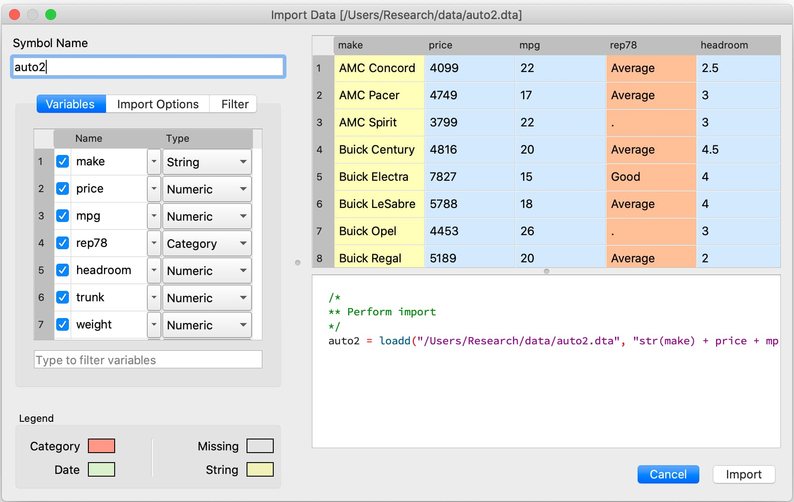
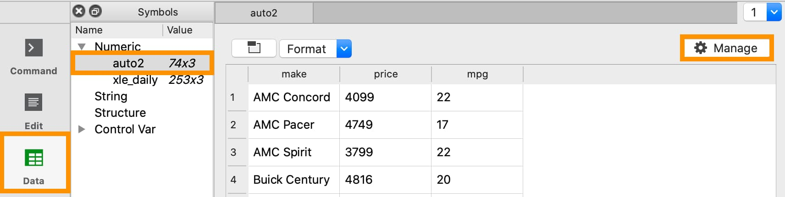

Introduction to GAUSS for Stata Users
=======================================
This page provides a basic overview of how common Stata operations can be implemented in GAUSS. It is not meant to serve as a comprehensive GAUSS guide. However, we do provide references for those who wish to explore topics in greater depth.

Data Storage
-----------------------------------------------------------
GAUSS stores data in matrices, string arrays, and dataframes. One of the key differences between data storage in GAUSS and Stata is that GAUSS allows you to store data from multiple sources simultaneously.

In Stata, people are most familiar with working with a single dataset in memory. Stata does allow you to store multiple datasets in memory using specified dataframes but special commands must be used to switch between frames.

+--------------------+-----------------------+--------------------+
| Reference          | GAUSS                 | Stata              |
+====================+=======================+====================+
|Data structure      | Dataframe or matrix   | Data set           |
+--------------------+-----------------------+--------------------+
|Series of data      | Column                | Variable           |
+--------------------+-----------------------+--------------------+
|Single occurrence   | Row                   | Observation        |
+--------------------+-----------------------+--------------------+
|Missing Values      |  `.`                  |     `.`            |
+--------------------+-----------------------+--------------------+


What is a GAUSS dataframe?
++++++++++++++++++++++++++++++


A GAUSS dataframe is used to store two-dimensional data and allows you to store:

  * Data in rows and columns.
  * Information about the data type and type-related properties.
  * Different variables together, including categorical data, strings, and dates.

Many internal functions are designed to work intelligently with dataframes to use variable names and types for estimation and reporting.

For example, :func:`olsmt` will use the information stored in a dataframe during estimation to:

  * Properly include dummy variables when categorical independent variables are present.
  * Include variable names in output reports.

Variables
^^^^^^^^^^^^^^^^
Each column of a GAUSS dataframe contains a series of data for a single variable. Variables are stored as strings, numbers, categories, or dates.

In Stata, variables are referenced directly by name.

.. code-block:: Stata

  list mpg

In GAUSS, variables can be referenced by indexing with variable name or by column number. However, we must tell GAUSS which dataframe to look for the variable in.

For example, if the variable ``mpg`` is stored in the fourth column of the dataframe ``auto`` we could use either

::

    auto[., "mpg"]

or

::

    auto[., 4]

to reference the variable.

.. note:: The ``.`` indicates to GAUSS that all rows are being indexed. This will be discussed in more detail in the indexing section.

+--------------------+---------------------------------------------+------------------------------------+
| Variable           | Description                                 | Examples                           |
| Type               |                                             |                                    |
+====================+=============================================+====================================+
|String              |The string data type can contain letters,    | Customer names, product names,     |
|                    |numbers, and other characters.               | or book titles.                    |
+--------------------+---------------------------------------------+------------------------------------+
|Number              |Analogous to the data stored in              | Daily temperatures, real GDP,      |
|                    |GAUSS matrices.                              | stock prices.                      |
+--------------------+---------------------------------------------+------------------------------------+
|Categories          |Houses discrete variables that capture       | Marriage status, performance       |
|                    |qualitative data.                            | ratings, transportation modes.     |
+--------------------+---------------------------------------------+------------------------------------+
|Dates               |Houses and displays dates and times.         | Purchase date, shipping date,      |
|                    |                                             | observation date.                  |
+--------------------+---------------------------------------------+------------------------------------+

Observations
^^^^^^^^^^^^^^^^
Each row of a GAUSS dataframe contains simultaneous observations of variables. In time series data or panel data, this may correspond to dates of observations. In cross-sectional data, this may correspond to some other identifier such as identification number, observation number, or name.

Rows of data are indexed by row number. For example, if we want to access the data stored in the fourth row we use

::

  auto[4, .]

Data Input/Output
--------------------

Constructing a dataframe from values
+++++++++++++++++++++++++++++++++++++
In Stata, the ``input`` statement is used to build datasets from specified values and column names:

.. code-block:: Stata

  input  x y
  1 2
  3 4
  5 6
  end

In GAUSS, a dataframe can be created from manually entered matrix and variable names using the :func:`asDF` procedure:

::

  // Create a 3 x 2 matrix
  mat = { 1 2, 3 4, 5 6};

  // Convert matrix to a dataframe
  // and name the first column "X"
  // and the second column "Y"
  df = asDF(mat, "X", "Y");

Reading external dataset
+++++++++++++++++++++++++++++++++++++
GAUSS can directly read and load data from most data formats, including:

  * CSV
  * Excel (XLS, XLSX)
  * HDF 5
  * GAUSS matrices (FMT)
  * GAUSS datasets (DAT)
  * Stata datasets (DTA)
  * SAS datasets (SAS7BDAT, SAS7BCAT)
  * SPSS datasets (SAV)

In Stata, the ``import`` command is used to import non-Stata datasets. Additional information must be provided to specify what type of file is being imported.

.. code-block:: Stata

  import excel "nba_ht_wt.xls", clear

Alternatively, the ``tips2.csv`` dataset is loaded into Stata using the import delimited command

.. code-block:: Stata

  import delimited "tips2.csv", clear

.. note:: The use of the ``clear`` option is necessary in Stata if the data is already loaded into the workspace. In GAUSS, this is not necessary because multiple data sets can be loaded into the work space simultaneously.

In GAUSS, all data files are usually loaded using the :func:`loadd` procedure. For example, consider loading the ``auto2.dta`` dataset:

::

  // Load all variables from the file 'auto2.dta'
  // using their default types
  auto2 = loadd(getGAUSSHome $+ "examples/auto2.dta");

This loads all the variables in the dataset and auto-detects their type.


Sometimes, you may need to specify the type and/or variables that you wish to load. This is done using a `formula string <https://www.aptech.com/resources/tutorials/formula-string-syntax/>`_:

For example, let’s consider loading the ``nba_ht_wt.xls`` file in GAUSS

::

    // Load the file 'nba_ht_wt.xls'
    // using a formula string to select variables
    // and specify variable types
    nba_ht_wt = loadd(getGAUSSHome $+ "examples/nba_ht_wt.xls",
                      "str(Player) + cat(Pos) + Height + Weight + Age + str(School) + date($BDate)");

Similarly, the ``tips2.csv`` data file:

::

    // Load the file 'tips2.csv'
    // using a formula string to select variables
    // and specify variable types
    tips2 = loadd(getGAUSSHome $+ "examples/tips2.csv",
                  "id + total_bill + tip + cat(sex) + cat(smoker) + cat(day) + cat(time) + size");


Formula strings accept a number of operators and keywords which allow you to:

* Specify variable types.
* Perform data transformations.

+--------------------+---------------------------------------------+
|Operator            | Purpose                                     |
+====================+=============================================+
|      `.`           |Represents all variables.                    |
+--------------------+---------------------------------------------+
|      `+`           |Adds a variable.                             |
+--------------------+---------------------------------------------+
|      `-`           |Removes a variable.                          |
+--------------------+---------------------------------------------+
|      `1`           |Represents an intercept term.                |
+--------------------+---------------------------------------------+
|      `*`           |Adds an interaction term and includes both   |
|                    |original variables.                          |
+--------------------+---------------------------------------------+
|      `:`           |Adds an interaction term between two         |
|                    |variables but does not include either        |
|                    |of the original variables.                   |
+--------------------+---------------------------------------------+

+--------------------+---------------------------------------------+
|Keyword             | Purpose                                     |
+====================+=============================================+
|      `cat`         |Load a variable as a categorical column.     |
+--------------------+---------------------------------------------+
|      `date`        |Load a variable as a date column.            |
+--------------------+---------------------------------------------+
|      `str`         |Load a variable as a string column.          |
+--------------------+---------------------------------------------+
|      `$`           |Indicate that a variable is stored in the    |
|                    |file as a string as should be passed to the  |
|                    |keyword or procedure as a string column.     |
+--------------------+---------------------------------------------+

The GAUSS Data Management guide provides a complete guide to `Programmatic Data Import <https://docs.aptech.com/gauss/data-management/programmatic-import.html#>`_.

Interactively loading data
+++++++++++++++++++++++++++++++++++++
The GAUSS **Data Import** window is a completely interactive environment for loading data and performing preliminary data cleaning. It can be used to:

* Select variables and change types.
* Select observation by range or logic filtering.
* Manage date formats and category labels.
* Preview data.

The **Data Import** window offers a data import experience similar to Stata’s menu driven data import. Like Stata, the GAUSS **Data Import** window auto-generates code that can be reused.

.. figure:: ../_static/images/data-import-code-generation.png
    :scale: 50%


You can open the **Data Import** window in three ways:

* Select **File > Import Data** from the main GAUSS menu bar.
* From the **Project Folders** window:

    * Double-click on the name of the data file.
    * Right-click the file and select **Import Data**.

A complete `guide to interactively loading data <https://docs.aptech.com/gauss/data-management/data-cleaning.html#interactive-data-cleaning>`_ is available in the GAUSS Data Management guide.

Viewing Data
+++++++++++++++++
Data can be viewed in GAUSS a number of ways:

* Using the **GAUSS Data Editor**.

* Opening a floating **Symbols Editor** window using `Ctrl+E`.
* Printing data to the **Command Window**.

For a quick preview, portions of a dataframe can be printed directly to screen using indexing. For example, the first five rows the `auto` dataframe can be printed to screen by entering

::

  auto[1:5, .];

This is equivalent to using the ``list`` command in Stata

.. code-block:: Stata

  list 1/5

If we only wanted to view the first five rows of the variable `mpg` from the `auto` dataframe, we would use

::

  auto[1:5, "mpg"];

which is equivalent to

.. code-block:: Stata

  list mpg 1/5

Data Operations
--------------------

Indexing matrices
++++++++++++++++++++++
GAUSS uses square brackets ``[]`` for indexing matrices. The indices are listed row first, then column, with a comma separating the two. For example, to index the element in the 3rd row and 7th column of the matrix `x`, we use:

::

  x[3, 7];

To select a range of columns or rows with numeric indices, GAUSS uses the `:` operator:

::

  x[3:6, 7];

GAUSS also allows you to use variable names in a dataframe for indexing. As an example, if we want to access the 3rd observation of the variable `mpg` in the `auto` dataframe, we use:

::

  auto[3, "mpg"];

You can also select multiple variables using a space separated list:

::

  auto[3, "mpg" "make"];

Finally, GAUSS allows you index an entire column or row using the `.` operator. For example, to see all observations of the variable `mpg` in the `auto` dataframe, we use:

::

  auto[., "mpg"];

Operations on variables
+++++++++++++++++++++++++
In Stata, ``generate`` and ``replace`` are required to either transform existing variables or generate new variables using existing variables:

.. code-block:: Stata

  replace total_bill = total_bill - 2
  generate new_bill  = total_bill / 2

In GAUSS, these operations are performed using operators, with no additional command required. For example, GAUSS uses:

* The  ``-`` operator to subtract values.
* The ``/`` operator to divide values.
* The ``=`` to assign the new values to a storage location.

::

  // Subtract 2 from all observations of the
  // variable ''total_bill' in the 'tips2' dataframe
  tips2[., "total_bill"] = tips2[., "total_bill"] - 2;

  // Divide all observations of the variable
  // 'total_bill' in the 'tips2' dataframe by 2
  tips2[., "total_bill"] = tips2[., "total_bill"] / 2;

  // Divide all observations of the variable
  // 'total_bill' in the 'tips2' dataframe by 2
  // and generate 'new_bill'
  tips2 = tips2 ~ dfname(tips2[.,"total_bill"]/2, "new_bill");

Matrix operations
+++++++++++++++++++
GAUSS is a matrix based language and matrix operations play a fundamental role in GAUSS computations.

**Common Matrix Operators**

+--------------------+-----------------------+-------------------------+
|Description         | GAUSS                 | Stata                   |
+====================+=======================+=========================+
|Matrix multiply     | `z = x * y;`          |   `matrix z = x*y`      |
+--------------------+-----------------------+-------------------------+
|Solve system of     | `b = y / x;`          |   `matrix b = y*inv(x)` |
|linear equations    |                       |                         |
+--------------------+-----------------------+-------------------------+
|Kronecker product   | `z = x .*. y;`        |   `matrix z = x#y`      |
+--------------------+-----------------------+-------------------------+
|Matrix transpose    |  `z = x';`            |   `matrix z = x’`       |
+--------------------+-----------------------+-------------------------+

When dealing with matrices, it is important to distinguish matrix operations from element-by-element operations. In Stata, element-by-element operations are specified with a colon ``:``. In GAUSS, element-by-element operations are specified by a dot ``.``.

**Element-by-element (ExE) Operators**

+---------------------------------+-----------------------+-------------------------+
|Description                      | GAUSS                 | Stata                   |
+=================================+=======================+=========================+
|Element-by-element multiply      | `z = x .* y;`         | `matrix z = x:*y`       |
+---------------------------------+-----------------------+-------------------------+
|Element-by-element divide        | `z = y ./ x;`         | `matrix z = y:/x`       |
+---------------------------------+-----------------------+-------------------------+
|Element-by-element exponentiation| `z = x .^ y;`         | `matrix z = x:^y`       |
+---------------------------------+-----------------------+-------------------------+
|Element-by-element addition      | `z = x + y;`          | `matrix z = x + y`      |
+---------------------------------+-----------------------+-------------------------+
|Element-by-element subtraction   | `z = x - y;`          | `matrix z = x - y`      |
+---------------------------------+-----------------------+-------------------------+

For a more in depth look at how matrix operation works in GAUSS you may want to review our blogs:

* `GAUSS Basics 3: Intro to Matrices <https://www.aptech.com/blog/gauss-basics-3-introduction-to-matrices/>`_
* `GAUSS Basics 4: Matrix Operations <https://www.aptech.com/blog/gauss-basics-4-matrix-operations/>`_
* `GAUSS Basics 5: Element by Element Conformability <https://www.aptech.com/blog/gauss-basics-5-element-by-element-conformability/>`_

Filtering
+++++++++++++++++++
In Stata, data is filtered using an ``if`` clause when using other commands. For example, to keep all observations where ``total_bill`` is greater than 10 we use:

.. code-block:: Stata

  keep if total_bill > 10

In GAUSS this can be done interactively with the **Data Management Tool**:


Programmatically this is done using the :func:`selif` procedure:

::

  // Select observations from the tips2 dataframe
  // where the total_bill variable is greater than 10
  tips2 = selif(tips2, tips2[., "total_bill"] .> 10);

More information about filtering data can be found in:

* The `Interactive Data Cleaning section <https://docs.aptech.com/gauss/data-management/data-cleaning.html#filtering-observations-of-a-dataframe>`_ of the Data Management Guide.
* `Preparing and Cleaning FRED data in GAUSS <https://www.aptech.com/blog/preparing-and-cleaning-data-fred-data-in-gauss/#filtering-dates>`_
* `Getting to Know Your Data with GAUSS 22 <https://www.aptech.com/blog/getting-to-know-your-data-with-gauss-22/>`_

Selection of data
+++++++++++++++++++
Stata allows you to select, drop, or rename columns using command line keywords:

.. code-block:: Stata

  keep sex total_bill tip

  drop sex

  rename total_bill total_bill_2

In GAUSS, the same can be done using the **Data Management Pane**
[NEED GIF HERE]


The corresponding GAUSS code is:

::

  // Keep only 'total_bill' 'tip' and 'sex'
  tips2 = tips2[., "total_bill" "tip" "sex"];

  // Drop sex variable
  tips2 = delcols(tips2, "sex");

  // Rename variable 'total_bill' to 'total_bill_2'
  tips2 = dfname(tips2, "total_bill_2", "total_bill");

Sorting
++++++++++++++++
In Stata the ``sort`` command is used for sorting data:

.. code-block:: Stata

  sort sex total_bill

In GAUSS, this is done using :func:`sortc` for a single key variable and :func:`sortmc` for multiple key variables.

We can accomplish the same sorting as the Stata line above using:

::

  // Sort the 'tips2' dataframe
  // based on 'sex' and 'total_bill'
  // variables
  tips2 = sortmc(tips2, "sex"$|"total_bill");

Date Functionality
--------------------
GAUSS dataframes include a date data type which makes it convenient to read, format, and use dates in analysis.

Date variables can be loaded interactively using the **Data Import** window or programmatically using :func:`loadd` and the ``date`` keyword.

Creating usable dates from raw data
++++++++++++++++++++++++++++++++++++++
In Stata, dates are most often imported as strings from raw data. They must then be converted to usable date types using the ``date()`` function and a readable format is set using ``format``.

For example, when the ``yellowstone.csv`` dataset is imported into Stata, the variable date is a string variable
The ``date`` variable must be converted to a date type:

.. code-block:: Stata

    generate date_var = date(date, “YMD”);

and the viewing format should be set

.. code-block:: Stata

    format date_var %d.

In GAUSS, dates can be directly read in as date variables using the :func:`loadd` procedure and the ``date`` keyword. The :func:`loadd` procedure automatically detects common date formats and doesn’t require a format specification unless a custom format is being used in the raw data:

::

  // Load the variable Visits, LowtTep, HighTemp and Date
  // from the file 'yellowstone.csv'
  yellowstone = loadd(getGAUSSHome $+ "examples/yellowstone.csv", "Visits + LowtTemp + HighTemp + date($Date)");


Creating dates from existing strings
++++++++++++++++++++++++++++++++++++++
The GAUSS :func:`asDate` procedure works similarly to the Stata ``date()`` function and can be used to convert strings to dataframe dates.

For example, suppose we want to convert the string ``"2002-10-01"``` to a date in Stata:

.. code-block:: Stata

  generate date_var = date("2002-10-01", "YMD")

When we do this in Stata the data is displayed in the date numeric format and we have to use the ``format`` command to change the display format:

.. code-block:: Stata

    format date_var %d

In GAUSS, this is done using the :func:`asDate` procedure:

::

  // Convert string date '2002-10-01' to
  // date variable
  date_var = asDate("2002-10-01");

The :func:`asDate` procedure automatically recognizes dates in the format ``"YYYY-MM-DD HH:MM:SS"``. However, if the date is in a different format, a ``fmt`` string can be used:

::

  // Convert string date '10/01/2002'
  // to a date variable
  date_var = asDate("10/01/2002", "%d/%m/%Y");


Changing the display format
++++++++++++++++++++++++++++++++++++++
Once a date variable has been imported or created, the display format can be specified either interactively using the GAUSS **Data Management Tool**:


or programmatically using :func:`asDate`:

::

  // Convert 'Date' variable from string variable
  // to date variable
  yellowstone =  asdate(yellowstone, "%b-%d-%Y", "Date");

String Processing
-------------------

Finding the length of a string
+++++++++++++++++++++++++++++++
The ``strlen()`` and ``ustrlen()`` functions are used in Stata to find the length of strings:

.. code-block:: Stata

  generate strlen_time = strlen(time)
  generate ustrlen_time = ustrlen(time)

GAUSS also uses a :func:`strlen()` procedure to find string lengths:

::

  // Find length of all observations
  // of the variable 'time' in the
  // 'tips2' dataframe
  strlen_time = strlen(tips2[., "time"]);

Finding the position of a substring
+++++++++++++++++++++++++++++++++++++++

Finding the position of strings can be useful for data searching and cleaning. In Stata, the ``strpos()`` function allows you to find the location of a specified substring within another string:

.. code-block:: Stata

  generate str_position = strpos(sex, "ale")

In GAUSS, this is done using the :func:`strindx()` or :func:`strrindx()` procedures. The :func:`strindx()` procedure searches from the beginning of the string and the :func:`strrindx()` procedure searches from the end of the string.

The functions require two inputs:

*  *where* (string or scalar) – the data to be searched.
*  *what* (string or scalar) – the substring to be searched for in *where*.

For example consider the 'sex' variable in the 'tips2' dataframe. The first ten observations are:

::

  tips2[1:10, "sex"];

             sex
          Female
            Male
            Male
            Male
          Female
            Male
            Male
            Male
            Male
            Male

::

  // Find the location of the substring 'ale'
  // in the variable 'sex' in the 'tips2' dataframe
  str_pos = strindx(tips2[., "sex"], "ale");

  // Display the first 10 observations of
  // all variables in 'str_pos'
  str_pos[1:10, .];

The printed result is:

::

  4.0000000
  2.0000000
  2.0000000
  2.0000000
  4.0000000
  2.0000000
  2.0000000
  2.0000000
  2.0000000
  2.0000000

Extracting a substring by position
++++++++++++++++++++++++++++++++++++
In Stata, the ``substr()`` function is used to extract substrings from a string. The ``substr()`` function uses position and string length to specify which substring to extract:

.. code-block:: Stata

  generate short_sex = substr(sex, 1, 1)

The same thing can be done in GAUSS using the :func:`strsect()`:

::

  // Extract first letter from
  // the variable 'sex' in the
  // 'tips2' dataframe
  short_sex = strsect(tips2[., "sex"], 1, 1);
  short_sex[1:5, .];

The printed result is:

::

  sex
    F
    M
    M
    M
    F

Extracting words
++++++++++++++++++
Stata allows you to extract the nth word from a string using the :func:`word()` function. For example, to consider if we wish to separate the first and last names from a name into two variables.

.. code-block:: Stata

  clear
  input str20 name
  "John Smith"
  "Jane Cook"
  end

  generate first_name = word(name, 1)
  generate last_name = word(name, -1)


While GAUSS doesn’t have an exactly analogous function, this can be done fairly easily using the :func:`strsplit` procedure.

The :func:`strsplit` procedure splits the string using an optional specified separator. If no separator is provided, :func:`strsplit` separates strings based on spaces.

For example:

::

  // Generate string array of names
  string name = {"John Smith", "Jane Cook"};

  // Split into two strings
  // and name variables 'first_name' and 'last_name'
  name_split = asDF(strsplit(name), "first_name", "last_name");

This creates the ``name_split`` dataframe:

::

  first_name        last_name
       John             Smith
       Jane             Cook

If the original name data has first, middle, and last names, all separate by spaces, then :func:`strsplit` will split the strings into three columns:

::

  // Generate string array of names
  string full_name = {"John Robert Smith", "Jane Elizabeth Cook"};

  // Split into three strings
  // and name variables 'first_name', 'middle_name', and 'last_name'
  name_split = asDF(strsplit(full_name), "first_name", "middle_name", "last_name");

Now the ``name_split`` variable contains three variable:

::

  first_name      middle_name        last_name
        John           Robert            Smith
        Jane        Elizabeth             Cook

Finally, suppose our names are separated by commas instead of spaces:

::

  // Generate string array of names
  string name = {"Smith,John", "Cook,Jane"};

  // Split into two strings using ',' as a separator
  // and name variables 'last_name' and 'first_name'
  name_split = asDF(strsplit(name, ","), "last_name", "first_name");

Now our ``name_split`` variable is:

::

  last_name       first_name
    Smith             John
     Cook             Jane

Changing case
++++++++++++++++++++
GAUSS uses the upper and lower proc to change all letters in strings to uppercase and lowercase, respectively.

For example:

::

  // Change time variable in 'tips2' to all uppercase
  tips2[., "time"] = upper(tips2[., "time"]);

  // Change sex variable in 'tips2' to all lowercase
  tips2[., "sex"] = lower(tips2[., "sex"]);

This compares to the ``strupper()`` and ``strlower()`` functions in Stata, which change all letters in a string to uppercase and lowercase, respectively.

.. code-block:: Stata

  generate upper_time = strupper(time)
  generate lower_sex = strlower(sex)

Missing values
++++++++++++++++
Missing values are represented by the same dot notation, ``.``, in both Stata and GAUSS.

This notation can be used for filtering data Stata:

.. code-block:: Stata

  * Keep missing values
  list if value_x == .

  * Keep non-missing values
  list if value_x != .

In GAUSS filtering for missing values is done using the ``error(0)`` code:

::

  // Keep missing values
  data = selif(data, data[., "x"] .== error(0));

  // Keep non-missing values
  data = selif(data, data[., "x"] .!= error(0));


Counting missing values
++++++++++++++++++++++++++
In Stata, missing value of individual variables can be counted using the ``count`` command. This command works with a logical statement specifying what condition is to be counted:

.. code-block:: Stata

  count if rep78 == .

In GAUSS, missing values can be counted using the :func:`counts` function and ``error(0)``:

::

  counts(auto2[., "rep78"], error(30));

This finds how many missing values there are of the 'rep78', found in the 'auto2' dataframe:

::

  5.0000000

Alternatively, missing values are counted as part of the descriptive statistics using :func:`dstatmt`:

::

    // Get descriptive statistics
    call dstatmt(auto2);

This returns

::

  ---------------------------------------------------------------------------------------------
  Variable             Mean     Std Dev      Variance     Minimum     Maximum     Valid Missing
  ---------------------------------------------------------------------------------------------
  make                -----       -----         -----       -----       -----        74    0
  price                6165        2949       8.7e+06        3291   1.591e+04        74    0
  mpg                  21.3       5.786         33.47          12          41        74    0
  rep78               -----       -----         -----        Poor   Excellent        69    5
  headroom            2.993       0.846        0.7157         1.5           5        74    0
  trunk               13.76       4.277          18.3           5          23        74    0
  weight               3019       777.2      6.04e+05        1760        4840        74    0
  length              187.9       22.27         495.8         142         233        74    0
  turn                39.65       4.399         19.35          31          51        74    0
  displacement        197.3       91.84          8434          79         425        74    0
  gear_ratio          3.015      0.4563        0.2082        2.19        3.89        74    0
  foreign             -----       -----         -----    Domestic     Foreign        74    0

Removing missing values
++++++++++++++++++++++++
GAUSS provides two options for removing missing values from a matrix:

* The :func:`packr()` procedure removes all rows from a matrix that contain any missing values.
* The :func:`delif()` procedure removes all rows which meet a particular condition.

::

  // Create matrix
  a = { 1 .,
      . 4,
      5 6 };

  // Remove all rows with a missing value
  print packr(a);

will return

::

    5 6

Conversely

::

  // Create matrix
  a = { 1 .,
      . 4,
      5 6 };

  // Remove all rows with a missing value
  // in the second column
  print delif(a, a[., 2] .== error(0) );

will only delete rows with a missing value in the second column

::

  . 4
  5 6

Replacing missing values
++++++++++++++++++++++++++
GAUSS also provides two functions for replacing missing values:

* The :func:`missrv` function.
* The :func:`impute` function.

The :func:`missrv`  function replaces all missing values in a matrix with a user-specified value

::

  // Create matrix
  a = { 1 .,
      . 4,
      5 6 };

  // Replace all missing values with -999
  print missrv(a, -999);

returns

::

       1 -999
    -999    4
       5    6

This is similar to using the replace variable in Stata

.. code-block:: Stata

  replace a = -999 if a >= .

The :func:`impute()`` procedure replaces missing values in the columns of a matrix using a specified imputation method.
The procedure offers six potential methods for imputation:

* ``"mean"`` - replaces missing values with the mean of the column.
* ``"median"`` - replaces missing values with the median of the column.
* ``"mode"`` - replace missing values with the mode of the column.
* ``"pmm"`` - replaces missing values using predictive mean matching.
* ``"lrd"`` - replaces missing values using local residual draws.
* ``"predict"`` - replaces missing values using linear regression prediction.

More details about dealing with missing values are available in:

* `The Introduction to Handling Missing Values blog. <https://www.aptech.com/blog/introduction-to-handling-missing-values/>`_
* `The Data Cleaning section <https://docs.aptech.com/gauss/data-management/data-cleaning.html#counting-missing-variables>`_ of the GAUSS Data Management Guide.

Merging
----------------
In Stata merging:

* Is performed using the ``merge`` command.
* Is done using a dataset in memory and a data file on disk.
* Keeps all data from the data in memory and the `using` data.
* Creates a ``_merge`` variable indicating if the data point from the original data, the ``using`` data, or the intersection of the two.
* Allows for one-to-one, one-to-many, many-to-one, and many-to-many joining operations.

In GAUSS merging:

* Is done using the :func:`outerJoin` or :func:`innerJoin` procedures.
* Is done completely with data in memory.
* The :func:`innerJoin` function only keeps matching observations.
* The :func:`outerJoin` function keeps observations either from both data sources or the left-hand data source.
* Allows for one-to-one, one-to-many, many-to-one, and many-to-many joining operations.

As a first example, let’s consider two dataframes. The first contains ``ID`` and ``Age``:

::

     ID      Age
   John       22
   Mary       18
  Susan       34
 Connie       45

The second contains ``ID`` and ``Occupation``:

::

     ID      Occupation
   John         Teacher
   Mary         Surgeon
   Susan      Developer
   Tyler          Nurse

In Stata, we merge these using ``merge()``:

.. code-block:: Stata

  * Create and save the age dataset
  clear
  input str10 ID
  John Doe
  Mary Jane
  Susan Smith
  Connie Lee
  end

  input age
  22
  18
  34
  45
  end
  save df1.dta

  * Now create occupation data
  * and keep in memory
  clear
  input str10 ID
  John
  Mary
  Susan
  Tyler
  end

  input occupation
  Teacher
  Surgeon
  Developer
  Nurse
  end

  merge 1:1 ID using df1


We can do the same in GAUSS using :func:`outerJoin`:

::

  // Create ID strings
  string ID1 = {"John", "Mary", "Susan", "Connie"};
  string ID2 = {"John", "Mary", "Susan", "Tyler"};

  // Create age vector
  age = {22, 18, 34, 45};

  // Create occupation string
  string Occupation = { "Teacher", "Surgeon", "Developer", "Nurse" };

  // Create first df
  df1 = asDF(ID1, "ID") ~ asDF(age, "Age");

  // Create second df
  df2 = asDF(ID2, "ID") ~ asDF(Occupation, "Occupation");

  // Merge dataframes
  df3 = outerJoin(df2, "ID", df1, "ID", "full");

The ``df3`` dataframe contains:

::

    ID       Occupation              Age
  John          Teacher        22.000000
  Mary          Surgeon        18.000000
  Susan       Developer        34.000000
  Tyler           Nurse                .
  Connie              .        45.000000

The ``df3`` dataframe contains all observations from both the ``df1`` and ``df2`` dataframes, even if they aren't matched, because we included the ``"full"`` option.

If we just wanted to keep the matches to the keys from the ``df2`` dataframe we would exclude the ``"full"`` option:

::

  // Merge dataframes
  df3 = outerJoin(df2, "ID", df1, "ID");

Now ``df3`` includes:

::

    ID       Occupation              Age
  John          Teacher        22.000000
  Mary          Surgeon        18.000000
 Susan        Developer        34.000000
 Tyler            Nurse                .
