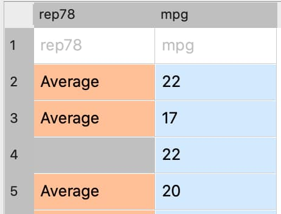

Interactive Data Cleaning
=========================

Interactive data cleaning can be performed in the **Data Import** window before import, or in a GAUSS **Symbol Editor** after it is loaded.

The **Data Management** pane
-----------------------------------------------------------

.. figure:: ../_static/images/data-management-pane.jpg
    :scale: 50%

The **Data Management** pane contains:

* The **Filter** tab that allows you to select observations based on a variety of criteria.
* The **Variables** tab allows you to:

    * Select or remove variables. 
    * Rename variables.
    * Change variable types. 
    * Manage category labels and order.

Open the Data Management page
-----------------------------------------------------------

.. figure:: ../_static/images/data-cleaning-open-symbol-editor-filter.jpg

To open the **Data Management** pane for an in-memory dataframe:

1. Double-click the name of the dataframe in the **Symbols** window on the **Edit** page. 
2. Click the **Manage** button with the cog icon on the top right of the open **Symbol Editor** window.

Missing values
--------------------

Missing values are represented by a dot for data loaded into GAUSS.

Elements that will be imported as missing values will be indicated by gray shading in the **Data Import** window.

Remove observations with missing values interactively
+++++++++++++++++++++++++++++++++++++++++++++++++++++++++++

.. figure:: ../_static/images/data-cleaning-filter-missings.jpg
    :scale: 50%

1. Select the variable to filter on from the **Variable** name drop-down list on the **Filter** tab.
2. Select **Is Not Missing** from the **Operation** drop-down list.
3. Click the ``+`` button to add the filter.

All observations where the selected variable contains a  missing value will be grayed out in the **Data Preview** window, indicating which observations will be imported.

Specify values to import as missing values
+++++++++++++++++++++++++++++++++++++++++++++

[Image of Missing data text boxes on Imports tab]

Enter a comma separated list of variables which should be imported as missing into the corresponding text box in the  **Imports** tab of the **Data Import** window. 

Data organization
--------------------

Changing variable names
+++++++++++++++++++++++++++++++++++++++++++++

.. figure:: ../_static/images/data-organization-rename-variable.jpg
    :scale: 50%

1. Double-click the dataframe you want to modify in the **Symbols** pane of the **Data** page.  
2. Click the **Manage** button at the top right of the open **Symbol Editor**. 
3. Click downward pointing triangle button to the right of the name of the variable name you want to change.. 
4. Enter the new name in the **Name** text box.

Click  [IMAGE of Apply button in data management pane] Apply. 

How do I sort my data based on a variable?
+++++++++++++++++++++++++++++++++++++++++++++

How do I sort my data based on multiple variables?
+++++++++++++++++++++++++++++++++++++++++++++

How do I sort my data in descending order?
+++++++++++++++++++++++++++++++++++++++++++++

How do I change the order of columns in my data? 
+++++++++++++++++++++++++++++++++++++++++++++

Deleting columns from a matrix
+++++++++++++++++++++++++++++++++++++++++++++

Select the matrix you want to delete columns from the Symbols pane in the Data Editor window.  
Click  [IMAGE of Organization button in data editor] Manage to open the Data Management pane. 
Uncheck the variables you want to remove from the data in the Variables tab. 
Click  [IMAGE of Apply button in data management pane] Apply. 

Data subsets 
+++++++++++++++++++++++++++++++++++++++++++++

Select the matrix you want to extract data from the Symbols pane in the Data Editor window.  
Click  [IMAGE of Organization button in data editor] Manage to open the Data Management pane. 
Use the Variable Name drop-down list on the Filter tab to select a variable to use for filtering.  
Select the operation to use for filtering from the Operation drop-down lists. 
In the Value box, enter or select the condition for filtering. 
Click  [IMAGE of Apply button in data management pane] Apply. 

Data types and formats
---------------------------------------------

Changing variable type
+++++++++++++++++++++++++++++++++++++++++++++
Select the matrix containing the variable(s) of interest from the Symbols pane in the Data Editor window.  
To change a variable type select the desired type form the Type drop-down list on the Variables tab. 
If further type-specific properties are required, a properties dialog will automatically.
Type-specific properties
Specifying date formats
[Image of the Specify Date Format dialog]

When changing the type of a variable to a date, you will be asked to manually specify a date format using the Specify Date Format dialog. 
The Specify Date Format dialog provides a list of BSD strftime format specifiers, along with a sample and description. 
Type the desired specifier in the Date Format box or select specifiers from the BSD specifier list. 
As you build your date format, a sample date will be created. 
To help locate the desired specifier, you can use the Pattern Filter drop-down list to filter specifiers by categories such as day specifiers, month specifiers, or hour specifiers. 
Our blog “Reading dates and times in GAUSS” provides additional information on this topic. 

Changing categorical mappings

Select the matrix containing the variable(s) of interest from the Symbols pane in the Data Editor window.  
When you change a variable to a category, a [image of the hamburger menu] Menu will appear next to the variable. This will open a Modify Column Mapping dialog. 
Enter the desired label in the Renamed Label textbox next to the category label you want to change.
Click [image of OK button in Modify Column Mapping] to apply the new category labels. 
Specifying a category to be the base case
Select the matrix containing the variable(s) of interest from the Symbols pane in the Data Editor window.  
Open [image of the hamburger menu] the Menu next to the categorical variable of interest. This will open the Modify Column Mapping dialog.
The Key column indicates the ordering of the categories. The category with the Key equal to zero is used as the base case in all GAUSS estimation procedures. 
To change the base case select the Label of the category you want to be the new base case. 
Click [image of the double arrow button Typein the modify column mapping dialog] to move the selected category to the base case. 
Checking the number of categories
Select the matrix containing the variable(s) of interest from the Symbols pane in the Data Editor window.  
Open [image of the hamburger menu] the Menu next to the categorical variable of interest. This will open the Modify Column Mapping dialog.
The count of categories will be located in the upper right hand corner of the Modify Column Mapping dialog. 
[Image of the Category Count in the Modify Column Mapping]

Programmatic Cleaning
=========================

Missing value handling
------------------------------

Counting missing variables
+++++++++++++++++++++++++++++++

The procedure :func:`dstatmt` provides a count of missing values by variable name as part of the descriptive statistics report. 
It requires only a single input indicating the source of data. 

The input may be either a dataset file name or the name of a data matrix currently in the workspace. 

::

    // Create file name with full path
    dataset = getGAUSSHome() $+ "examples/freqdata.dat";

    // Compute descriptive statistics and print report
    call dstatmt("freqdata.dat")

::

    -----------------------------------------------------------------------------------
    Variable      Mean     Std Dev    Variance    Minimum     Maximum    Valid  Missing
    -----------------------------------------------------------------------------------
    
    AGE          5.678       2.993       8.959          1          10       398       2 
    PAY          1.968      0.8019      0.6431          1           3       400       0 

Checking for missing values
++++++++++++++++++++++++++++++

The :func:`ismiss` function checks for missing values in a matrix. It will return a value of 1 if any missing values are present in a matrix. 

::
    
    // Create one vector with a 
    // missing value and one without
    a = { 1, 2, 3 };
    b = { 4, ., 5 };

    // Check whether the vectors contain missing values
    ret_a = ismiss(a);
    ret_b = isiass(b);

After the code above, *ret_a* will equal 0, but *ret_b* will equal 1.

Removing missing values
++++++++++++++++++++++++

There are two options for removing missing values from a matrix:

* :func:`packr` removes all rows from a matrix that contain any missing values.
* :func:`delif` removes all rows which meet a particular condition.

::

    a = { 1 .,
          . 4,
          5 6 };

    // Remove all rows with a missing value 
    print packr(a);

will return:

::

    5 6

whereas:

::

    a = { 1 .,
          . 4,
          5 6 };
     m = { . };

    // Remove all rows with a missing value 
    // in the second column
    print delif(a, a[.,2] .== m );

will only delete rows with a missing value in the second column.

::

    . 4
    5 6

Replacing missing values 
++++++++++++++++++++++++++++

GAUSS has two functions that can be used to replace missing values:

:func:`missrv` replaces all missing values in a matrix with a user-specified value(s). Unique replacement values can be specified for each column.

::

    a = { 1 .,
          . 4,
          5 6 };

    // Replace all missing values with -999
    print missrv(a, -999);

::

       1 -999
    -999    4 
       5    6

The :func:`impute` procedure replaces missing values in the columns of a matrix by a specified imputation method.

The procedure offers six potential methods for imputation:

* "mean" - replaces missing values with the mean of the column. 
* "median" - replaces missing values with the median of the column.
* "mode" - replace missing values with the mode of the column. 
* "pmm" - replaces missing values using predictive mean matching. 
* "lrd" - replace missing values using local residual draws. 
* "predict" - replace missing values using linear regression prediction. 

See the Command Reference for :func:`imppute` for more details and examples.

Organization
--------------

Sorting data 
+++++++++++++++

Use :func:`sortc` to sort a matrix or dataframe in ascending order based on a certain column.

::

    a = { 1 3 5,
          7 0 9,
          4 2 6 };

    // Sort 'a' based on the second column
    print sortc(a, 2);

::

    7 0 9
    4 2 6
    1 3 5

:func:`sortmc` sorts matrices and dataframes based on multiple columns. 

::

    a = { 1 3 5,
          7 0 9,
          4 0 6 };

    // Sort 'a' based on the second and third column
    print sortmc(a, 2|3);

::

    4 0 6
    7 0 9
    1 3 5

.. note:  :func:`sortmc` and :func:`sortc` sort data in ascending order. To sort data in descending order, wrap the call to the sorting procedure using the procedure `rev` .

Changing the order of columns
++++++++++++++++++++++++++++++++++

Use the `order` procedure to reorder columns in a matrix. 

The `order` procedure requires two inputs - the data that is to be reordered and a columnlist representing the columns to be relocated to the beginning of the dataset in the order in which the columns are specified.

Deleting columns 
+++++++++++++++++++++

You can delete columns from a matrix using the `delcols` procedure.
The `delcols` procedure requires two inputs, the data and the columns, either as indices or variable names, to delete from the data. 

Deleting rows from a matrix
++++++++++++++++++++++++++++++++

Two GAUSS functions are available for deleting rows from a matrix:

:func:`delrows` deletes rows based on the specified row number.

::

    a = { 1 2,
          3 4,
          5 6,
          7 8 };

    print delrows(a, 2|4);

::

    1 2
    5 6

:func:`trimr` trims rows from either the top and bottom of a matrix.

::

    a = { 1 2,
          3 4,
          5 6,
          7 8 };

    print trimr(a, 1|2);

::

    3 4

Conditionally deleting data from a matrix
++++++++++++++++++++++++++++++++++++++++++++++

:func:`delif` conditionally delete data from a matrix based upon a logical vector..

::

    a = { 1 2,
          3 4,
          5 6,
          7 8 };

    // Remove rows where the element in the
    // first column of 'a' is equal to 3
    print delif(a, a[.,1] .== 3);

::

    1 2
    5 6
    7 8 

How do I conditionally select data from a matrix?
++++++++++++++++++++++++++++++++++++++++++++++

You can conditionally select data from a matrix using the `selif` procedure.
Enter the data to be as the first input to `selif` and the condition to be used for selecting data as  the second input. 

::

    a = { 1 2,
          3 4,
          5 6,
          7 8 };

    // Keep rows where the element in the second
    // column of 'a' is less than or equal to 6
    print selif(a, a[.,2] .<= 6);

::

    1 2
    3 4
    5 6

Data Types, Labels, and Names
Determining current type of variables
Use the `getColTypes` procedure to lookup the type of a matrix or variable. 
The `getColTypes` procedure requires one input, the matrix name. It also accepts an optional input specifying the indices or variable names to be checked. 
Setting a variable type
Use the `setColTypes` procedure to set the type of a matrix or variable.
The `setColTypes` procedure requires two inputs, the matrix name and the  types. It also accepts an optional input specifying the indices or variable names to be checked. 
Determining current variable names
The `getColNames` provides the variable names assigned to columns in a matrix.
The procedure requires one input indicating the matrix. In addition, it accepts an optional input specifying the indices of the columns of interest.
The `getColNames` procedure returns a string array of variable names. 
Setting variable names
Use the `setColNames` to change or add variable names to a matrix. 
The `setColNames` procedure requires two inputs, the matrix name and the new names to be assigned. It also accepts an optional input specifying the indices or names to be changed. 
If the data does not currently have variable names, names will be created for all columns, with default names being assigned to any columns for which user-specified names were not provided. 
Determining current categorical variable labels
The `getColLabels` procedure provides the variable names assigned to columns in a matrix.
The procedure requires one input indicating the matrix. In addition, it accepts an optional input specifying the indices of the columns of interest.
The `getColLabels` procedure returns a string array of variable names. 
The procedure is valid only for categorical variables. 
Setting categorical variable labels
Use the`setColLabels` to change the labels of categorical variables. 
The `setColLabels` procedure changes the current type of the column to a categorical variable. 
The procedure requires four inputs, the matrix of interest, the labels, the corresponding key values, and the columns to be assigned labels.  
If any column does not currently have labels, any unique category values for which labels were not provided will be given blank labels. 
Changing categorical variable basecase 
Use the `setcatbasecase` procedure to change the base case for a categorical variable.
The `setcatbasecase` procedure requires two inputs, the data and the new base case. 
If data is a matrix an index or variable name must be included as the third input.
Recoding categorical variable labels
The `recodecatlabels` procedure can be used to recode the labels for a categorical variable. 
The `recodecatlabels` procedure requires three inputs, the data, a list of old labels, and the new labels.
If data is a matrix an index or variable name must be included as the third input.
Reordering categorical variable labels
The `reordercatLabels` procedure can be used to reorder the labels for a categorical variable.
The `reordercatLabels` procedure requires two inputs, the data and the new label order. 
If data is a matrix an index or variable name must be included as the third input.

