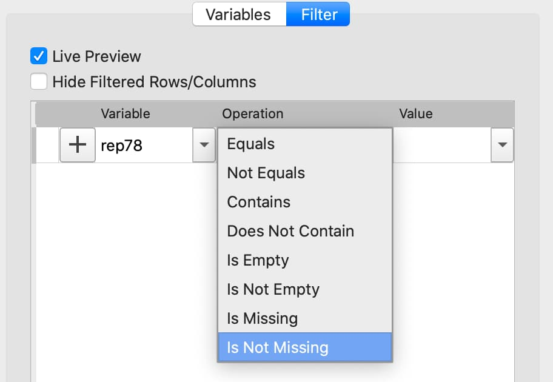
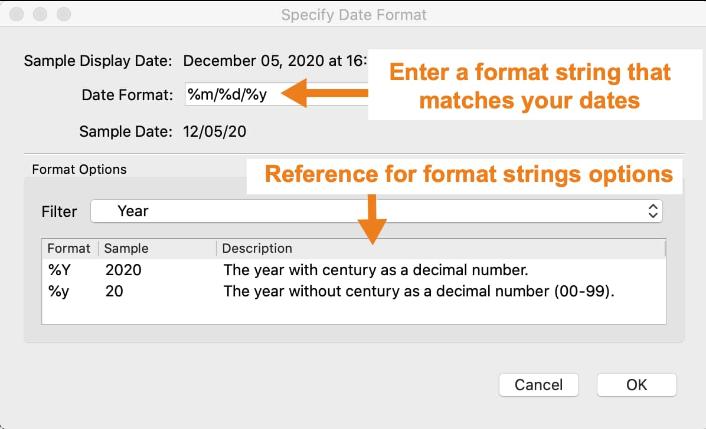

Data Cleaning
==================

Interactive Data Cleaning
-----------------------------

Interactive data cleaning can be performed in the **Data Import** window before import, or in a GAUSS **Symbol Editor** after it is loaded.

This section will show how to clean data using the **Data Management** pane of a **Symbol Editor**. Most actions will be the same in the **Data Import** window. See `Interactive Data Import <./interactive-import.html>`_

The Data Management pane
+++++++++++++++++++++++++++

.. figure:: ../_static/images/data-management-pane.jpg
    :scale: 50%

The **Data Management** pane contains:

* The **Filter** tab that allows you to select observations based on a variety of criteria.
* The **Variables** tab that allows you to:
    * Select or remove variables.
    * Rename variables.
    * Change variable types.
    * Manage category labels and order.
    * Change date display formats.

Open the Data Management page
+++++++++++++++++++++++++++++++++++++++++++++++++++++++++++

.. figure:: ../_static/images/data-cleaning-open-symbol-editor-filter.jpg

To open the **Data Management** pane for an in-memory dataframe:

1. Double-click the name of the dataframe in the **Symbols** window on the **Data** page.
2. Click the **Manage** button with the cog icon on the top right of the open **Symbol Editor** window.

Missing values
++++++++++++++++++++

Missing values are represented by a ``.`` for data loaded into GAUSS.

Remove observations with missing values interactively
^^^^^^^^^^^^^^^^^^^^^^^^^^^^^^^^^^^^^^^^^^^^^^^^^^^^^^^^^^^

1. Select the variable to filter on from the **Variable** name drop-down list on the **Filter** tab.
2. Select **Is Not Missing** from the **Operation** drop-down list.
3. Click the ``+`` button to add the filter.

All observations where the selected variable contains a  missing value will be grayed out in the **Data Preview** window, indicating which observations will be imported.

You can click **Apply** or continue to create more filters.

Data organization
++++++++++++++++++++

Changing variable names
^^^^^^^^^^^^^^^^^^^^^^^^^^^^^^^^^^^^^^^^^^^^^

.. figure:: ../_static/images/data-organization-rename-variable.jpg
    :scale: 50%

1. Double-click the dataframe you want to modify in the **Symbols** pane of the **Data** page.
2. Click the **Manage** button at the top right of the open **Symbol Editor**.
3. Click downward pointing triangle button to the right of the name of the variable name you want to change and select **Rename**.
4. Enter the new name in the **Name** text box.

These changes will not be made until you click **Apply**.

Deleting columns from a matrix
^^^^^^^^^^^^^^^^^^^^^^^^^^^^^^^^^^^^^^^^^^^^^

Clear the check box next to the name of the variables you want to remove from the data.

These changes will not be made until you click **Apply**.

Filtering observations of a dataframe
^^^^^^^^^^^^^^^^^^^^^^^^^^^^^^^^^^^^^^^^^^^^^

The **Data Management** pane provides the following options for filtering dataframes.

+--------------------+------------------+--------------------+------------------+
|Data type           |Filter options    |Data type           |Filter options    |
+====================+==================+====================+==================+
|Numeric and Date    |                  |String and Category |                  |
+--------------------+------------------+--------------------+------------------+
|                    |=                 |                    |Equals            |
+--------------------+------------------+--------------------+------------------+
|                    |!=                |                    |Not Equals        |
+--------------------+------------------+--------------------+------------------+
|                    |<                 |                    |Contains          |
+--------------------+------------------+--------------------+------------------+
|                    |<=                |                    |Does not Contain  |
+--------------------+------------------+--------------------+------------------+
|                    |>                 |                    |Is Empty          |
+--------------------+------------------+--------------------+------------------+
|                    |>=                |                    |Is not Empty      |
+--------------------+------------------+--------------------+------------------+
|                    |Is Missing        |                    |Is Missing        |
+--------------------+------------------+--------------------+------------------+
|                    |Is Not Missing    |                    |Is Not Missing    |
+--------------------+------------------+--------------------+------------------+

To implement any of these filtering options:

1. Select the variable to filter on from the **Variable** name drop-down list on the **Filter** tab.
2. Select the desired operation from the **Operation** drop-down list.
3. Depending on the operation, either enter or select a value in the **Value** combo box.
4. Click the ``+`` button to add the filter.
5. Either **Apply** your changes or add another filter.

Filter based on partial string match
^^^^^^^^^^^^^^^^^^^^^^^^^^^^^^^^^^^^^^^^^

Filter based numeric value
^^^^^^^^^^^^^^^^^^^^^^^^^^^^^^^^^^^^^^^^^

Apply changes
++++++++++++++++++++++++

The **Apply** button at the bottom of the **Data Management** pane allows you to apply the variable modifications and filters created.

To modify the current dataframe, either click **Apply** or click the drop-down and select **Overwrite Existing**.

To create a new dataframe containing your changes, click the drop-down next to the **Apply** button and select **Create New**. A text box will appear allowing you to enter the name of the new dataframe.

Data types and formats
+++++++++++++++++++++++++++++++++++++++++++++

Changing variable type
^^^^^^^^^^^^^^^^^^^^^^^^^^^^^^^^^^^^^^^^^^^^^

To change a variable type select the desired type from the **Type** drop-down list on the **Variables** tab.

If further type-specific properties are required, a properties dialog will automatically open.

Changing categorical mappings
^^^^^^^^^^^^^^^^^^^^^^^^^^^^^^^

Click the drop-down button to the right of the variable name and select **Properties** to open the **Modify Column Mapping** dialog.

**Change a category label** by double-clicking in the **Renamed Label** textbox next to the category label you want to change, then enter the new label name.

**Specify a category to be the base case** by selecting the **Label** of the category you want to be the new base case then click the double up-pointing arrow button to move the selected category to the base case.

The **Category Count** will be listed in the top right of the **Modify Column Mapping** dialog.

Specifying date formats
^^^^^^^^^^^^^^^^^^^^^^^^^^^^^^^

If GAUSS does not automatically detect your date format, you will be asked to manually specify a date format using the **Specify Date Format** dialog.

Build a format string in the **Date format** box, using the BSD strftime specifiers, that represents your data.

If your data looked like this ``03/12/2017``, the correct format string would be ``%m/%d/%Y``. The table below explains this.

+-----------------+---------------------------+---------+----------------------+
|Original Contents|Description                |Type     |Format string contents|
+=================+===========================+=========+======================+
|03               |A two digit month.         |Date     |``%m``                |
+-----------------+---------------------------+---------+----------------------+
|/                |A forward slash.           |Literal  |/                     |
+-----------------+---------------------------+---------+----------------------+
|12               |A two digit day.           |Date     |``%d``                |
+-----------------+---------------------------+---------+----------------------+
|/                |A forward slash.           |Literal  |/                     |
+-----------------+---------------------------+---------+----------------------+
|2017             |A four digit year.         |Date     |``%Y``                |
+-----------------+---------------------------+---------+----------------------+

The **Format Options** section of this dialog contains the BSD strftime specifiers for reference. Use the **Filter** drop-down to filter the reference options shown.

Programmatic Data Cleaning
------------------------------

Missing value handling
++++++++++++++++++++++++++++++

Counting missing variables
^^^^^^^^^^^^^^^^^^^^^^^^^^^^^^^

The procedure :func:`dstatmt` counts missing values by variable name as part of the descriptive statistics report.
It requires only a single input indicating the source of data.

The input may be either the file name of a dataset or the name of a matrix or dataframe currently in the workspace.

::

    // Create file name with full path
    dataset = getGAUSSHome("examples/auto2.dta");

    // Compute descriptive statistics and print report
    // of a dataset stored on disk
    call dstatmt(dataset);

::

    -------------------------------------------------------------------------------------
    Variable         Mean   Std Dev    Variance    Minimum     Maximum    Valid   Missing
    -------------------------------------------------------------------------------------
    
    make            -----     -----       -----      -----       -----       74        0
    price            6165      2949     8.7e+06       3291   1.591e+04       74        0
    mpg              21.3     5.786       33.47         12          41       74        0
    rep78           -----     -----       -----       Poor   Excellent       69        5
    headroom        2.993     0.846      0.7157        1.5           5       74        0
    trunk           13.76     4.277        18.3          5          23       74        0
    weight           3019     777.2    6.04e+05       1760        4840       74        0
    length          187.9     22.27       495.8        142         233       74        0
    turn            39.65     4.399       19.35         31          51       74        0
    displacement    197.3     91.84        8434         79         425       74        0
    gear_ratio      3.015    0.4563      0.2082       2.19        3.89       74        0
    foreign         -----     -----       -----   Domestic     Foreign       74        0

A second optional input allows you to specify which columns to use.

::

    // Create file name with full path
    dataset = getGAUSSHome("examples/auto2.dta");
    
    // Load data from the file
    auto = loadd(dataset);

    // Compute descriptive statistics and print report
    // of specific variables from a dataframe
    call dstatmt(dataset, "price + mpg + rep78");

::

    -------------------------------------------------------------------------------------
    Variable         Mean   Std Dev    Variance    Minimum     Maximum    Valid   Missing
    -------------------------------------------------------------------------------------
    
    price            6165      2949     8.7e+06       3291   1.591e+04       74        0
    mpg              21.3     5.786       33.47         12          41       74        0
    rep78           -----     -----       -----       Poor   Excellent       69        5

Checking for missing values
^^^^^^^^^^^^^^^^^^^^^^^^^^^^^^

The :func:`ismiss` function checks for missing values in a matrix. It will return a value of 1 if any missing values are present in a matrix.

::

    // Create one vector with a
    // missing value and one without
    a = { 1, 2, 3 };
    b = { 4, ., 5 };

    // Check whether the vectors contain missing values
    ret_a = ismiss(a);
    ret_b = ismiss(b);

After the code above, *ret_a* will equal 0, but *ret_b* will equal 1.

Removing missing values
^^^^^^^^^^^^^^^^^^^^^^^^

There are two options for removing missing values from a matrix:

* :func:`packr` removes all rows from a matrix that contain any missing values.
* :func:`delif` removes all rows which meet a particular condition.

::

    a = { 1 .,
          . 4,
          5 6 };

    // Remove all rows with a missing value
    print packr(a);

will return:

::

    5 6

whereas:

::

    a = { 1 .,
          . 4,
          5 6 };
     m = { . };

    // Remove all rows with a missing value
    // in the second column
    print delif(a, a[., 2] .== m );

will only delete rows with a missing value in the second column.

::

    . 4
    5 6

Replacing missing values
^^^^^^^^^^^^^^^^^^^^^^^^^^^^

GAUSS has two functions that can be used to replace missing values:

*  The :func:`missrv` function.
*  The :func:`impute` function.

The :func:`missrv` function replaces all missing values in a matrix with a user-specified value(s). Unique replacement values can be specified for each column.

::

    a = { 1 .,
          . 4,
          5 6 };

    // Replace all missing values with -999
    print missrv(a, -999);

::

       1 -999
    -999    4
       5    6

The :func:`impute` procedure replaces missing values in the columns of a matrix using a specified imputation method.

The procedure offers eight potential methods for imputation:

* ``"bfill"`` - replaces missing values with the next valid observation (backward fill).
* ``"ffill"`` - replaces missing values with the most recent previous valid observation (forward fill).
* ``"mean"`` - replaces missing values with the mean of the column.
* ``"median"`` - replaces missing values with the median of the column.
* ``"mode"`` - replace missing values with the mode of the column.
* ``"pmm"`` - replaces missing values using predictive mean matching.
* ``"lrd"`` - replace missing values using local residual draws.
* ``"predict"`` - replace missing values using linear regression prediction.

See the Command Reference for :func:`impute` for more details and examples.

Organization
++++++++++++++

Sorting data
^^^^^^^^^^^^^^^

Use :func:`sortc` to sort a matrix or dataframe in ascending order based on a certain column.

::

    a = { 1 3 5,
          7 0 9,
          4 2 6 };

    // Sort 'a' based on the second column
    print sortc(a, 2);

::

    7 0 9
    4 2 6
    1 3 5

Matrices and dataframes can be sorted on multiple columns using the :func:`sortmc` procedure.

::

    a = { 1 3 5,
          7 0 9,
          4 0 6 };

    // Sort 'a' based on the second and third column
    print sortmc(a, 2|3);

::

    4 0 6
    7 0 9
    1 3 5

.. note::  The :func:`sortmc` and :func:`sortc` sort data in ascending order. To sort data in descending order, wrap the call to the sorting procedure using the procedure :func:`rev` .

Changing the order of columns
^^^^^^^^^^^^^^^^^^^^^^^^^^^^^^^^^^

Use the :func:`order` procedure to reorder columns in a matrix or dataframe.

::

    // Create example matrix
    X = { 9 6 2 6,
          9 8 2 1,
          3 0 2 9,
          1 0 3 0 };

    // Put the 2nd and 4th columns first
    X_2 = order(X, 2|4);

After the above code, *X_2* will equal:

::

    6 6 9 2
    8 1 9 2
    0 9 3 2
    0 0 1 3

::

    // Load some variables from a dataset
    dataset = getGAUSSHome("examples/yellowstone.csv");
    yellowstone = loadd(dataset, "LowtTemp + HighTemp + Visits + TotalPrecip + date($Date)");

    // Reorder the dataframe so 'date' and 'visits'
    // are the first two variables
    yellowstone_2 = order(yellowstone, "Date" $| "Visits");

After the above code, the first four rows of *yellowstone* will be:

::

        LowtTemp    HighTemp      Visits  TotalPrecip             Date
           -17.0        37.0       30621         1.09       2016/01/01
           -17.0        42.0       28091        0.770       2015/01/01
           -19.0        41.0       26778         1.28       2014/01/01
           -22.0        43.0       24699        0.610       2013/01/01

while the first four rows of *yellowstone_2* look like this:

::

            Date     Visits    LowtTemp    HighTemp   TotalPrecip
      2016/01/01      30621       -17.0        37.0          1.09
      2015/01/01      28091       -17.0        42.0         0.770
      2014/01/01      26778       -19.0        41.0          1.28
      2013/01/01      24699       -22.0        43.0         0.610

Deleting columns
^^^^^^^^^^^^^^^^^^^^^

You can delete columns from a matrix using the :func:`delcols` procedure. The columns to remove can be specified as numeric indices for matrices and dataframes:

::

    a = { 1 3 5 7,
          7 0 9 4,
          4 2 6 2 };

    // Remove the 1st and 3rd column from 'a'
    print delcols(a, 1|3);

::

    3 7
    0 4
    2 2

You can also use column names to delete columns from a dataframe.

::

    // Create file name with full path
    dataset = getGAUSSHome("examples/detroit.sas7bdat");

    // Load  4 variables from the dataset
    detroit = loadd(dataset, "unemployment + weekly_earn + hourly_earn + assault");

    // Remove 2 variables from 'detroit' by name
    detroit = delcols(detroit, "weekly_earn" $| "hourly_earn");

    // Print the first 4 rows of 'detroit'
    print detroit[1:4, .];

::

       unemployment       assault
               11.0        306.18
                7.0        315.16
                5.2        277.53
                4.3        234.07

Deleting rows from a matrix
^^^^^^^^^^^^^^^^^^^^^^^^^^^^^^^^

Two GAUSS functions are available for deleting rows from a matrix:

:func:`delrows` deletes rows based on the specified row number.

::

    a = { 1 2,
          3 4,
          5 6,
          7 8 };

    // Remove the 2nd and 4th row of 'a'
    print delrows(a, 2|4);

::

    1 2
    5 6

:func:`trimr` trims rows from either the top and bottom of a matrix.

::

    a = { 1 2,
          3 4,
          5 6,
          7 8 };

    // Trim the top row and the bottom
    // 2 rows from 'a'
    print trimr(a, 1, 2);

::

    3 4

Conditionally deleting rows of data
^^^^^^^^^^^^^^^^^^^^^^^^^^^^^^^^^^^^^^^^^^^^^^

:func:`delif` conditionally deletes rows from a matrix, dataframe or string array  based upon a logical vector.

::

    a = { 1 2,
          3 4,
          5 6,
          7 8 };

    // Remove rows where the element in the
    // first column of 'a' is equal to 3
    print delif(a, a[., 1] .== 3);

::

    1 2
    5 6
    7 8

How do I conditionally select data from a matrix or dataframe?
^^^^^^^^^^^^^^^^^^^^^^^^^^^^^^^^^^^^^^^^^^^^^^^^^^^^^^^^^^^^^^^^^^^

You can conditionally select data from a matrix, dataframe, or string array  using the :func:`selif` procedure.
Enter the data as the first input to :func:`selif` and the condition to be used for selecting data as the second input.

::

    a = { 1 2,
          3 4,
          5 6,
          7 8 };

    // Keep rows where the element in the second
    // column of 'a' is less than or equal to 6
    print selif(a, a[., 2] .<= 6);

::

    1 2
    3 4
    5 6

Data Types, Labels, and Names
+++++++++++++++++++++++++++++++++

Determining variable or column types
^^^^^^^^^^^^^^^^^^^^^^^^^^^^^^^^^^^^^^^^^

Use the :func:`getColTypes` procedure to lookup the type of the variables in a dataframe. :func:`getColTypes` returns a dataframe. The table below shows the type labels and their corresponding integer values.

+-------+---------+
|Value  |Label    |
+=======+=========+
|0      |String   |
+-------+---------+
|1      |Numeric  |
+-------+---------+
|2      |Category |
+-------+---------+
|3      |Date     |
+-------+---------+

::

    // Load 4 variables of different types from a dataset
    dataset = getGAUSSHome("examples/nba_ht_wt.xls");
    nba_ht_wt = loadd(dataset, "str(Player) + cat(Pos) + Age + date($BDate, '%m/%d/%Y')");

    // Check the types of each variable in 'nba_ht_wt'
    print getColTypes(nba_ht_wt);

The above code will print:

::

       type
     String
   Category
    Numeric
       Date

:func:`getColTypes` also accepts a second optional input that allows you to check only specified column types. Continuing with the data from our previous example:

::

    // Check the types of the 2nd and 4th variables in 'nba_ht_wt'
    print getColTypes(nba_ht_wt, 2|4);

will return:

::

        type
    Category
        Date

Setting a variable type
^^^^^^^^^^^^^^^^^^^^^^^^^^^^

:func:`dfType` sets the variable type of one or more columns of a matrix or dataframe.

::

    // Create a column of numbers which represent
    // seconds since Jan 1, 1970 (Posix time)
    d = {    0,
         86400,
        172800,
        259200 };

    // Set the variable type of 'd' to be a date
    d = dfType(d, "Date");

After the above code, *d* will be a date and if we print it we will see:

::

            X1
    1970-01-01
    1970-01-02
    1970-01-03
    1970-01-04

It also accepts an optional input specifying the indices or variable names to be checked.

::

    // Load 3 variables of different types from a dataset
    dataset = getGAUSSHome("examples/nba_ht_wt.xls");
    nba = loadd(dataset, "str(player) + cat(pos) + age");

After loading the above data, the first four rows of *nba* will be:

::

              player       pos       age
      Vitor Faverani         C        25
       Avery Bradley         G        22
        Keith Bogans         G        33
     Jared Sullinger         F        21

We can change the type of the second column from a categorical to a numeric variable like this:

::

    // Set the second column to be numeric
    nba = dfType(nba, "Number", "pos");

After this code, the first four rows of *nba* will be:

::

              player       pos       age
      Vitor Faverani         0        25
       Avery Bradley         2        22
        Keith Bogans         2        33
     Jared Sullinger         1        21

The elements of the *pos* now contain only the numeric values that correspond to the string category labels. The string labels, ``"C"``, ``"F"`` and ``"G"`` have been removed.

Determining current variable names
^^^^^^^^^^^^^^^^^^^^^^^^^^^^^^^^^^^^^^^^

The :func:`getColNames` procedure returns the variable names assigned to columns in a matrix.

::

    // Load all variables from a CSV file
    dataset = getGAUSSHome("examples/housing.csv");
    housing = loadd(dataset);

    // Print the variable names from 'housing'
    print getcolnames(housing);

The above code will print out the string array:

::

           taxes
            beds
           baths
             new
           price
            size

In addition, it accepts an optional input specifying the indices of the columns of interest. For example, continuing with our previous example:

::

    // Print the names of the 3rd and 5th variable name
    print getcolnames(housing, 3|5);

will return:

::

    baths
    price

Setting variable names
^^^^^^^^^^^^^^^^^^^^^^^^^^^

The :func:`setColNames` procedure changes or adds variables names to a matrix or dataframe.

::

    // Create example matrix
    X = { 1 2,
          3 4,
          5 6 };

    // Assign variable names to the columns of 'X'
    X = setcolnames(X, "alpha" $| "beta");

    print X;

The above code will print:

::

    alpha    beta
        1       2
        3       4
        5       6

It also accepts an optional input specifying the indices or names to be changed. For example, continuing with the example above:

::

    // Set the second variable name from 'X' to 'gamma'
    X = setcolnames(X, "gamma", 2);

    print X;

The above code will print:

::

    alpha   gamma
        1       2
        3       4
        5       6

If the data does not currently have variable names, names will be created for all columns, with default names being assigned to any columns for which user-specified names were not provided.

Determining current categorical variable labels
^^^^^^^^^^^^^^^^^^^^^^^^^^^^^^^^^^^^^^^^^^^^^^^^^^

:func:`getColLabels` returns the string category labels and corresponding integer values for a categorical or string column of a dataframe.

::

    // Create a file name with full path
    dataset = getGAUSSHome("examples/auto2.dta");

    // Load all variables from the dataset
    auto = loadd(dataset);

    // Return the string category labels and
    // corresponding numeric values
    { labels, values } = getColLabels(auto, "rep78");

After running the code above:

::

    labels =  Poor  Values = 1
              Fair           2
           Average           3
              Good           4
          Excellent          5

Setting categorical variable labels
^^^^^^^^^^^^^^^^^^^^^^^^^^^^^^^^^^^^^^^^

The :func:`setColLabels` procedure allows you to add or modify the labels of categorical variables.
It changes the current type of the column to a categorical variable.

Convert a column from a matrix to a categorical variable
^^^^^^^^^^^^^^^^^^^^^^^^^^^^^^^^^^^^^^^^^^^^^^^^^^^^^^^^^^^

::

    // Create example matrix
    X = { 1.4 0,
          1.9 2,
          2.3 1,
          0.9 2 };

    labels = "low" $| "medium" $| "high";
    values = { 0, 1, 2 };

    // Make the second column of 'X' a
    // categorical variable with the
    // provided labels and values
    X = setColLabels(X, labels, values, 2);

    print X;

The above code will return:

::

     X1      X2
    1.4     low
    1.9    high
    2.3  medium
    0.9    high

.. note:: If a label is not provided for all key values, the unlabeled key values will be given blank labels.

Change the order of categories in a dataframe
^^^^^^^^^^^^^^^^^^^^^^^^^^^^^^^^^^^^^^^^^^^^^^^^^

::

    // Load dataset
    dataset = getGAUSSHome("examples/yarn.xlsx";
    yarn = loadd(dataset, "cat(amplitude) + cycles");

    // Get labels and values for amplitude variable
    // in yarn dataframe
    { labels_1, values_1 } = getColLabels(yarn, "amplitude");

After the above code:

::

    labels_1 = high   values_1 = 0
                low              1
                med              2

Since Excel files do not provide labels or order for string columns, GAUSS assigns the category value based on alphabetical order. We can reorder the categories like this:

::

    // Change the order of the category labels for the
    // variable 'amplitude' in 'yarn'
    yarn = reordercatlabels(yarn, "low" $| "med" $| "high", "amplitude");

    // Get column labels and key values for `amplitude`
    { labels_2, values_2 } = getColLabels(yarn, "amplitude");

After the above code:

::

    labels_2 =  low   values_2 = 0
                med              1
               high              2

.. note:: Since there is only one categorical variable in the *yarn* dataframe, :func:`setColLabels` does not require a specified variable name.

Changing categorical variable base case
^^^^^^^^^^^^^^^^^^^^^^^^^^^^^^^^^^^^^^^^^^^

The :func:`setbasecat` function provides a convenient way to set the base case for a categorical variable.

::

    // Load the NBA dataset
    dataset = getGAUSSHome("examples/nba_ht_wt.xls");
    nba = loadd(dataset, "cat(pos) + height + weight");

    // Get column names
    { labels, values } = getColLabels(nba, "pos");

After the above code:

::

    labels = C   values = 0
             F            1
             G            2

You can change ``"G"`` to the base case like this:

::

    // Change the `G` category to the basecase
    nba = setBaseCat(nba, "G", "pos");

    // Get new labels
    { labels, values } = getColLabels(nba, "pos");

As we can see below, the new base case, ``"G"``, has been moved to the top and all the other variables have been shifted down.

::

    labels = G   values = 0
             C            1
             F            2

Recoding categorical variable labels
^^^^^^^^^^^^^^^^^^^^^^^^^^^^^^^^^^^^^^^^

The :func:`recodecatlabels` procedure changes the labels for a categorical variable.

::

    // Load NBA data
    dataset = getGAUSSHome("examples/nba_ht_wt.xls");
    nba = loadd(dataset, "cat(pos) + height + weight");

    // Get column labels
    { labels, values } = getColLabels(nba, "pos");

Here are the initial category labels and order.

::

    labels = C   values = 0
             F            1
             G            2

We can change the category labels like this:

::

    // Specify current labels
    old_labels = "C" $| "F" $| "G";

    // Specify new labels to set
    new_labels = "Center" $| "Forward" $| "Guard";

    // Recode the old labels to the new labels
    nba = recodeCatLabels(nba, old_labels, new_labels, "pos");

    // Get column labels
    { labels, values } = getColLabels(nba, "pos");

::

    labels =  Center   values = 0
             Forward            1
               Guard            2

As we can see above the label names have changed, but the underlying values and order are the same.

Reordering categorical variable labels
^^^^^^^^^^^^^^^^^^^^^^^^^^^^^^^^^^^^^^^^

The :func:`reorderCatLabels` procedure can be used to reorder the labels for a categorical variable.

Change the order of categories in a dataframe
^^^^^^^^^^^^^^^^^^^^^^^^^^^^^^^^^^^^^^^^^^^^^^^^^

::

    // Load the yarn dataset
    dataset = getGAUSSHome("examples/yarn.xlsx");
    yarn = loadd(dataset, "cat(amplitude) + cycles");

    // Get column labels
    { labels, values } = getColLabels(yarn, "amplitude");

After the above code:

::

    labels = high   values = 0
              low            1
              med            2

Since Excel files do not provide labels or order for string columns, GAUSS assigns the category value based on alphabetical order. We can reorder the categories like this:

::

    // Reorder the categorical labels for the `amplitude` variable
    yarn = reorderCatLabels(yarn, "low" $| "med" $| "high", "amplitude");

    { labels, values } = getColLabels(yarn, "amplitude");

After the above code:

::

    labels =  low   values = 0
              med            1
             high            2
