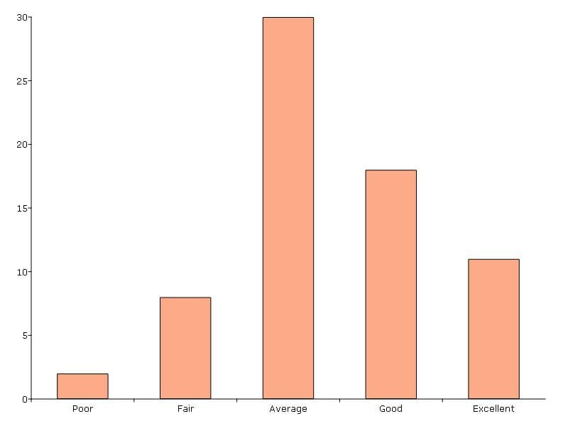
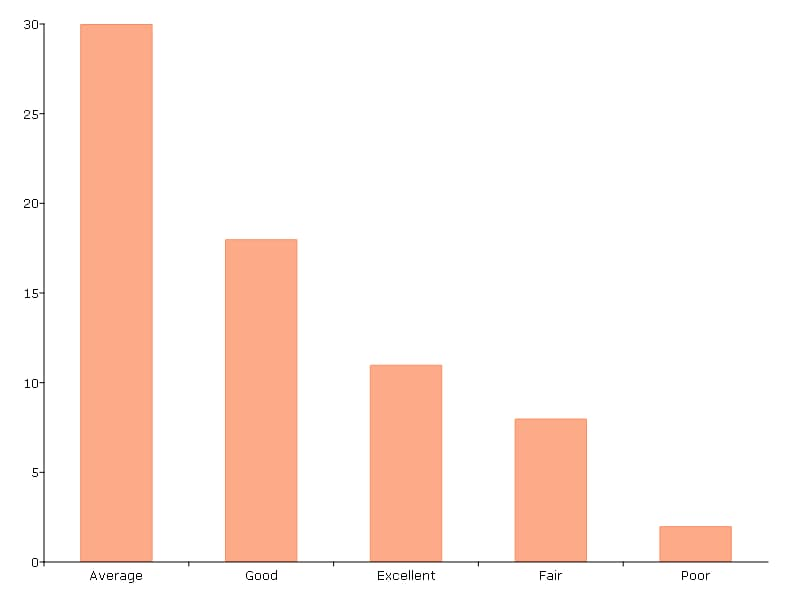
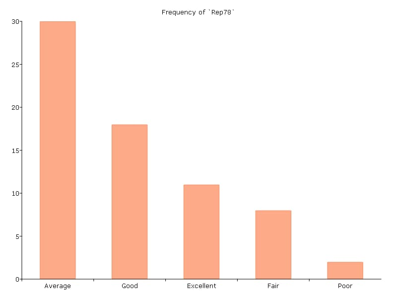

Data Exploration
=============================
Descriptive statistic table
---------------------------------
The :func:`dstatmt` procedure generates a summary table of descriptive statistics. It computes following statistics for every numeric column:

* Mean
* Standard deviation
* Variance
* Minimum
* Maximum
* Valid cases
* Missing cases

It works directly with matrices and dataframes and will print a complete summary table to the **Comand** window.

Example: Summary statistics from a datafile
+++++++++++++++++++++++++++++++++++++++++++++

::

  // Create file name with full path
  file_name = getGAUSSHome("examples/fueleconomy.dat");

  /*
  ** Compute statistics for all variables in the dataset
  ** The 'call' keyword disregards return values from the function
  */
  call  dstatmt(file_name);

This prints the following results

::

  ----------------------------------------------------------------------------------------------------
  Variable                    Mean     Std Dev      Variance     Minimum     Maximum     Valid Missing
  ----------------------------------------------------------------------------------------------------

  annual_fuel_cost           2.537      0.6533        0.4267        1.05         5.7       978    0
  engine_displacement        3.233       1.376         1.892           1         8.4       978    0

The :func:`dstatmt` function can also be used on a subset of variables, rather than the entire dataset.

Example: Summary statistics for select variables
++++++++++++++++++++++++++++++++++++++++++++++++++

::

  // Create file name with full path
  fname = getGAUSSHome("examples/nba_ht_wt.xls");
  nba_ht_wt = loadd(fname,
      "str(Player) + cat(Pos) + Height + Weight + Age + str(School) + str(BDate)");

  /*
  ** Compute statistics for all variables in the dataset
  ** The 'call' keyword disregards return values from the function
  */
  call  dstatmt(nba_ht_wt, "Height"$|"Weight"$|"Age");

This prints the following output:

::

  ----------------------------------------------------------------------------------------
  Variable        Mean     Std Dev      Variance     Minimum     Maximum     Valid Missing
  ----------------------------------------------------------------------------------------

  Height         79.07       3.454         11.93          69          87       505    0
  Weight         220.7       26.64         709.9         157         290       505    0
  Age            26.19       4.325         18.71          15          40       505    0

Individual descriptive statistics
-----------------------------------

+--------------------------+---------------------+--------------------+
| Statistic                | Matrices            | Arrays             |
+==========================+=====================+====================+
| Mean                     | :func:`meanc`       | :func:`amean`      |
+--------------------------+---------------------+--------------------+
| Median                   | :func:`median`      |                    |
+--------------------------+---------------------+--------------------+
| Mode                     | :func:`modec`       |                    |
+--------------------------+---------------------+--------------------+
| Quantiles                | :func:`quantile`    |                    |
+--------------------------+---------------------+--------------------+
| Sample standard deviation| :func:`stdc`        | :func:`astd`       |
+--------------------------+---------------------+--------------------+
| Pop. Standard deviation  | :func:`stdsc`       | :func:`astds`      |
+--------------------------+---------------------+--------------------+
| Minimum                  | :func:`minc`        | :func:`amin`       |
+--------------------------+---------------------+--------------------+
| Maximum                  | :func:`maxc`        | :func:`amax`       |
+--------------------------+---------------------+--------------------+
| Sum                      | :func:`sumc`        | :func:`asum`       |
|                          | :func:`sumr`        |                    |
+--------------------------+---------------------+--------------------+

Example: Finding mean by column
+++++++++++++++++++++++++++++++++

::

  // Load stock price data
  fname = getGAUSShome("examples/xle_daily.xlsx");
  xle_daily = loadd(fname,
                   "date($Date, '%m/%d/%Y %T.%L') + Adj Close + Volume");

  // Find mean of 'Adj Close' and 'Volume'
  meanc(xle_daily[., "Adj Close" "Volume"]);

The results are printed directly to screen:

::

  68.442841
  14308087.

Computing group descriptive statistics
-----------------------------------
The :func:`aggregate` procedure finds descriptive statistics for each group in panel data. It allows an optional input to specify the name of the categorical variable to be used for grouping.

In order to be used with :func:`aggregate` data should:

- Have group identifiers in the first column if the name of the categorical variable for grouping is not specified.
- Be in stacked panel data format (see :func:`dfLonger`).

If the input data is contained in a dataframe, the :func:`aggregate` procedure will output a dataframe.
    
The function supports the following statistics for grouping:

* Mean
* Median
* Mode
* Min
* Max
* Sample standard deviation
* Sum
* Sample variance

The :func:`aggregate` function also accepts an optional indicator input for fast computation. If fast computation is specified, the procedure will not check for missing values.  

Example One: Group variable contained in first column
++++++++++++++++++++++++++++++++++++++++++++++++++++++
In this example, the group variable is included in the first column. No categorical variable is specified for grouping.

::

  // Create file name with full path
  fname = getGAUSSHome("examples/housing.csv");

  // Load three variables from dataset
  X = loadd(fname, "beds + price + size");

  // Compute the median of the sales price
  // and size (sq ft) by the variable in the
  // first column, which is the number of bedrooms.
  x_a = aggregate(X, "median");

The matrix *x_a* contains:

::

  bedrooms          price            sq ft
       2             94.3             1060
       3            132.6           1473.5
       4              179             2000
       5           352.65             3095

Example Two: Specifying the group variable as an input
++++++++++++++++++++++++++++++++++++++++++++++++++++++++
In this example, a categorical variable name is specified for grouping.

::

  // Load data
  auto2 = loadd(getGAUSSHome("examples/auto2.dta"));

  // Aggregate data using
  // foreign column as group
  aggregate(auto2[., "price" "mpg" "foreign"], "mean", "foreign");

The aggregated results are printed to the **Command** window:

::

  foreign     price      mpg
  Domestic  6072.423   19.827
  Foreign   6384.682   24.773

.. note :: The :func:`aggregate` function is similar to creating pivot tables, where:  
    *  The group variable is equivalent to a pivot table row variable.   
    *  The remaining variables in *x* are equivalent to column variables.  
    *  The *method* input is equivalent to the values setting in a pivot table.   
    
Frequency tables and plots
-----------------------------
One-way frequency counts 
+++++++++++++++++++++++++
The :func:`frequency` procedure computes a frequency count of all categories of a categorical variable.

::

  // Load data
  fname = getGAUSSHome("examples/auto2.dta");
  auto2 = loadd(fname);

  // Frequency table
  print "Frequency counts for 'rep78' and 'foreign':";
  frequency(auto2, "rep78 + foreign");

The above code prints:

::

     Frequency count for 'rep78':
           Label      Count   Total %    Cum. % 
            Poor          2     2.899     2.899 
            Fair          8     11.59     14.49 
         Average         30     43.48     57.97 
            Good         18     26.09     84.06 
       Excellent         11     15.94       100 
           Total         69       100

Multiple tables can be generated by adding variables to the variable formula string using ``"+"``.

::

  // Load data
  fname = getGAUSSHome("examples/auto2.dta");
  auto2 = loadd(fname);

  // Frequency table
  print "Frequency counts for 'rep78' and 'foreign':";
  frequency(auto2, "rep78 + foreign");

::

    Frequency counts for 'rep78' and 'foreign':
        
        Label      Count   Total %    Cum. % 
         Poor          2     2.899     2.899 
         Fair          8     11.59     14.49 
      Average         30     43.48     57.97 
         Good         18     26.09     84.06 
    Excellent         11     15.94       100 
        Total         69       100           

        Label      Count   Total %    Cum. % 
     Domestic         52     70.27     70.27 
      Foreign         22     29.73       100 
        Total         74       100           
    
         
An optional indicator input can be used with the :func:`frequency` procedure to sort the frequency counts in descending order. 

::

  // Load data
  fname = getGAUSSHome("examples/auto2.dta");
  auto2 = loadd(fname);

  // Frequency table
  print "Sorted frequency count for 'rep78':";
  frequency(auto2, "rep78", 1);
         
::

        Sorted frequency count for 'rep78':
            
        Label      Count   Total %    Cum. % 
      Average         30     43.48     43.48 
         Good         18     26.09     69.57 
    Excellent         11     15.94     85.51 
         Fair          8     11.59      97.1 
         Poor          2     2.899       100 
        Total         69       100          
            
As an alternative to :func:`frequency`, the :func:`counts` procedure counts the numbers of elements of a vector that fall into specified ranges and can be used to create frequency tables.

For example, to find the frequency of each category for a categorical variable, use :func:`counts` with the unique category keys as cutoffs.

::

  // Load data
  fname = getGAUSSHome("examples/auto2.dta");
  auto2 = loadd(fname, "str(make) + cat(rep78) + cat(foreign)");

  // Frequency table of rep78
  print "Frequency table of rep78:";

  // Get column labels
  { label, keyvalues } = getcollabels(auto2, "rep78");
  counts(auto2[., "rep78"], keyvalues);

::

  Frequency table of rep78:

       2.0000000
       8.0000000
       30.000000
       18.000000
       11.000000

Frequency plots
+++++++++++++++++
The :func:`plotFreq` procedure will compute and plot frequencies for a categorical variable. A quick plot can be generated using default formatting or an optional ``plotControlStructure`` can be used for custom formatting. An optional indicator input can be used with the :func:`plotFreq` procedure to sort the bars in descending order. 
 
 
**Example: Plotting category frequency**  
  
::

  // Load data
  fname = getGAUSSHome("examples/auto2.dta");
  auto2 = loadd(fname);

  // Frequency plot
  plotFreq(auto2, "rep78");

**Example: Plotting sorted frequencies**  
In this example, the optional argument is used to specify that the bars should be sorted in order from most frequently to least frequently occurring.

::

  // Sorted frequency plot
  plotFreq(auto2, "rep78", 1);

       
**Example: Adding a title to a frequency plot**   
In the next example, a ``plotControlStructure`` is used to add a title to the sorted frequency plot. 

::

  // Declare plotControl structure
  struct plotControl myPlt;
  myPlt = plotGetDefaults("bar");

  // Set title
  plotSetTitle(&myPlt, "Frequency of `Rep78`");

  // Frequency plot
  plotFreq(myPlt, auto2, "rep78", 1);

    
Two-way tables  
+++++++++++++++++
The :func:`tabulate` procedure generates two-way tables and returns the counts as a dataframe. 

Basic tabulation with the :func:`tabulate` procedure requires:
- A dataframe or filename input.
- A formula string to specify which variables to include in the table. 

The formula string specifies the row variable on the left-hand side of the tilde and column variables on the right-hand side. 

::

    // Load 'tips' dataset
    fname = getGAUSSHome("examples/tips2.dta");
    tips  = loadd(fname);

    // Create two-way table of smoking rates by sex
    // with sex in rows and smoking status
    // in columns
    call tabulate(tips, "sex ~ smoker");

::

    ============================================================
          sex                   smoker                 Total
    ============================================================
                          No            Yes

       Female             55             33               88
         Male             99             60              159

        Total            154             93              247
    ============================================================

Multiple tables can be generated by including additional right-hand side column variables using ``"+"``.

::

    // Load 'tips' dataset
    fname = getGAUSSHome("examples/tips2.dta");
    tips  = loadd(fname);

    // Generate separate tables for sex vs smoker
    // and sex vs time
    call tabulate(tips, "sex ~ smoker + time");

::

    ============================================================
              sex                   smoker                 Total
    ============================================================
                               No            Yes

          Female             55             33               88
            Male             99             60              159

           Total            154             93              247
    ============================================================
             sex                    time                  Total
    ============================================================
                          Lunch         Dinner

          Female             35             53               88
            Male             33            126              159

           Total             68            179              247
   ============================================================
   
An optional ``tabControl`` structure input can be used for advanced options including. An instance of the ``tabControl`` structure, *tCtl*, includes the following members:
    
+----------------------+------------------------------------------------------------------+
| Member               | Description                                                      |
+======================+==================================================================+
| *tCtl.exclude*       | String, the categories to be excluded from table counts. Totals  |
|                      | will not include observations in excluded categories.            |
+----------------------+------------------------------------------------------------------+
| *tCtl.UnusedLevels*  | Scalar, indicates whether to include unused levels in table. Set |
|                      | to 0 to remove unused levels from the table. Default = 1.        |
+----------------------+------------------------------------------------------------------+    

**Dropping unused categories from the table**   
Consider the following two-way frequency table:

::

    // Load 'tips' dataset
    fname = getGAUSSHome("examples/tips2.dta");
    tips  = loadd(fname);
    
    // Take the first 50 observations as a sample
    tips = tips[1:50, .];

    // Compute and print the frequency table
    call tabulate(tips, "day ~ smoker");

::

     ============================================================
                 day                   smoker               Total
     ============================================================
                                 No            Yes

                Thur              0              0              0
                 Fri              0              0              0
                 Sat             23              0             23
                 Sun             27              0             27

               Total             50              0             50
     ============================================================

The *unusedCategories* member of the ``tabControl`` structure can be used to drop the unused categories *Thur* and *Fri* from the table. It is an indicator input, which should be set to 0 to drop the unused categories. 

::

    // Declare an instance of the 
    // tabControl structure
    // and fill with defaults
    struct tabControl tbctl;
    tbctl = tabControlCreate();

    // Supress unrepresented categories
    tbctl.unusedLevels = 0;

    // Compute and print the frequency table
    call tabulate(tips, "day ~ smoker", tbctl);

The table no longer includes the unused categories from the table. 

::

    =============================================
                day         smoker          Total
    =============================================
                                No

                Sat             23             23
                Sun             27             27

              Total             50             50
    =============================================

**Excluding specified categories from the table**  
Specific categories can be excluding from the table using the *exclude* member of the ``tabControl`` structure. This input is a string array input which must include the variable name and the associated category, separated by a ``":"``.

::

    // Load 'tips' dataset
    fname = getGAUSSHome("examples/tips2.dta");
    tips  = loadd(fname);
    
    // Declare an instance of the 
    // tabControl structure
    // and fill with defaults
    struct tabControl tbctl;
    tbctl = tabControlCreate();

    // Exclude non-smokers from the table
    tbctl.exclude = "smoker:No";

    // Compute and print the frequency table
    call tabulate(tips, "day ~ smoker", tbctl);

::

    =============================================
                day         smoker          Total
    =============================================
                              Yes

               Thur             17             17 
                Fri             15             15 
                Sat             42             42 
                Sun             19             19 

              Total             93             93
    =============================================
   
Associations and correlations
----------------------------------

**Computing correlations**

Two GAUSS functions are available for computing correlations of a sample:

+----------------------+------------------------------------------+
| Function             | Description                              |
+======================+==========================================+
| :func:`corrms`       | Computes the sample correlation using a  |
|                      | moment matrix as the input.              |
+----------------------+------------------------------------------+
| :func:`corrxs`       | Computes the sample correlation using a  |
|                      | data matrix as the input.                |
+----------------------+------------------------------------------+

Example: Finding correlation of height and weight in NBA players
+++++++++++++++++++++++++++++++++++++++++++++++++++++++++++++++++

::

  /*
  ** Import data
  */
  fname = getGAUSSHome("examples/nba_ht_wt.xls");
  nba_ht_wt = loadd(fname, "str(Player) + cat(Pos) + Height + Weight + Age + str(School) + date($BDate, '%m/%d/%Y %T.%L')");

  // Calculate correlation of
  // height and weight
  corr_nba = corrxs(nba_ht_wt[., "Height" "Weight"]);

This prints the correlations to screen:

::

      Height           Weight
   1.0000000       0.82071923
  0.82071923        1.0000000

.. note:: The :func:`corrms` and :func:`corrxs` functions compute the sample correlation matrix. To compute the population correlation matrix use :func:`corrm` or :func:`corrx`.

Finding variance-covariance
----------------------------------
Two GAUSS functions are available for computing correlations of a sample:

+-------------------------+------------------------------------------+
| Function                | Description                              |
+=========================+==========================================+
| :func:`varCovMS`        | Computes the variance-covariance matrix  |
|                         | using a moment matrix as the input.      |
+-------------------------+------------------------------------------+
| :func:`varCovXS`        | Computes the variance-covariance matrix  |
|                         | using a data matrix as the input.        |
+-------------------------+------------------------------------------+

Example: Finding variance/covariance of height and weight in NBA players
+++++++++++++++++++++++++++++++++++++++++++++++++++++++++++++++++++++++++

::

  /*
  ** Import data
  */
  // Create file name with full path
  fname = getGAUSSHome("examples/nba_ht_wt.xls");

  // Load file
  nba_ht_wt = loadd(fname);

  // Calculate correlation of
  // height and weight
  corr_nba = corrxs(nba_ht_wt[., "Height" "Weight"]);

  // Calculate variance-covariance
  // of height and weight
  varCovxs(nba_ht_wt[., "Height" "Weight"]);

This prints the following variance/covariance matrix:

::

  11.930245        75.527346
  75.527346        709.85534

.. note:: The :func:`covVarMS` and :func:`covVarXS` functions compute the sample variance/covariance. It is computed as the moment matrix of deviations about the mean divided by the number of observations minus one, *N−1*. For a population covariance matrix which uses *N* rather than *N−1* see :func:`varCovM()` or :func:`varCovX()`.

Exploratory data visualizations
---------------------------------

**Plotting histograms**

Histograms of data can be plotted using one of three functions:

*  The :func:`plotHist` function which computes and graphs a frequency histogram.
*  The :func:`plotHistP` function which computes and graphs a percent frequency histogram.
*  The :func:`plotHistF` function which graphs a histogram given vector of frequency counts.

.. note:: These functions do not currently utilize the categorical labels and :func:`plotFreq` is recommended for categorical variables with labels.

Example: Frequency and percentage histograms
++++++++++++++++++++++++++++++++++++++++++++++

::

  // Create data
  r = rndGamma( 1e4, 1, 3, 2 );

  // Declare plotControl structure
  struct plotControl myPlot;

  // Set plotControl structure to
  // default values
  myPlot = plotGetDefaults( "bar" );

  // Set Title
  fontname = "Helvetica Neue";
  plotSetTitle( &myPlot, "Example Percentage Histogram", fontname, 18 );

  // Set Y label
  plotSetYLabel( &myPlot, "Percentage",  fontname, 14);

  // Use first pane
  // in layout

  plotLayout(1, 2, 1);
  // plot a percentage histogram
  // with the data from 'r' spread
  // into 50 bins.
  plotHistP( myPlot, r, 50 );

  // Set solid fill and completely opaque (i.e. zero transparency)
  plotSetFill( &myPlot, 1, 1);

  // Set Title
  plotSetTitle( &myPlot, "Example Frequency Histogram" );

  // Set Y label
  plotSetYLabel( &myPlot, "Frequency" );

  // Use second pane
  // in layout
  plotLayout(1, 2, 2);

  // Plot a standard histogram
  // with the data from 'r' spread
  // into 80 bins.
  plotHist( myPlot, r, 80 );

**Plotting scatter plots**

The :func:`plotScatter` function creates a quick scatter plot using either:

* A *x* and *y* input.
* A dataframe name and formula string specify *x* and *y*.

Using a dataframe with a formula string, will result in automatic labeling of the *x* and *y* axis. To add additional custom formatting, use the :class:`plotControl` structure.

Example: Plotting the relationship between height and weight in NBA players
+++++++++++++++++++++++++++++++++++++++++++++++++++++++++++++++++++++++++++++++++

::

   // Create file name with full path
   fname = getGAUSSHome("examples/nba_ht_wt.xls");
   nba_ht_wt = loadd(fname);

   // Plot height and weight
   plotScatter(nba_ht_wt, "Weight~Height");
