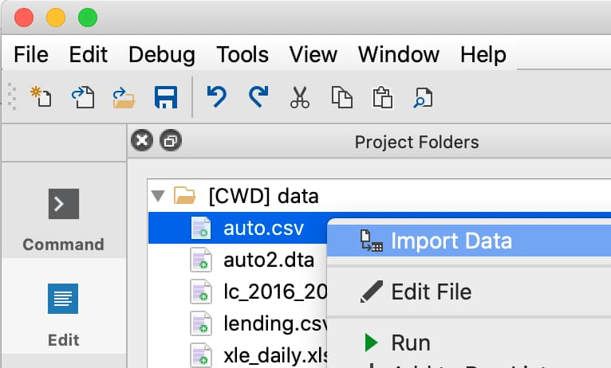

Interactive Data Import
======================================

The GAUSS **Data Import** window is an interactive environment for loading data from:

* CSV and other text delimited files.
* Excel files (XLS, XLSX).
* GAUSS datasets (DAT) and matrix files (FMT).
* SAS, Stata and SPSS datasets.

as well as performing all aspects of data import, such as:

* Selecting variables and changing their types.
* Selecting observations by range or logical filtering.
* Managing date formats and category labels.
* Previewing data.

.. figure:: ../_static/images/data-import-window-1.jpg

Open the Data Import window
--------------------------------------------

You can open the **Data Import** window in three ways:

* Select data **File > Import Data** from the main GAUSS menu bar. 
* From the **Project Folders** window:

    * Double-click on the name of the data file.
    * Right-click the file and select **Import Data** from the context menu.

Change the name of the matrix, or dataframe that is imported
---------------------------------------------------------

.. figure:: ../_static/images/data-import-symbol-name.png
    :scale: 50%

The **Symbol Name** text box in the **Data Import** window controls the name of the new matrix or dataframe that will be created. By default, this will be the name of the data file.

Autogenerated code to reproduce interactive import
---------------------------------------------------------

The **Data Import** window auto-generates code to perform all the import and filter steps. This is the actual code that is run to import the data. Therefore, you can copy-and-paste this code from the **Command History** to a program file to repeat these steps. 

.. figure:: ../_static/images/data-import-code-generation.png
    :scale: 50%

Managing import options
---------------------------------------------------------

.. figure:: ../_static/images/data-import-import-options-csv.png
    :scale: 50%

The **Import Options** tab lets you specify various aspects of data import, such as:

Import
+++++++++++

* **Keep Metadata**: If checked, the data will be imported as a dataframe with variable names and column type information (category, date, numeric, string). Otherwise the data will be imported as a matrix or string array.
* **Import As**: This dropdown allows you to import the data as a string array instead of a matrix or dataframe.

File
+++++++++++

* **Header row**: GAUSS automatically locates the most likely header row. To specify a different header row, enter the row number in the **Header Row** text box. 
* **Sheets** (Excel only) Selects which sheet to load data from. 
* **Separator** (CSV only) Select one of several common data delimiters from a list or set a custom delimitor.
* **Quote** (CSV only) Sets the quote character to a single or double-quote.

Selection
+++++++++++++++++

* **Row range**: Controls the rows of data to be imported. This should not include the variable names, if present.

Navigation and Data Preview
------------------------------

How to bring a variable in my dataset into view to preview?
++++++++++++++++++++++++++++++++++++++++++++++++++++++++++++++++++

1. Click the button with the downward pointing triangle to the right of the variable you wish to bring into view. 
2. Select **View** from the menu.

The preview window will shift to bring the selected variable into view. This is particularly useful for wide datasets with many variables. 

Find specific variables in the Variables list
+++++++++++++++++++++++++++++++++++++++++++++++++++++++++++

Type in the filter box below the **Variables** list to filter the variables by name or type. The **Variables** list will be dynamically updated with matches after each new character.

.. note:: You can filter the variables by type. For example, entering `category` in the filter text box will show all variables that are listed as categorical.

Select multiple variables
+++++++++++++++++++++++++++++++++++++++++++++++++++++++++++

Click on the variable names while pressing the `Control` or `Command` key to select multiple variables that are not next to eachother. Once selected, you can add, remove or change their types all at once.

Select a group of variables
++++++++++++++++++++++++++++++++++++++++++++++++++++++++++++++++++

Click on the name of the first variable in the group. Press `Shift` and click on the name of the last variable in the group. 

You may now perform actions on this entire group such as changing the variable types, selecting the variables for import.

Importing subsets of data
---------------------------------

Select subsets of variables to import
++++++++++++++++++++++++++++++++++++++++++++++++++++++++++++++++++

Clear the checkbox to the left of the variable name on the **Variables** tab for any variables you do not want to load. 

Control which rows are imported
++++++++++++++++++++++++++++++++++++++++++++++++++++++++++++++++++

The starting and ending row can be specified in the **Row Range** text box located in the  **File** pane of the **Import Options** tab. 

.. note:: By default, GAUSS assumes the starting row is the first row immediately after the header row. 

Data Filtering
---------------------------------

Filter observations to be imported
++++++++++++++++++++++++++++++++++++++++++++++++++++++++++++++++++

1. Use the **Variable** name drop-down list on the **Filter** tab to select a variable to use for filtering.
2. Select the desired filtering operation from the **Operation drop-down** list. 
3. Enter the value for the filtering condition in the **Value** text box. 
4. Click the ``+`` button to add the filter.

+--------------------+------------------+
|Data type           |Filter options    |
+====================+==================+
|Numeric and Date    |                  | 
+--------------------+------------------+
|                    |=                 |
+--------------------+------------------+
|                    |!=                |
+--------------------+------------------+
|                    |<                 |
+--------------------+------------------+
|                    |<=                |
+--------------------+------------------+
|                    |>                 |
+--------------------+------------------+
|                    |>=                |
+--------------------+------------------+
|                    |Is Missing        |
+--------------------+------------------+
|                    |Is Not Missing    |
+--------------------+------------------+
|String and Category |                  |
+--------------------+------------------+
|                    |Equals            |
+--------------------+------------------+
|                    |Not Equals        |
+--------------------+------------------+
|                    |Contains          |
+--------------------+------------------+
|                    |Does not Contain  |
+--------------------+------------------+
|                    |Is Empty          |
+--------------------+------------------+
|                    |Is Not Empty      |
+--------------------+------------------+
|                    |Is Missing        |
+--------------------+------------------+
|                    |Is Not Missing    |
+--------------------+------------------+

Disable a filtering condition
++++++++++++++++++++++++++++++++++++++++++++++++++++++++++++++++++

Uncheck the checkbox to the left of the enacted filter to disable it.

Hide filtered observations from view
++++++++++++++++++++++++++++++++++++++++++++++++++++++++++++++++++

Check the **Hide Filtered Rows/Columns** option on the **Filter** tab to remove filtered observations from the preview. 

Dates
------------------------------------------------------------------

Interactively import dates into GAUSS
++++++++++++++++++++++++++++++++++++++++++++++++++++++++++++++++++

The GAUSS **Data Import** window uses an internal smart date detector to automatically recognize data which represents dates and times. 

If a date variable is not determined by GAUSS as a date, you can select **Date** from the **Type** drop-down list on the **Variable** tab. 
When a variable type is changed to **Date**, a **Specify Date Format** dialog automatically opens.

Specify a date format
++++++++++++++++++++++++++++++++++++++++++++++++++++++++++++++++++

If GAUSS does not automatically detect your date format, you will be asked to manually specify a date format using the **Specify Date Format** dialog. 

.. figure:: ../_static/images/data-import-date-specify-dialog.jpg
    :scale: 50%

Build a format string in the **Date format** box, using the BSD strftime specifiers, that represents your data. 

If your data looked like this ``03/12/2017``, the correct format string would be ``%m/%d/%Y``. The table below explains this.

+-----------------+---------------------------+---------+----------------------+
|Original Contents|Description                |Type     |Format string contents|
+=================+===========================+=========+======================+
|03               |A two digit month.         |Date     |`%m`                  |
+-----------------+---------------------------+---------+----------------------+
|/                |A forward slash.           |Literal  |/                     |
+-----------------+---------------------------+---------+----------------------+
|12               |A two digit day.           |Date     |`%d`                  |
+-----------------+---------------------------+---------+----------------------+
|/                |A forward slash.           |Literal  |/                     |
+-----------------+---------------------------+---------+----------------------+
|2017             |A four digit year.         |Date     |`%Y`                  |
+-----------------+---------------------------+---------+----------------------+

The **Format Options** section of this dialog contains the BSD strftime specifiers for reference. Use the **Filter** dropdown to filter the reference options shown.

String type
------------------------------------------------------------------

How to change my variable to a string type?
++++++++++++++++++++++++++++++++++++++++++++++++++++++++++++++++++

To specify a variable as a string, select String from the Type drop-down list on the Variables tab of the **Data Import** window. 
When a variable is specified as a string type, it attaches string labels to underlying numeric variables. 
This allows you to view string labels when printing your matrix.

Category type
------------------------------------------------------------------

How to specify my variable to be a category?
++++++++++++++++++++++++++++++++++++++++++++++++++++++++++++++++++

To specify that a variable is a categorical variable, select Category from the Type drop-down list on the Variables tab of the **Data Import** window. 

How to change the category mapping?
++++++++++++++++++++++++++++++++++++++++++++++++++++++++++++++++++

When you change a variable to a category, a [image of the hamburger menu] Menu will appear next to the variable. This will open a Modify Column Mapping dialog. 

Enter the desired label in the Renamed Label textbox next to the category label you want to change.
Click [image of OK button in Modify Column Mapping] to apply the new category labels. 

How to specific categories to be the base case?
++++++++++++++++++++++++++++++++++++++++++++++++++++++++++++++++++

Open [image of the hamburger menu] the Menu next to the categorical variable of interest. This will open the Modify Column Mapping dialog.
The Key column indicates the ordering of the categories. The category with the Key equal to zero is used as the base case in all GAUSS estimation procedures. 
To change the base case select the Label of the category you want to be the new base case. 

Click [image of the double arrow button in the modify column mapping dialog] to move the selected category to the base case. 

How to count the number of categories in my categorical data?
++++++++++++++++++++++++++++++++++++++++++++++++++++++++++++++++++
Open [image of the hamburger menu] the Menu next to the categorical variable of interest. This will open the Modify Column Mapping dialog.
The count of categories will be located in the upper right hand corner of the Modify Column Mapping dialog. 
[Image of the Category Count in the Modify Column Mapping]

Numeric type	
------------------------------------------------------------------

How to convert my data to a numeric variable?
++++++++++++++++++++++++++++++++++++++++++++++++++++++++++++++++++

To specify a variable as a numeric variable, select String from the Type drop-down list on the Variables tab of the **Data Import** window. 

