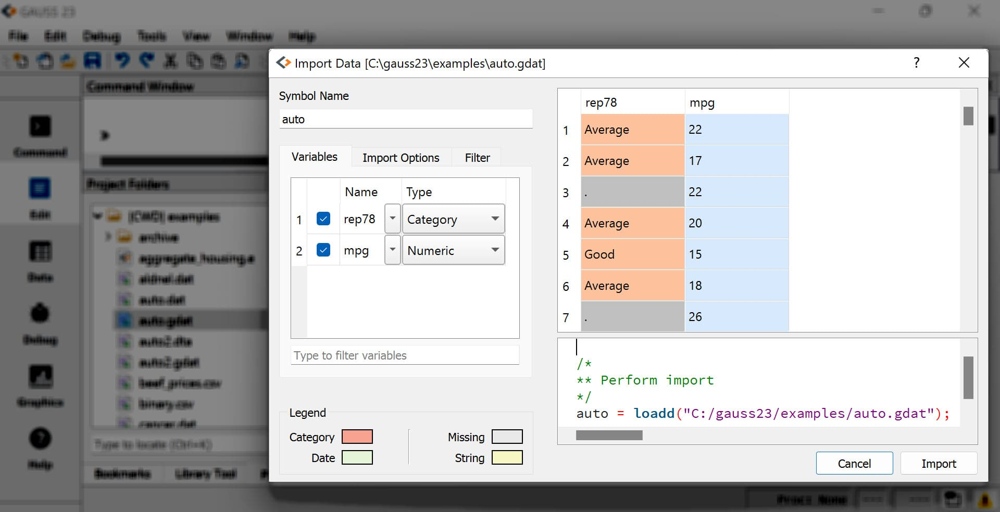

Programmatic Export
=============================

+--------------------+--------------+-----------------+-----------------+--------------------------+
|                    |:func:`saved` |:func:`csvWriteM`|:func:`xlsWrite` |:func:`save`              |
+====================+==============+=================+=================+==========================+
|**File types**      |              |                 |                 |                          |
+--------------------+--------------+-----------------+-----------------+--------------------------+
|GAUSS Dataset       |       X      |                 |                 |                          |
| (GDAT, DAT)        |              |                 |                 |                          |
+--------------------+--------------+-----------------+-----------------+--------------------------+
|CSV                 |       X      |        X        |                 |                          |
+--------------------+--------------+-----------------+-----------------+--------------------------+
|Excel (XLS, XLSX)   |       X      |                 |        X        |                          |
+--------------------+--------------+-----------------+-----------------+--------------------------+
|GAUSS Matrix (FMT)  |       X      |                 |                 |           X              |
+--------------------+--------------+-----------------+-----------------+--------------------------+
|GAUSS String (FST)  |              |                 |                 |           X              |
+--------------------+--------------+-----------------+-----------------+--------------------------+

Exporting datasets
----------------------------------------------
The :func:`saved` procedure exports matrices and dataframes in the GAUSS workspace to datasets in GDAT, CSV, DAT, XLS, or XLSX format.

The GDAT file type should be used to save all data attributes within a GAUSS dataframe. It is the only file format that can be used to save and load GAUSS dataframes without losing any data characteristics such as variable names, types, and formats.

When using :func:`saved` to save non-GDAT file types:

* **Variable names** from dataframes will be written to the file. For matrices, variable names can be provided, or default variable names (X1, X2,...XP) will be created.
* **Labels** from string and category columns in a dataset will be written as string labels in Excel and CSV files.
* **The file type** for the dataset created is determined by the file extension of the dataset.

Example: Load Stata dataset and save to a CSV file
++++++++++++++++++++++++++++++++++++++++++++++++++++

::

    // Create file name with full path
    fname = getGAUSSHome("examples/auto2.dta");

    // Load 'rep78' as a categorical variable and 'mpg' as a numeric variable
    auto = loadd(fname, "cat(rep78) + mpg");

    // Save the data to a CSV dataset
    call saved(auto, "auto.csv");

After the above code, there will be a file named *auto.csv* in your current working directory. The first five rows of the file will look like this:

::

    rep78,mpg
    Average,22
    Average,17
    ,22
    Average,20

Example: Load Stata dataset and save to a .gdat file
++++++++++++++++++++++++++++++++++++++++++++++++++++

::

    // Create file name with full path
    fname = getGAUSSHome("examples/auto2.dta");

    // Load 'rep78' as a categorical variable and 'mpg' as a numeric variable
    auto = loadd(fname, "cat(rep78) + mpg");

    // Save the data to a CSV dataset
    call saved(auto, "auto.gdat");

Opening the file `auto.gdat` in the *Data Import* window provides a preview of the created file, *auto.gdat*:

Full details and more examples can be found in the Command Reference page for :func:`saved`.

Advanced exporting to Excel spreadsheets
----------------------------------------------

:func:`xlsWrite` can write a GAUSS matrix, string, or string array to a specified range of an Excel spreadsheet.

Example: Save a matrix to an Excel file
++++++++++++++++++++++++++++++++++++++++++

::

    // Create an example matrix
    X = { 1 2,
          3 4,
          5 6 };

    // Write the contents of 'X' to an Excel file
    call xlsWrite(X, "example.xlsx", "B2");

The above code will write the data in the matrix ``X`` to the cell range ``"B2:C4"`` of the first sheet of an Excel file named *example.xlsx* in your current working directory.

The :func:`xlsWrite` Command Reference page explains how to specify the sheet number and contains more examples.

Advanced exporting to CSV files
----------------------------------------------
Use the :func:`csvWriteM` procedure to write a GAUSS matrix to a ``.csv`` file.

Example: Save a matrix to an CSV file
++++++++++++++++++++++++++++++++++++++++++

::

    // Create an example matrix
    X = { 1 2,
          3 4,
          5 6 };

    // Write the contents of 'X' to a CSV file
    call csvWriteM(X, "example.csv");

The above code will write the data in the matrix *X* to a CSV file named *example.csv* in your current working directory.

In addition to the data and filename, :func:`csvWriteM` also allows you to specify:

* The data separator or delimiter.
* The number of digits of precision to return when exporting.
* Whether the data should be appended to a current file, or overwrite an existing file.
* The end of line character.

The Command Reference page for :func:`csvWriteM` describes their usage.

Exporting to HDF5 Files
----------------------------------------------

HDF5 files are flexible data files with many options. Multiple datasets can be held inside a single HDF5 file.

Create an HDF5 data file
+++++++++++++++++++++++++++++++

:func:`h5create` will create a new HDF5 file. It requires that you specify:

1. The file name.
2. The first dataset to create in the file. (Others may be added later).
3. The size of the dataset. (Though the dimensions do not need to be fixed).

::

    // Specify 4 columns and a flexible number of rows
    dims = __INFP | 4;

    // Create an HDF5 file with one dataset named 'data'
    call h5create("example.h5", "data", dims);

:func:`h5create` also allows you to specify:

* The data type. The default is double precision floating point.
* The data chunksize in the file. This can be important for performance of large files.

Write data to an HDF5 data file
++++++++++++++++++++++++++++++++++

:func:`h5write` will write data to a dataset inside of an HDF5 file previously created by :func:`h5create`.

::

    // Example 2x4 matrix
    X = { 1 2 3 4,
          5 6 7 8 };

    // Write the data in X to the 'data' dataset
    // in 'example.h5'
    call h5write("example.h5", "data", X);

Write data attributes to an HDF5 data file
+++++++++++++++++++++++++++++++++++++++++++++

An HDF5 **Attribute** is extra data stored in a dataset. They can be used to describe the data.

Variable names, or headers, can be stored in an HDF5 **Attribute**.

::

    // Create a 4x1 string array with variable names
    vnames = "alpha" $| "beta" $| "gamma" $| "delta";

    // Add the variable names as an Attribute to the 'data' dataset in
    // the 'example.h5' file
    call h5writeAttribute("example.h5", "data", "headers", vnames);

.. note:: HDF5 files with an **Attribute** named `headers` containing the variable names can be loadded with :func:`loadd`.

Saving matrices, strings, and string arrays
----------------------------------------------

Using the ``save`` keyword to save GAUSS matrices (``.fmt``) and strings/ string arrays (``.fst``) can be very convenient and is very fast. However, it does not support variable names or non-numeric columns.

By default, ``save`` will save the data to your current working directory.

::

    // Example data
    X = { 1 2 3 4,
          5 6 7 8 };

    // Save the data in 'X' to a file named 'X.fmt'
    // in your current working directory
    save X;

You change the path that ``save`` uses by adding the ``path`` option. For example, if you have a folder named ``data`` inside your current directory:

::

    // Future calls to 'save' will write
    // data to the folder C:\\gauss\\data
    save path = C:/gauss/data;

    save X;
