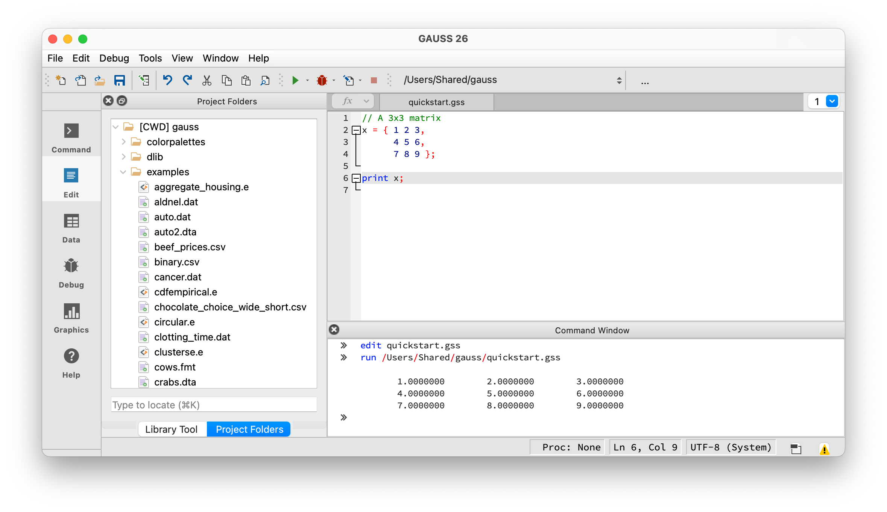
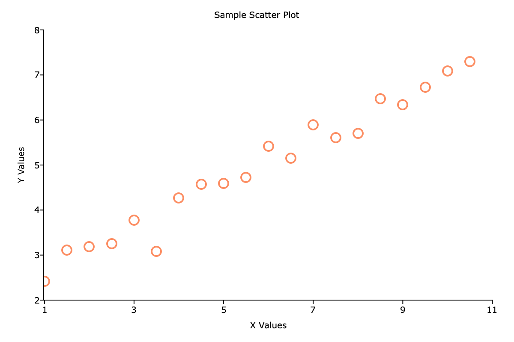
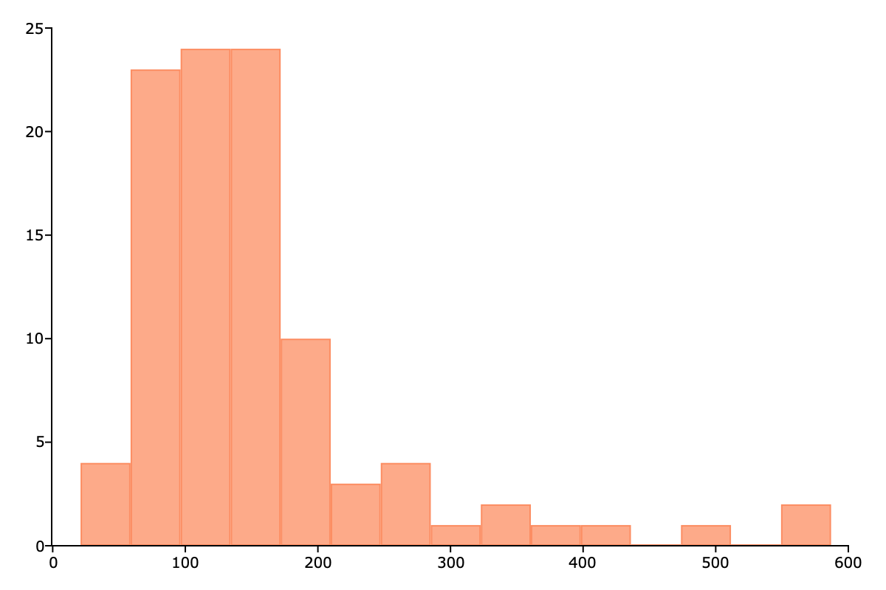

GAUSS Quickstart
================

This 10-minute guide gets you writing and running GAUSS code. You'll learn to create matrices, load data, run a regression, and make a plot.

Prerequisites
-------------

- GAUSS installed
- Basic familiarity with any programming language (helpful but not required)

**Where to type code:** Open GAUSS and create a new program file (File → New). Type or paste the examples below, then click the **Run** button to execute. You can also type single lines in the **Command Window** at the bottom.

   Code goes in the **Editor** (top right). Output appears in the **Command Window** (bottom).

Creating Matrices
-----------------

Everything in GAUSS is built on matrices. A **dataframe** is a matrix with named, typed columns -- you get one when you load data with :func:`loadd`. We'll start with plain matrices, then work with dataframes starting in `Loading Data`_ below.

Every GAUSS statement ends with a semicolon (``;``). Lines starting with ``//`` are comments.

Create a matrix by listing values in braces, with spaces separating columns and commas separating rows:

::

    // A 3x3 matrix
    x = { 1 2 3,
          4 5 6,
          7 8 9 };
    print x;

Output::

           1.0000000        2.0000000        3.0000000
           4.0000000        5.0000000        6.0000000
           7.0000000        8.0000000        9.0000000

Create sequences with :func:`seqa`:

::

    // Start at 1, increment by 1, 5 elements
    x = seqa(1, 1, 5);
    print x;

Output::

           1.0000000
           2.0000000
           3.0000000
           4.0000000
           5.0000000

Generate random data with :func:`rndn` (standard normal):

::

    // 3 rows, 4 columns of random normals
    x = rndn(3, 4);
    print x;

Your output will differ since the values are random.

Basic Operations
----------------

GAUSS uses ``*`` for matrix multiplication and ``.*`` for element-wise multiplication. The same dot-prefix pattern applies to division (``./``) and exponentiation (``.^``). Addition and subtraction (``+``, ``-``) always work element-wise:

::

    // A 5x1 column vector (commas separate rows)
    x = { 1, 2, 3, 4, 5 };

    // Element-wise square
    y = x.^2;

    // Horizontal concatenation with ~ (joins columns side by side)
    print x~y;

Output::

           1.0000000        1.0000000
           2.0000000        4.0000000
           3.0000000        9.0000000
           4.0000000        16.000000
           5.0000000        25.000000

Common statistical functions:

::

    x = rndn(100, 3);

    print "Column means:";
    print meanc(x);

    print "Column std devs:";
    print stdc(x);

    // sumc sums each column; nest it to get the grand total
    print "Sum of all elements:";
    print sumc(sumc(x));

Loading Data
------------

Use :func:`loadd` to load CSV, Excel, SAS, Stata, or GAUSS datasets:

::

    // Get full path to a dataset included with GAUSS
    fname = getGAUSSHome("examples/housing.csv");

    // Load the data
    data = loadd(fname);

    print rows(data) "rows," cols(data) "columns";

Output::

           100.00000 rows,       6.0000000 columns

View column names:

::

    print getcolnames(data);

Output::

           taxes
            beds
           baths
             new
           price
            size

Preview the first few rows (the ``.`` means "all columns"):

::

    print data[1:5, .];

Output::

               taxes             beds            baths              new            price             size
           3104.0000        4.0000000        2.0000000        0.0000000        279.90000        2048.0000
           1173.0000        2.0000000        1.0000000        0.0000000        146.50000        912.00000
           3076.0000        4.0000000        2.0000000        0.0000000        237.70000        1654.0000
           1608.0000        3.0000000        2.0000000        0.0000000        200.00000        2068.0000
           1454.0000        3.0000000        3.0000000        0.0000000        159.90000        1477.0000

Running a Regression
--------------------

Use :func:`olsmt` for OLS regression with a formula string. Inside the formula, ``~`` separates the dependent variable from the independent variables, and ``+`` lists the predictors. (This ``~`` is unrelated to the concatenation operator — it only has this meaning inside a formula string.)

``call`` discards the return value — use it when you just want the printed report:

::

    // Load the housing dataset
    fname = getGAUSSHome("examples/housing.csv");
    data = loadd(fname);

    // Regress price on beds, baths, and size
    call olsmt(data, "price ~ beds + baths + size");

Output::

    Ordinary Least Squares
    ====================================================================================
    Valid cases:                      100          Dependent variable:             price
    Missing cases:                      0          Deletion method:                 None
    Total SS:                    1.02e+06          Degrees of freedom:                96
    R-squared:                      0.701          Rbar-squared:                   0.692
    Residual SS:                 3.03e+05          Std. err of est:                 56.2
    F(3,96):                         75.1          Probability of F:            4.38e-25
    ====================================================================================
                                Standard                    Prob       Lower       Upper
    Variable        Estimate       Error     t-value        >|t|       Bound       Bound
    ------------------------------------------------------------------------------------

    CONSTANT          -27.29      28.241    -0.96634      0.3363     -82.641      28.061
    beds             -14.466      10.583     -1.3668     0.17487     -35.209      6.2779
    baths             6.8903       13.54     0.50888       0.612     -19.648      33.429
    size             0.13043    0.011951      10.914  1.6423e-18     0.10701     0.15386
    ====================================================================================

The output shows coefficients, standard errors, t-values, p-values, and confidence intervals. House size is the only significant predictor (p < 0.001).

Creating Plots
--------------

GAUSS has built-in plotting functions. Here's a scatter plot:

::

    // Generate sample data
    x = seqa(1, 0.5, 20);
    y = 2 + 0.5*x + rndn(20, 1)*0.3;

    // Create a scatter plot
    plotScatter(x, y);

   A basic scatter plot

Customize plots with a ``plotControl`` structure. Create one, set options on it with ``plotSet`` functions, then pass it to the plot call. The ``&`` before the structure name is required so the function can update the settings:

::

    struct plotControl myPlot;
    myPlot = plotGetDefaults("scatter");

    plotSetTitle(&myPlot, "Housing: Price vs Size");
    plotSetXLabel(&myPlot, "Square Feet");
    plotSetYLabel(&myPlot, "Price ($000s)");

    fname = getGAUSSHome("examples/housing.csv");
    data = loadd(fname);

    // data[., "size"] selects all rows of the column named "size"
    plotScatter(myPlot, data[., "size"], data[., "price"]);

For histograms:

::

    fname = getGAUSSHome("examples/housing.csv");
    data = loadd(fname);
    plotHist(data[., "price"], 15);

   Distribution of housing prices

Saving Your Work
----------------

Save the most recent plot to a file with :func:`plotSave`. The ``|`` operator stacks values into a column vector — here it creates a 2x1 width-by-height size:

::

    // Save the last plot as an 800x600 PNG
    plotSave("my_scatter.png", 800|600, "px");

Files are saved to your GAUSS working directory (shown at the top of the GAUSS window).

Save data with :func:`saved`:

::

    // Save as CSV
    saved(data, "mydata.csv");

    // Save as GAUSS dataset (.gdat preserves column names and types)
    saved(data, "mydata.gdat");

What's Next?
------------

- :doc:`absolute-basics` — If you're new to programming
- :doc:`running-existing-code` — If you inherited GAUSS code
- :doc:`../data-management` — Loading and transforming data
- :doc:`../command-reference` — Full function reference

.. seealso::

    :func:`loadd`, :func:`olsmt`, :func:`plotScatter`, :func:`plotXY`, :func:`meanc`, :func:`stdc`
