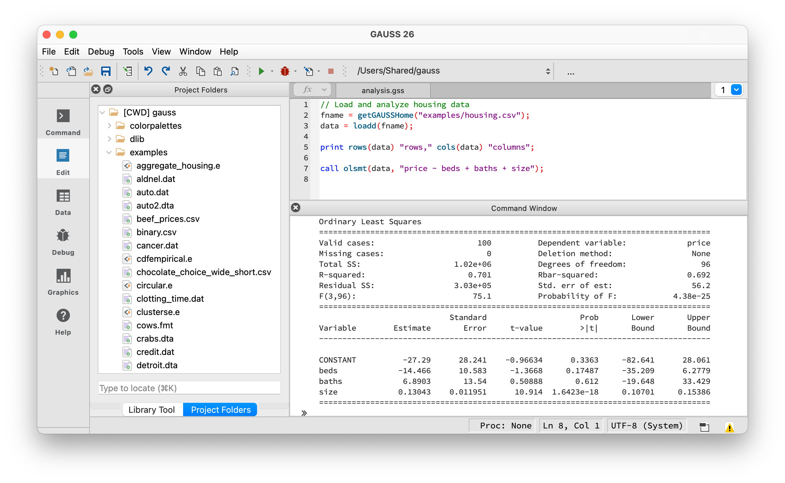

Running Existing Code
=====================

You've inherited GAUSS code from a colleague, downloaded replication files for a paper, or received code from your advisor. This guide helps you get it running.

Before You Start
----------------

Before clicking Run, take a few minutes to inventory what you have:

1. **Read any README or notes files** in the folder.
2. **Identify the main program file.** This is the file you will run — usually named ``main``, ``run``, or ``master``, with a ``.gss`` or ``.prg`` extension. Files ending in ``.src`` contain helper procedures and should not be run directly — they are loaded by the main program. If no file has an obvious name, open each ``.gss`` file and look for the one with ``#include`` statements and data loading near the top — that is the entry point.
3. **Check for ``#include`` lines.** Open the main file and scan for ``#include`` statements. Make sure you have all the files they reference.
4. **Check for ``library`` lines.** These load add-on packages. Check Tools → Package Manager to see if the required packages are installed.
5. **Check for data files.** Scan for ``loadd``, ``csvReadM``, or ``load`` statements. Make sure you have all the data files they reference.

Opening and Running a File
--------------------------

GAUSS programs are plain text files. The modern convention is ``.gss`` for program files and ``.src`` for source files that only contain procedure definitions. Shared or older code may use other extensions such as ``.prg``, ``.gau``, ``.e``, or even ``.txt``. If a file has a ``.txt`` extension, use File → Save As to save it as ``.gss`` — this enables syntax highlighting.

1. File → Open (or Ctrl+O / Cmd+O)
2. Navigate to the main program file
3. Click the **Run** button or press F5

   A program file open in the **Editor** with successful output in the **Command Window**.

When a program runs successfully, results from ``print`` statements and estimation procedures appear in the **Command Window** at the bottom of the screen. Plots open in a separate window. Some programs save output to files — look for ``output file =`` or :func:`saved` statements in the code. If the program finishes without errors but you don't see output, check whether results were written to a file in your working directory.

Common First-Run Errors
-----------------------

File Not Found
^^^^^^^^^^^^^^

::

    error G0014 : 'loadd' : File not found: data.csv

**Cause:** GAUSS can't find a data file the code references.

**Solutions:**

1. **Check the working directory.** The code may assume files are in a specific location.

   ::

       // See current working directory
       print cdir(0);

       // Change to the folder containing your data
       chdir "/path/to/your/data";

2. **Use absolute paths.** Edit the code to specify the full path:

   ::

       // Instead of:
       data = loadd("mydata.csv");

       // Use:
       data = loadd("/Users/you/research/project/mydata.csv");

3. **Copy data files** to the same folder as the program file.

Undefined Symbol
^^^^^^^^^^^^^^^^

::

    error G0025 : Undefined symbol: 'olsmt'

**Cause:** The code uses a function that isn't loaded.

**Solutions:**

1. **Missing library statement.** Add at the top of the file:

   ::

       library tsmt, cmlmt;  // Load required libraries

2. **Missing add-on package.** Some functions require separately installed packages:

   - ``olsmt``, ``glm`` → Base GAUSS (should work)
   - ``varma``, ``varmares`` → TSMT (Time Series MT)
   - ``dcc``, ``garch`` → FANPAC or TSMT
   - ``cmlmt``, ``comt`` → Optimization packages
   - ``dcm`` → Discrete Choice Models

   Check Tools → Package Manager to see installed packages.

3. **Missing procedure definition.** The code may call a custom procedure defined in another file. Look for:

   ::

       // Load procedures from another file
       #include "helper_functions.src"

   Make sure that file exists in the same directory or in your GAUSS source path.

Library Not Found
^^^^^^^^^^^^^^^^^

::

    error G0044 : Library not found: tsmt

**Cause:** Code requires an add-on package you don't have.

**Solution:** Contact Aptech to purchase/license the required package, or comment out the library statement and related code to see what else runs.

Outdated ``load`` Statement
^^^^^^^^^^^^^^^^^^^^^^^^^^^

Older code may load data with the ``load`` statement:

::

    load x[] = C:\data\mydata.prn;
    load x[24,7] = C:\data\mydata.txt;

**Do not use this pattern.** When dimensions are specified (e.g., ``x[24,7]``), GAUSS forces the data into that shape — silently recycling or truncating values and potentially putting data in the wrong columns. Replace ``load`` with :func:`csvReadM` for headerless numeric files:

::

    // Read numeric data with default comma separator
    x = csvReadM("C:\\data\\mydata.txt");

    // Specify a different separator: tab, space, or semicolon
    x = csvReadM("C:\\data\\mydata.txt", "\t");     // tab
    x = csvReadM("C:\\data\\mydata.txt", " ");      // space
    x = csvReadM("C:\\data\\mydata.txt", ";");      // semicolon

If the file has column headers (or you can add them), rename it to ``.csv`` and use :func:`loadd` instead — this gives you a dataframe with named columns.

Outdated ``pgraph`` Plotting
^^^^^^^^^^^^^^^^^^^^^^^^^^^^^

Older code may use the ``pgraph`` library for plotting:

::

    library pgraph;
    xy(x, y);

The ``pgraph`` library and its functions (``xy``, ``bar``, ``hist``, ``surface``, ``contour``, etc.) have been replaced by modern built-in plotting functions. Remove the ``library pgraph;`` line and replace the old function calls:

================= =========================
Old (pgraph)      Modern replacement
================= =========================
``xy(x, y)``      ``plotXY(x, y)``
``bar(x, y)``     ``plotBar(x, y)``
``hist(x, bins)`` ``plotHist(x, bins)``
``surface(x)``    ``plotSurface(x)``
``contour(x)``    ``plotContour(x)``
================= =========================

The modern ``plot`` functions support the same data but also offer customization through ``plotControl`` structures. See :doc:`quickstart` for an example.

``library`` vs. ``#include``
^^^^^^^^^^^^^^^^^^^^^^^^^^^^

These serve different purposes:

- ``library tsmt;`` loads an installed add-on package. It makes all functions from that package available.
- ``#include "file.src"`` reads in the contents of a specific file. Code from colleagues typically uses ``#include`` for their custom procedures and ``library`` for commercial GAUSS packages.

Understanding ``#include``
^^^^^^^^^^^^^^^^^^^^^^^^^^

Code often loads procedures from other files with ``#include``:

::

    #include "helper_functions.src"
    #include "utilities.gau"

This reads in the contents of that file before your program runs — it's how code reuses procedures defined elsewhere. GAUSS searches for included files in this order:

1. Your current working directory (shown at the top of the GAUSS window)
2. Directories listed in your source path (Edit → Preferences → Source Path)

Note that GAUSS searches the **working directory**, not the directory containing the program file — these may be different. If you get a file-not-found error on an ``#include``, the easiest fix is to add ``#includedir`` (with no argument) at the very top of the program:

::

    #includedir
    #include "helper_functions.src"

This adds the program file's own directory to the source path, so GAUSS will find other files in the same folder regardless of your working directory. If the included files are in a subfolder, specify it as a relative path:

::

    #includedir src
    #include "helper_functions.src"

Some code uses many ``#include`` statements. Check that you received **all** the files, not just the main program.

If you can't find an included file, ask the person who sent you the code — it likely contains custom procedures that the main program depends on.

Understanding Code Structure
----------------------------

GAUSS programs typically follow this structure:

::

    // 1. Library declarations (only needed for add-on packages)
    library tsmt;

    // 2. Global settings or data paths
    data_path = "/path/to/data/";

    // 3. Load data
    data = loadd(data_path $+ "mydata.csv");

    // 4. Data preparation
    y = data[., "gdp"];
    x = data[., "date"];

    // 5. Analysis
    call adf(y, 4);

    // 6. Output/plots
    plotXY(x, y);

Key Syntax to Recognize
-----------------------

**Semicolons** end statements (required):

::

    x = 5;      // Correct
    x = 5       // Error: missing semicolon

**Comments:**

::

    // Single line comment
    /* Multi-line
       comment */

**String concatenation** uses ``$+``:

::

    path = "/data/" $+ "file.csv";

**Matrix indexing** uses square brackets (1-based):

::

    x[1, 2]     // Row 1, column 2
    x[1:5, .]   // Rows 1-5, all columns
    x[., 1]     // All rows, column 1

**Discarding return values** — use ``call`` to run a function for its printed output without storing the result:

::

    call olsmt(data, "y ~ x1 + x2");   // Print the report, discard the return value

**Procedures** are defined with ``proc`` and ``endp``. The ``(1)`` is the number of return values. ``local`` declares variables that only exist inside the procedure — without it, variables are global:

::

    proc (1) = myfunction(x);
        local result;               // Local to this procedure
        result = x^2;
        retp(result);               // Return the result
    endp;

**Structures** group related results together. Many GAUSS functions return a structure instead of a single value:

::

    struct olsmtOut out;
    out = olsmt(data, "y ~ x1 + x2");

    print out.b;          // Coefficients
    print out.stderr;     // Standard errors

Installing Required Libraries
-----------------------------

If code requires add-on packages:

1. **Browse and install packages:** Tools → Package Manager
2. **Install a downloaded package:** Tools → Install Application
3. **Purchase add-ons:** Contact sales@aptech.com

Common packages for econometrics:

================= ===============================================
Package           Functions
================= ===============================================
TSMT              Time series: VAR, GARCH, state-space, forecasting
Optmum/CO/ML      Optimization, maximum likelihood
DCM               Discrete choice models
FANPAC            Financial analysis, GARCH variants
================= ===============================================

Setting Up Source Paths
-----------------------

If code includes files from multiple directories, set paths in GAUSS:

1. Edit → Preferences → Source Path
2. Add directories containing your ``.src`` files

This tells GAUSS where to find ``#include`` files and procedure definitions.

Debugging Tips
--------------

**Print intermediate values:**

::

    print "x dimensions:" rows(x) cols(x);
    print "First 5 rows:";
    print x[1:5, .];

**Step through code:** Use the GAUSS debugger (F8 to set breakpoint, F5 to run to breakpoint).

**Check variable types:**

::

    print type(x);   // 6 = matrix/dataframe, 13 = string, 21 = string array

**Run code section by section:** Highlight lines and press F4 to run selection.

Getting Help
------------

Press **F1** with the cursor on a function name to open its documentation. You can also use the Help menu to browse the Command Reference.

If you're looking for a function but don't know its name, open the Help menu and search the Command Reference. The documentation page for each function shows which package it belongs to.

.. seealso::

    :doc:`quickstart` — Learn GAUSS basics from scratch

    **Coming from another language?** Side-by-side guides for
    :doc:`../coming-to-gauss/intro-gauss-for-stata-users`,
    :doc:`../coming-to-gauss/intro-gauss-for-r-users`,
    :doc:`../coming-to-gauss/intro-gauss-for-matlab-users`,
    :doc:`../coming-to-gauss/intro-gauss-for-eviews-users`, and
    :doc:`../coming-to-gauss/intro-gauss-for-python-users`.
