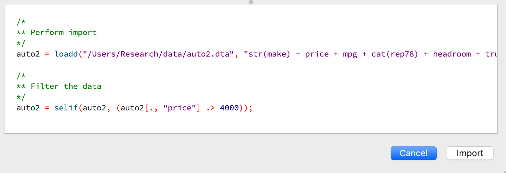

Introduction to GAUSS for Stata Users
=======================================
This page provides a basic overview of how common Stata operations can be implemented in GAUSS. It is not meant to serve as a comprehensive getting started guide and throughout references will be provided for those who wish to explore topics in greater depth.

Data Storage
-----------------------------------------------------------
GAUSS stores data in matrices, string arrays, and dataframes. One of the key differences between data storage in GAUSS and STATA is that GAUSS allows you to store data from multiple sources simultaneously. Any dataframe or matrix can be referenced, operated on, and manipulated.

In STATA, most people are familiar with working with a single dataset in memory. STATA does allow you to store multiple datasets in memory using specified data frames but special commands must be used to switch between frames.

+--------------------+-----------------------+--------------------+
| Reference          | GAUSS                 | STATA              |
+====================+=======================+====================+
|Data structure      | Dataframe or matrix   | Data set           |
+--------------------+-----------------------+--------------------+
|Series of data      | Column                | Variable           |
+--------------------+-----------------------+--------------------+
|Single occurrence   | Row                   | Observation        |
+--------------------+-----------------------+--------------------+
|Missing Values      |  `.`                  |     `.`            |
+--------------------+-----------------------+--------------------+

What is a GAUSS dataframe?
++++++++++++++++++++++++++++++
.. figure:: /static/images/data-import-window-1.jpg
    :scale: 50%

The GAUSS dataframe is used to store two-dimensional data and allows you to store:
  * Data in rows and columns, similar to the GAUSS matrix.
  * Metadata about the data type and type-related properties.
  * Different variables together, including categorical data, strings, and dates.

Many internal functions are designed to work intelligently with dataframes to use variable names and types for estimation and reporting.

For example, :func:`olsmt` will use the information stored in a dataframe during estimation to:
  * Properly include dummy variables when categorical variables are included as independent variables.
  * Include variable names in output reports.

Variables
^^^^^^^^^^^^^^^^
Each column of a GAUSS dataframe contains a series of data for a single variable. Variables are stored as strings, numbers, categories, or dates.

Variables can be referenced in GAUSS by variable name or by column number. For example, if the variable ``mpg`` is stored in the fourth column of the dataframe ``auto`` we could use either

::

    auto[., "mpg"]

or

::

    auto[., 4]

to reference the variable.

+--------------------+---------------------------------------------+------------------------------------+
| Variable           | Description                                 | Examples                           |
| Type               |                                             |                                    |
+====================+=============================================+====================================+
|String              |The string data type can contain letters,    | Customer names, product names,     |
|                    |numbers, and other characters.               | or book titles.                    |
+--------------------+---------------------------------------------+------------------------------------+
|Number              |Analogous to the data stored in              | Daily temperatures, real GDP,      |
|                    |GAUSS matrices.                              | stock prices.                      |
+--------------------+---------------------------------------------+------------------------------------+
|Categories          |Houses discrete variables that capture       | Daily temperatures, real GDP,      |
|                    |qualitative outcomes.                        | stock prices.                      |
+--------------------+---------------------------------------------+------------------------------------+
|Dates               |Houses and displays dates and times.         | Purchase date, shipping date,      |
|                    |                                             | observation date.                  |
+--------------------+---------------------------------------------+------------------------------------+

Observations
^^^^^^^^^^^^^^^^
Each row of a GAUSS dataframe contains simultaneous observations of variables. In time series data or panel data, this may correspond to dates of observations. In cross-sectional data, this may correspond to some other identifier such as identification number, observation number, or name.

Rows of data are indexed by row number . For example, if we want to access the data stored in the fourth row we use

::

  auto[4, .]

Data Input/Output
--------------------

Constructing a dataframe from values
+++++++++++++++++++++++++++++++++++++
In STATA, the ``input`` statement is used to build a datasets from specified values and column names:

.. code-block:: stata

  input  x y
  1 2
  3 4
  5 6
  end

In GAUSS, a dataframe can be manually entered from values and variable names using the :func:`asDF` procedure:

::

  mat = { 1 2, 3 4, 5 6};
  df = asDF(mat, “X”, “Y”);

Reading external dataset
+++++++++++++++++++++++++++++++++++++
GAUSS can directly read and load data from most data formats including:
  * CSV
  * Excel (XLS, XLSX)
  * HDF
  * GAUSS matrices (FMT)
  * GAUSS datasets (DAT)
  * Stata datasets (DTA)
  * SAS datasets (SAS7BDAT, SAS7BCAT)

In STATA, the `import` command is used to import non-STATA datasets. Additional information must be provided to specify what type of file is being imported.

.. code-block:: stata

  import excel "nba_ht_wt.xls", clear

Alternatively, the ``tips2.csv`` dataset is loaded into STATA using the import delimited command

.. code-block:: stata

  import delimited "tips2.csv", clear

.. note:: The use of the ``clear`` option is necessary in STATA if the data is already loaded into the workspace. In GAUSS, this is not necessary because multiple data sets can be loaded into the work space simultaneously.

In GAUSS, all data files are loaded using the :func:`loadd` procedure. For example, consider loading the ``auto2.dta`` dataset:

::

  auto2 = loadd("C:/gauss22/examples/auto2.dta");

This load all the variable in the dataset and auto-detects their type.

.. figure:: /static/images/data-import-window-1.jpg
    :scale: 50%

Sometimes, you may need to specify the type and/or variables that you wish to load. This is done using a `formula string <https://www.aptech.com/resources/tutorials/formula-string-syntax/>`_:

For example, let’s consider  loading `nba_ht_wt.xls` in GAUSS we use

::

    nba_ht_wt = loadd("C:/gauss22/examples/nba_ht_wt.xls",
                      "str(Player) + cat(Pos) + Height + Weight + Age + str(School) + date($BDate)");

Similarly, the `tips2.csv` data file:

::

    tips2 = loadd("C:/gauss22/examples/tips2.csv",
                  "id + total_bill + tip + cat(sex) + cat(smoker) + cat(day) + cat(time) + size");

Formula strings accept a number of operators and keywords which allow you to:

* Specify variable types.
* Perform data transformations.

+--------------------+---------------------------------------------+
|Operator            | Purpose                                     |
+====================+=============================================+
|      `.`           |Represents all variables.                    |
+--------------------+---------------------------------------------+
|      `+`           |Adds a variable.                             |
+--------------------+---------------------------------------------+
|      `-`           |Removes a variable.                          |
+--------------------+---------------------------------------------+
|      `1`           |Represents and intercept term.               |
+--------------------+---------------------------------------------+
|      `*`           |Adds an interaction term and includes both   |
|                    |original variables.                          |
+--------------------+---------------------------------------------+
|      `:`           |Adds an interaction term between two         |
|                    |variables but does not include either        |
|                    |of the original variables.                   |
+--------------------+---------------------------------------------+

+--------------------+---------------------------------------------+
|Keyword             | Purpose                                     |
+====================+=============================================+
|      `cat`         |Load a variable as a categorical column.     |
+--------------------+---------------------------------------------+
|      `date`        |Load a variable as a date column.            |
+--------------------+---------------------------------------------+
|      `str`         |Load a variable as a string column.          |
+--------------------+---------------------------------------------+
|      `$`           |Represents and intercept term.               |
+--------------------+---------------------------------------------+
|      `*`           |Adds an interaction term and includes both   |
|                    |original variables.                          |
+--------------------+---------------------------------------------+
|      `$`           |Indicate that a variable is stored in the    |
|                    |file as a string as should be passed to the  |
|                    |keyword or procedure as a string column.     |
+--------------------+---------------------------------------------+

The GAUSS Data Management guide provides a complete guide to `Programmatic Data Import <https://docs.aptech.com/gauss/data-management/programmatic-import.html#>`_.

Interactively loading data
+++++++++++++++++++++++++++++++++++++
The GAUSS **Data Import** window is a completely interactive environment for loading data and performing preliminary data cleaning. In can be used to:

* Select variables and change types.
* Select observation by range or logic filtering.
* Manage date formats and category labels.
* Preview data.

The **Data Import** window offers a data import experience most similar to STATA’s menu driven data import. Like STATA, the GAUSS **Data Import** window auto-generates code that can be reused.

You can open the **Data Import** window in three ways:

.. figure:: _static/images/data-import-project-folder.jpg
    :scale: 50%

* Select **File > Import Data** from the main GAUSS menu bar.
* From the **Project Folders** window:

    * Double-click on the name of the data file.
    * Right-click the file and select **Import Data**.

A complete `guide to interactively loading data <https://docs.aptech.com/gauss/data-management/data-cleaning.html#interactive-data-cleaning>`_ is available in the GAUSS Data Management guide.

Viewing Data
+++++++++++++++++
Data can be viewed in GAUSS a number of ways:

* Using the **GAUSS Data Editor**.
.. figure:: /_static/images/data-cleaning-open-symbol-editor-filter.jpg
    :scale: 50%
* Opening a floating **Symbols Editor** window using `Ctrl+E`.
* Printing data to the **Command Window**.

For a quick preview, portions of a dataframe can be printed directly to screen using indexing. For example, the first five rows the `auto2` dataframe can be printed to screen by entering

::

  auto2[1:5, .];

This is equivalent to using the `list` command in Stata

.. code-block:: stata

  list 1/5

If we only wanted to view the first five rows of the variable mpg from the `auto` dataframe, we would use

::

  auto2[1:5, "mpg""];

which is equivalent to

.. code-block:: stata

  list mpg 1/5

Data Operations
--------------------

Indexing matrices
++++++++++++++++++++++
GAUSS uses square brackets ``[]`` for indexing matrices. The indices are listed row first, the column, with a comma separating the two. For example, to index the element in the 3rd row and 7th column of the matrix x, we use:

::

  x[3, 7];

To select a range of columns or rows wiht numberic indices, GAUSS uses the `:` operator:

::

  x[3:6, 7];

GAUSS also allows you to use variable names in a dataframe for indexing. As an example, if we want to access the 3rd observation of the variable `mpg` in the `auto` dataframe, we use:

::

  auto[3, "mpg"];

You can also select multiple variables using a space separated list:

::

  auto[3, "mpg" "make"];

GAUSS also allows you index an entire column or row using the `.` operator. For example, to see all observations of the variable `mpg` in the `auto` dataframe, we use:

::

  auto[., "mpg"];

Operations on variables
+++++++++++++++++++++++++
In STATA, ``generate`` and ``replace`` are required to either transform existing variables or generate new variables using existing variables.

.. code-block:: stata

  replace total_bill = total_bill - 2
  generate new_bill  = total_bill / 2

In GAUSS, these operations are performed using operators, with no additional command required. For example, to subtract 2 from `total bill` GAUSS uses:

* The  ``-`` operator to subtract values.
* The ``/`` operator to divide values.
* The ``=`` to assign the new values to a storage location.

::

  tips2[., “total_bill”] = tips2[., “total_bill”] - 2;
	tips2[., “new_bill”] = tips2[., “new_bill”]/2;

Matrix operations
+++++++++++++++++++
GAUSS is a matrix based language and matrix operations play a fundamental role in GAUSS computations.

**Common Matrix Operators**
+--------------------+-----------------------+-------------------------+
|Description         | GAUSS                 | STATA                   |
+====================+=======================+=========================+
|Matrix multiply     | `z = x * y;`          |   `matrix z = x*y`      |
+--------------------+-----------------------+-------------------------+
|Solve system of     | `b = y / x;`          |   `matrix b = y*inv(x)` |
|linear equations    |                       |                         |
+--------------------+-----------------------+-------------------------+
|Kronecker product   | `z = x .*. y;`        |   `matrix z = x#y`      |
+--------------------+-----------------------+-------------------------+
|Matrix transpose    |  `z = x';`            |   `matrix z = x’`       |
+--------------------+-----------------------+-------------------------+

When dealing with matrices, it is also important to distinguish matrix operations from element-by-element operations. In STATA, element-by-element operations are specified with a colon ``:``. In GAUSS, element-by-element operations are specified by a dot ``.``.

**Element-by-element (ExE) Operators**
+---------------------------------+-----------------------+-------------------------+
|Description                      | GAUSS                 | STATA                   |
+=================================+=======================+=========================+
|Element-by-element multiply      | `z = x .* y;`         | `matrix z = x:*y`       |
+---------------------------------+-----------------------+-------------------------+
|Element-by-element divide        | `z = y ./ x;`         | `matrix z = y:/x`       |
+---------------------------------+-----------------------+-------------------------+
|Element-by-element exponentiation| `z = x .^ y;`         | `matrix z = x:^y`       |
+---------------------------------+-----------------------+-------------------------+
|Element-by-element addition      | `z = x + y;`          | `matrix z = x + y`      |
+---------------------------------+-----------------------+-------------------------+
|Element-by-element subtraction   | `z = x - y;`          | `matrix z = x - y`      |
+---------------------------------+-----------------------+-------------------------+

For a more in depth look at how matrix operation works in GAUSS you may want to review our blogs:

* `GAUSS Basics 3: Intro to Matrices <https://www.aptech.com/blog/gauss-basics-3-introduction-to-matrices/>`_
* `GAUSS Basics 4: Matrix Operations <https://www.aptech.com/blog/gauss-basics-4-matrix-operations/>`_
* `GAUSS Basics 5: Element by Element Conformability <https://www.aptech.com/blog/gauss-basics-5-element-by-element-conformability/>`_

Filtering
+++++++++++++++++++
In Stata, data is filtered using an `if` clause when using other commands. For example, to list all observations where `total_bill` is greater than 10 we use

.. code-block:: stata

  list if total_bill > 10

In GAUSS this can be done interactively **Data Management Tool**
[IMAGE NEEDED HERE]

Programmatically this is done using the selif procedure

::

  tips2 = selif(tips2, tips2[., "total_bill"] .> 10);

More information about filtering data can be found in:

* The `Interactive Data Cleaning section <https://docs.aptech.com/gauss/data-management/data-cleaning.html#filtering-observations-of-a-dataframe>`_` of the Data Management Guide.
* `Preparing and Cleaning FRED data in GAUSS <https://www.aptech.com/blog/preparing-and-cleaning-data-fred-data-in-gauss/#filtering-dates>`_
* `Getting to Know Your Data with GAUSS 22 <https://www.aptech.com/blog/getting-to-know-your-data-with-gauss-22/>`_

Selection of data
+++++++++++++++++++
Stata allows you to select, drop, or rename columns using command line keywords

.. code-block:: stata

  keep sex total_bill tip

  drop sex

  rename total_bill total_bill_2

In GAUSS, the same can be done using the Data Management Pane
[NEED GIF HERE]

The corresponding GAUSS code is

::

  // Keep only `total_bill”, “tip” and “sex”
  tips2 = tips2[., "total_bill" "tip" "sex"];

  // Drop sex variable
  tips2 = delcols(tips2, “sex”);

  // Rename variable “total_bill” to “total_bill_2”
  tips2 = dfname(tips2, "total_bill_2", "total_bill");

Sorting
++++++++++++++++
In STATA the sort command is used for sorting data

.. code-block:: stata

  sort sex total_bill

In GAUSS, this is done using sortc for a single key variable and sortmc for multiple key variables.

We can accomplish the same sorting as the STATA line above using

::

  tips2 = sortmc(tips2, "sex"$|"total_bill");
