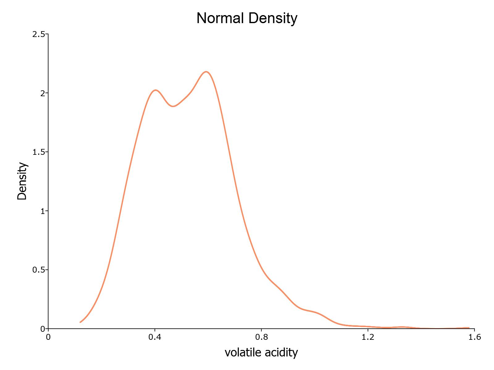

kernelDensity
==============================================

Purpose
----------------
To compute kernel density estimate and plot.

Format
----------------
.. function:: out = kernelDensity(dataset [, kernel, bw, c0])
              out = kernelDensity(dataset, formula [, kernel, bw, c0])
              out = kernelDensity(datafile, formula [, kernel, bw, c0])

    :param dataset: Name of datafile or dataframe.
    :type dataset: String or matrix

    :param formula: Optional argument, formula string for loading variables from datafile. Default is to load all variables.
    :type dataset: String

    :param kernel: Optional argument, type of kernel. Default = 1.

              =========== ==============
              1           Normal.
              2           Epanechnikov.
              3           Biweight.
              4           Triangular
              5           Rectangular.
              6           Truncated normal.
              7           Parzen.
              8           Cosine.
              9           Triweight.
              10          Tricube.
              11          Logistic.
              12          Sigmoid.
              13          Silverman.
              =========== ==============

              If kernel is scalar, the kernel is the same
              for all parameters.  Default = Normal density.

    :type kernel: Scalar

    :param bw: Optional argument, smoothing coefficient (bandwidth). If scalar, smoothing coefficient will be the same for each plot. If zero, optimal smoothing coefficient will be computed. If matrix, smoothing coefficient will be different for each observation. Default = 0.
    :type bw: Matrix

    :param c0: Instance of :class:`kernelDensityControl` structure containing the following members:

        .. list-table::
            :widths: auto

            * - c0.varNames
              - String array, variable name(s). Default is dataframe headers if included, `"X1"`, `"X2"`, ... otherwise.

            * - c0.NumPoints
              - Scalar, number of points to be computed for plots.

            * - c0.EndPoints
              - Kx2 matrix, lower (in first column) and upper (in second column) endpoints of density.  Default is minimum and maximum, respectively, of the parameter values.  If 1x2 matrix, endpoints will be the same for all parameters.

            * - c0.Truncate
              - Kx2 matrix, lower (in first column) and upper (in second column) truncation limits for truncated normal kernel. If 1x2 matrix, truncations limits will be the same for all plots.  Default is minimum and maximum, respectively.

            * - c0.plotFunctionPtr
              - Scalar, a pointer to a user-defined function used to specify format modifications to the default plot format.

    :type c0: Structure

    :return out: Instance of :class:`KernelDensityResults` structure

        .. csv-table::
            :widths: auto

                  "out.px", "Matrix, abscissae."
                  "out.py", "Matrix, ordinates."
                  "out.sm", "Kx1, or Nxk, or Nx1 smoothing coefficients."

    :rtype out: Structure

Examples
----------------

Basic usage with dataframe
+++++++++++++++++++++++++++++++

::

  /*
  ** Example One:
  ** Basic usage
  */

  // Load data
  fname = getGAUSSHome $+ "examples/winevolatileacidity.csv";
  data = loadd(fname);

  // Call kernelDensity function
  // with default normal density
  struct kernelDensityResults krslt1;
  krslt1 = kernelDensity(data[., "volatile acidity"]);

Basic usage with filename
+++++++++++++++++++++++++++++++

::

  /*
  ** Example Two:
  ** Basic usage with filename
  */

  // Load data
  fname = getGAUSSHome $+ "examples/winevolatileacidity.csv";

  // Call kernelDensity function
  // with default normal density
  call kernelDensity(fname, "volatile acidity");

Basic usage with multiple kernels
++++++++++++++++++++++++++++++++++

::

  /*
  ** Example Three:
  ** Multiple kernels
  ** on same plot
  */

  struct kernelDensityResults krslt2;
  krslt2 = kernelDensity(data[., "volatile acidity"], 1|2|3);

.. figure:: _static/images/kdensity2.jpeg
   :scale: 50 %

Basic usage with multiple series
+++++++++++++++++++++++++++++++++

::

  /*
  ** Example Four:
  ** Multiple series on different plots
  */

  struct kernelDensityResults krslt3;
  krslt3 = kernelDensity(data, 1);

.. figure:: _static/images/kdensity3a.jpeg
   :scale: 50 %

.. figure:: _static/images/kdensity3b.jpeg
   :scale: 50 %

Modifying plot with plotControl pointer
++++++++++++++++++++++++++++++++++++++++

::

  /*
  ** Example Five:
  ** Modifying plot
  */

  struct kernelDensityControl kctl;
  kctl = kernelDensityControlCreate();

  kctl.plotFunctionPtr = &myPlotCustomizations;

  // Basic example of cmlmtKerneldensity plot customization
  proc (1) = myPlotCustomizations(struct plotControl myPlot);

    //Make all lines 2px thick
    plotSetGridPen(&myPlot, "major", 1, "dimgray", 2);

    //Return modified plotControl structure
    retp(myPlot);

  endp;

  // Set kernel to normal
  kernel = 1;

  // Automatically compute bandwidth
  bw = 0;

  // Call kernelDensity with
  // control structure
  struct kernelDensityResults krslt4;
  krslt4 = kernelDensity(data[., "volatile acidity"], kernel, bw, kctl);

.. figure:: _static/images/kdensity4.jpeg
   :scale: 50 %
