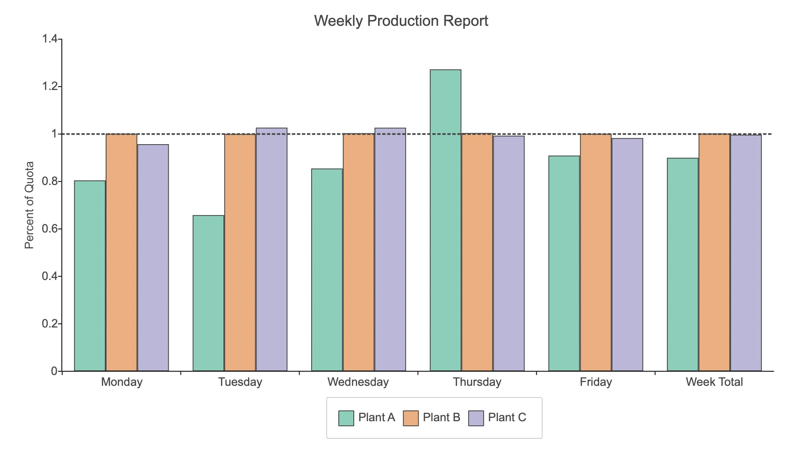

Bar plot with string labels and added horizontal line
=====================================================================

**Minimum version**: GAUSS 22.1.0

Load and preview data
++++++++++++++++++++++++++++++

Here is a link to `download the dataset <https://raw.githubusercontent.com/aptech/gauss-plot-library/master/data/plant-production.csv>`_.

::

    // Load all variables from the CSV file
    data = loadd("plant-production.csv", "str(Day) + Plant A + Plant B + Plant C");

    // Print first 5 rows
    head(data);

::

           Day    Plant A    Plant B    Plant C 
        Monday       0.80       1.00       0.96 
       Tuesday       0.66       1.00       1.03 
     Wednesday       0.85       1.00       1.03 
      Thursday       1.27       1.00       0.99 
        Friday       0.91       1.00       0.98

Set graph size and get default settings
+++++++++++++++++++++++++++++++++++++++++

Function reference: :func:`plotcanvassize`, :func:`plotgetdefaults`

::

    // Declare plotControl structure
    struct plotControl plt;
    
    // Set plotControl structure to
    // default values
    plt = plotGetDefaults("bar");
    
    plotCanvasSize("px", 960 | 540);

Set bar appearance
++++++++++++++++++++++++++++++

Function reference: :func:`getcolorpalette`, :func:`listcolorpalettes`, :func:`plotsetfill`, :func:`plotsetlinepen`, :func:`plotsetbarwidth`

::
    
    // Get 3 colors from the Colorbrewer 'dark2' color palette
    // You can get a list of available color palettes by
    // calling listColorPalettes()
    clrs = getColorPalette("dark2", 3);
    
    // Set bar fill type, opacity and colors
    plotSetFill(&plt, 5, 1, clrs);
    
    // Turn on 1 pixel outline for bars
    plotSetLinePen(&plt, 1, "#454545");

    // Set bars to take up 80% of the available width
    plotSetBarWidth(&plt, 0.8);

Fonts for all text elements
+++++++++++++++++++++++++++++++++

Function reference: :func:`plotsetfonts`

::
    
    plotSetFonts(&plt, "all", "arial", 14, "#454545");

Title
+++++++++

Function reference: :func:`plotsettitle`

::
    
    // 1. Set graph title text.
    // 2. Leave current font-family ("")
    // 3. Increase font size for title to 18 points
    plotSetTitle( &plt, "Weekly Production Report", "", 18);

Y-axis label
+++++++++++++++

Function reference: :func:`plotsetylabel`

::    

    // Use the font family, size and color
    // set earlier by 'plotSetFonts'
    plotSetYLabel(&plt, "Percent of Quota");
    
    
Legend
++++++++

Function reference: :func:`plotsetlegend`

::
    
    // Set legend text and location. Use font settings applied earlier.
    plotSetLegend(&plt, "Plant A"$|"Plant B"$|"Plant C", "bottom hcenter outside");

Draw bar plot
++++++++++++++++

Function reference: :func:`plotbar`

::
    
    // Plot data using plotControl structure
    plotBar( plt, data[.,"Day"], data[.,"Plant A" "Plant B" "Plant C"]);

Add horizontal line
+++++++++++++++++++++

Function reference: :func:`plotgetdefaults`, :func:`plotsetlinepen`, :func:`plotaddhline`

::
    
    // Overwrite plotControl structure
    // with default XY settings
    plt = plotGetDefaults("xy");

    // Set line width: 2px
    //     line color
    //     line style: 3 (dot line)    
    plotSetLinePen(&plt, 2, "#454545", 3);

    // Add a horizontal line at Y=1 
    plotAddHLine(plt, 1);

