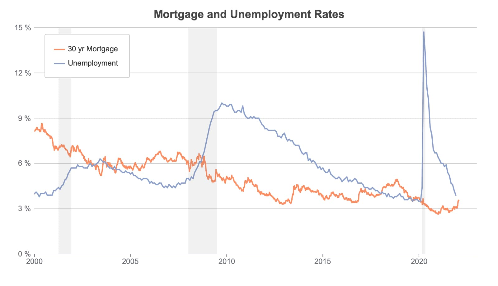

Time Series Plot with Recession Bars and Horizontal Grid
=====================================================================

**Minimum version**: GAUSS 22.1.0

Load and preview data
++++++++++++++++++++++++++++++

Here is a link to `download the dataset <https://raw.githubusercontent.com/aptech/gauss-plot-library/master/data/unemp_mtg30.csv>`_.

::

    data = loadd("unemp_mtg30.csv", "date(date) + mtg30 + unrate");

    // Print columns 10 characters wide with
    // 2 numbers after the decmial point
    format /rd 10,2;

    // Print the first 5 rows of the data
    head(data);

::

          date      mtg30     unrate 
    2000-01-01          .       4.00 
    2000-01-07       8.15          . 
    2000-01-14       8.18          . 
    2000-01-21       8.26          . 
    2000-01-28       8.25          .

Set graph size and get default settings
+++++++++++++++++++++++++++++++++++++++++

Function reference: :func:`plotcanvassize`, :func:`plotgetdefaults`

::

    // Set the graph size
    plotCanvasSize("px", 800 | 460);
    
    // Declare plotControl structure and
    // fill with default settings
    struct plotControl plt;
    plt = plotGetDefaults("xy");

Title
+++++++

We use HTML below to set the title font to be bold. However, you can also use Latex to style text in your GAUSS graphs. See :func:`plotSetTextInterpreter` for more details.

Function reference: :func:`plotsettitle`

::
    
    // Set title text, font, size and color,
    // using HTML tags for bold text
    plotSetTitle(&plt, "<b>Mortgage and Unemployment Rates</b>", "Arial", 18, "#464646");

X-axis settings
+++++++++++++++++++

Function reference: :func:`plotsetxpen`, :func:`plotsetxrange`, :func:`plotsetxlabel`

::
    
    axes_clr = "#6E7079";
    
    // Set wdith (1 pixel) and color of x-axis line
    plotSetXPen(&plt, 1, axes_clr);
    
    // Set range of x-axis to year 2000-2023,
    // Add tick labels every 5 years
    plotSetXRange(&plt, "2000", "2023", 5, "years");
    
    // Turn off x-axis label
    plotSetXLabel(&plt, " ");
    

Y-axis settings
+++++++++++++++++++

Function reference: :func:`plotsetypen`, :func:`plotsetygridpen`, :func:`plotsetyrange`

::

    // Turn off y-axis line by setting
    // width to 0 pixels
    plotSetYPen(&plt, 0);
    
    // Enable y-axis major grid lines
    // that are 1 pixel wide, a light gray
    // color (#ccc) and solid (1)
    plotSetYGridPen(&plt, "major", 1, "#ccc", 1);
    
    // Set the y-axis to range from 0-15
    // with tick labels every 3
    plotSetYRange(&plt, 0, 15, 3);

Tick label settings
+++++++++++++++++++++++

Function reference: :func:`plotsetticlabelfont`, :func:`plotsetyticlabel`

::
    
    
    plotSetTicLabelFont(&plt, "Arial", 12, axes_clr);
    
    // Format the y-tick label numbers to
    // suppress trailing zeros and add a space
    // and percent sign at the end
    plotSetYTicLabel(&plt, "%g %%");

Legend settings
++++++++++++++++++

Function reference: :func:`plotsetlegend`, :func:`plotsetlegendfont`, :func:`plotsetlegendbkd`

::
    
    
    plotSetLegend(&plt, "30 yr Mortgage" $| "Unemployment", "top left inside");
    plotSetLegendFont(&plt, "Arial", 12, "#333");
    
    // Set legend background to be
    // fully transparent (0% opacity)
    plotSetLegendBkd(&plt, 1);
    

Mising value settings
+++++++++++++++++++++++++

By default, missing values create gaps in line plots. Since our monthly unemployment data has many missing values, we need to skip over the missing values and connect each valid unemployment observation.

Function reference: :func:`plotsetmissgap`

::

    // Draw connected lines, ignoring missing values
    plotSetMissGap(&plt, "off");

Draw plot
+++++++++++++

The tilde, ``~``, separates the y variables, ``mtg30`` and ``unrate``, from ``date`` which will be on the x-axis.

Function reference: :func:`plotxy`

::
    
    // Draw plot
    plotXY(plt, data, "mtg30 + unrate ~ date");

Add recession bars
++++++++++++++++++++

Function reference: :func:`plotsetfill`, :func:`plotsetlinestyle`, :func:`loadd`, :func:`plotaddvbar`

::
    
    
    // Fill 'plt' with default bar plot settings
    plt = plotGetDefaults("bar");
    
    // Set fill style (1=solid), opacity 10%, and color
    plotSetFill(&plt, 1, 0.1, axes_clr);
    
    // Set line style to 0=off
    plotSetLineStyle(&plt, 0);
    
    // Load recession data from the GAUSS examples directory
    usrec = loadd(getGAUSSHome() $+ "examples/USREC.csv", "date(DATE) + USREC");
    
    // Draw vertical bars over recession dates
    plotAddVBar(plt, usrec);
    
