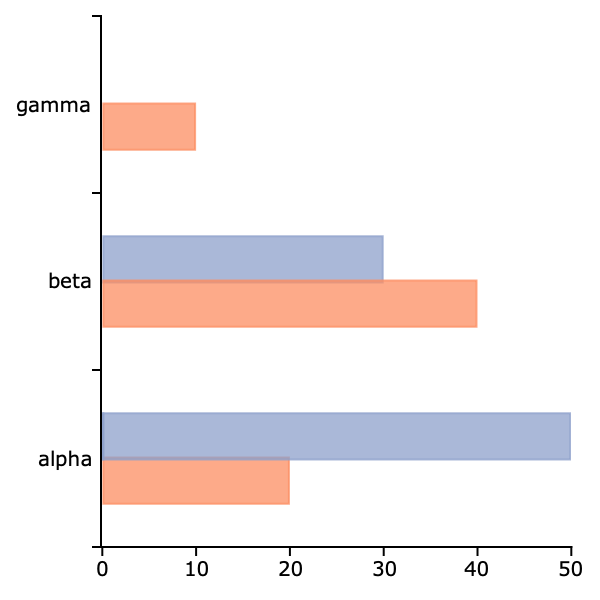
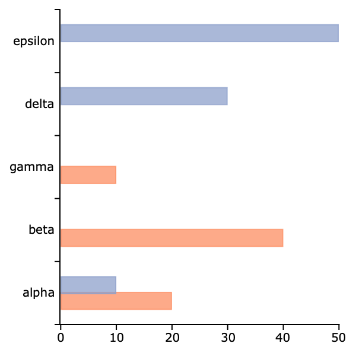

plotAddBarH
==============================================

Purpose
----------------
Adds horizontal bars to an existing graph.

Format
----------------
.. function:: plotAddBarH([myPlot, ]val, ht)

    :param myPlot: Optional argument. A :class:`plotControl` structure
    :type myPlot: struct

    :param val: bar labels.

        .. csv-table::
          :widths: auto

          "Scalar 0", "The new bars will be added consecutively to the existing labels. See the example below."
          "Numeric", "*val* represents the label indices."
          "String array", "*val* represents labels and the bar is added to the existing matching label. If the label in *val* is not found on the existing graph, the label and associated bar is added to the end of the plot window."

    :type val: Nx1 numeric vector or Nx1 string array

    :param ht: bar heights.

        *K* overlapping or side-by-side sets of *N* bars will be graphed.

    :type ht: NxK numeric vector

Examples
-----------

Example 1: Add bars to existing labels
++++++++++++++++++++++++++++++++++++++++
::

    // Assign labels and bar heights
    label = "alpha" $| "beta" $| "gamma";
    ht = { 20, 40, 10 };
    
    // Draw initial horizontal bar plot
    plotBarH(label, ht);
    
    // Add horizontal bars to the first two labels
    ht2 = { 30, 50 };

    // When the first input is 0, the new
    // bars will be added to the existing bars
    // consecutively.
    plotAddBarH(0, ht2);

We could also create the same graph shown above, if we changed the zero passed to :func:`plotAddBarH` to a vector of indices like this:

::

    indx = { 1, 2 };
    plotAddBarH(indx, ht2);
     

Example 2: Add bars to existing and new labels
++++++++++++++++++++++++++++++++++++++++++++++++++

::

    // Assign labels and bar heights
    label = "alpha" $| "beta" $| "gamma";
    ht = { 20, 40, 10 };

    // Draw initial horizontal bar plot
    plotBarH(label, ht);

    // Add horizontal bars to the first label (alpha)
    // and add two new labels (delta and epsilon)
    ht2 = { 10, 30, 50 };
    label_2 = "alpha" $| "delta" $| "epsilon";
    plotAddBarH(label_2, ht2);

Remarks
-------

:func:`plotAddBarH` may only add bars to 2-D graphs.

This function will not change any of the current graph's settings other
than to resize the view as necessary to display the new curve.

.. seealso:: Functions :func:`plotAddBar`, :func:`plotAddHist`, :func:`plotAddHistP`, :func:`plotAddXY`
