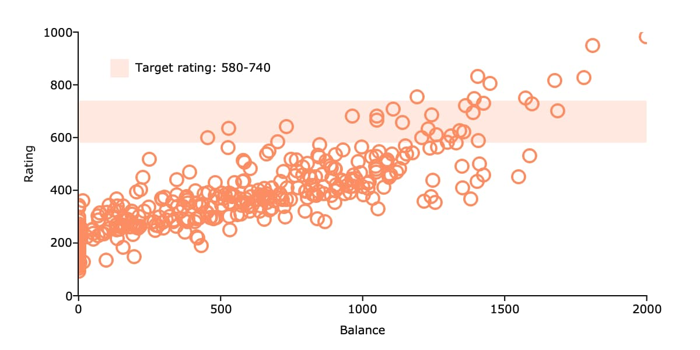

plotAddHBar
==============================================

Purpose
----------------
Adds one or more horizontal bars spanning the full extent of the y-axis to an existing graph.

Format
----------------
.. function:: plotAddHBar([myPlot, ], y_start, y_end)
              plotAddHBar([myPlot, ], y_loc)

    :param myPlot: Optional argument, an instance of a :class:`plotControl` structure.
    :type myPlot: struct

    :param y_start: the Y coordinate for the start of the bounding box for each respective shape.
    :type y_start: scalar or Nx1 vector

    :param y_end: the Y coordinate for the end of the bounding box for each respective shape.
    :type y_end: scalar or Nx1 vector

    :param y_loc: the first column should contain Y coordinates. The second column should be a binary vector with a 1 for locations where the bar should be drawn, otherwise a 0.
    :type y_loc: Nx2 vector

Examples
----------------

Add Horizontal Spanning Bar
++++++++++++++++++++++++++++++++++++++++++++++++++++

::

    // Create string with fully pathed file name
    fname = getGAUSSHome() $+ "examples/credit.dat";

    // Load variables to plot from dataset
    credit = loadd(fname, "Rating + Balance");

    // Draw scatter plot
    plotScatter(credit, "Rating ~ Balance");

    // Declare plotControl structure and
    // fill with default bar settings
    struct plotControl plt;
    plt = plotGetDefaults("bar");

    // Solid fill with 20% opacity
    plotSetFill(&plt, 1, 0.2);

    plotSetLegend(&plt, "Target rating: 580-740", "top left inside");

    // Add horizontal bar from y=580 to y=740
    plotAddHBar(plt, 580, 740);

Remarks
-------

:func:`plotAddHBar` will add horizontal spanning bars to existing graphs. It will not create a
new graph, however, if one does not already exist.

:func:`plotAddHBar` is not yet supported for surface plots.

.. seealso:: Functions :func:`plotAddVBar`, :func:`plotAddHLine`
