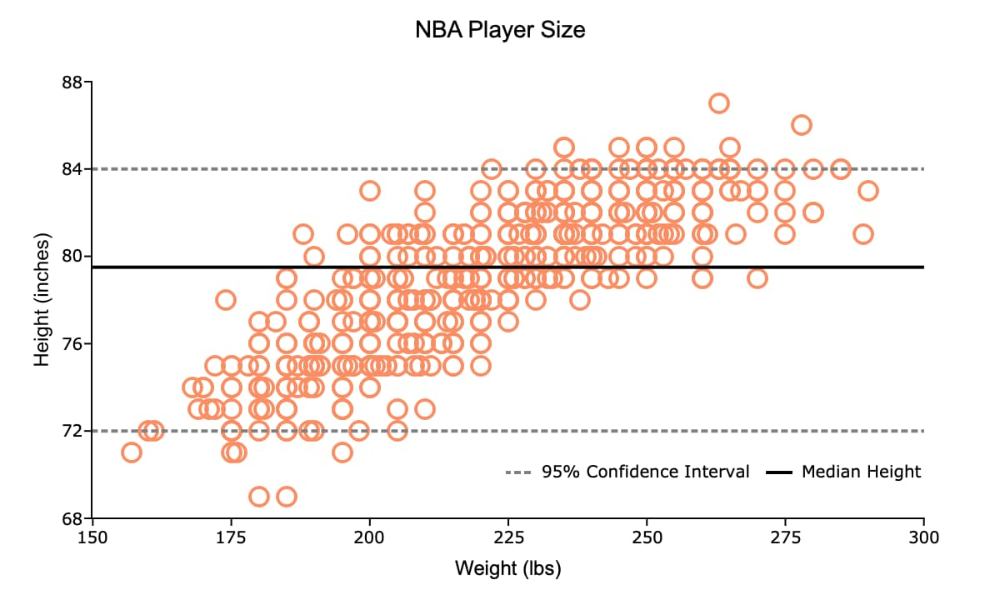

plotAddHLine
==============================================

Purpose
----------------
Adds a horizontal line to an existing plot.

Format
----------------
.. function:: plotAddHLine([myPlot, ]y)

    :param myPlot: Optional argument. An instance of a :class:`plotControl` structure.
    :type myPlot: struct

    :param y: the Y coordinate(s) specifying where the horizontal lines should be added.
    :type y: scalar or Nx1 vector

Examples
----------------

This example creates a scatter plot of two variables and adds horizontal lines representing the 95% confidence interval and the median for the Y variable.

::

    // Create file name with full path
    dataset = getGAUSSHome("examples/nba_ht_wt.xls");
    
    // Load variables from the Excel file
    nba = loadd(dataset, "Height + Weight");
    
    // Declare plotControl structure and
    // fill with default settings
    struct plotControl plt;
    plt = plotGetDefaults("scatter");
    
    plotSetTitle(&plt, "NBA Player Size", "Arial", 14);
    
    plotSetXLabel(&plt, "Weight (lbs)", "Arial", 12);
    plotSetYLabel(&plt, "Height (inches)");
    
    
    // Draw scatter plot
    plotScatter(plt, nba[.,"Weight"], nba[.,"Height"]);
    
    
    // Compute quantiles to add to graph
    qtls = quantile(nba[.,"Height"], 0.025|0.5|0.975);
    
    /*
    ** Set up line style for the
    ** horizontal lines we will add
    */
    clr = "gray" $| "black";
    styles = { 3 /* dot   */,
               1 /* solid */ };
    plotSetLinePen(&plt, 2, clr, styles);
    
    /*
    ** Set up legend
    */
    legend_labels = "95% Confidence Interval" $| /* Label for first set of h-lines */
                    "Median Height";             /* Label for final h-line */
    
    // Place top-left corner of legend box at x=220, y=72
    // The final input, 0, makes legend lined up horizontally
    plotSetLegend(&plt, legend_labels, 220|72, 0);
    
    // Turn off legend border
    plotSetLegendBorder(&plt, "white", 0);
    
    // Add gray lines with dot styling
    plotAddHLine(plt, qtls[1 3]);
    
    // Add black solid line
    plotAddHLine(qtls[2]);

Notice that the line style and legend options are set after the call to :func:`plotScatter`. These settings are applied when the plotControl structure is passed in to the first call to :func:`plotAddHLine`.

The second call to :func:`plotAddHLine` does not pass in a :class:`plotControl` structure. Therefore, the second line color, line style and legend label settings are used for this line.

Remarks
-------

- As shown in the above example, each set of lines added with a call to :func:`plotAddHline` will have the same line color, thickness and style. 
- If a legend label is added, all lines from a single call will share one legend entry.

Please note that :func:`plotAddHLine` will add lines to existing graphs, it
will not create a new graph if one does not exist. :func:`plotAddHLine` is not
yet supported for surface plots.

.. seealso:: Functions :func:`plotAddVLine`, :func:`plotAddHBar`
