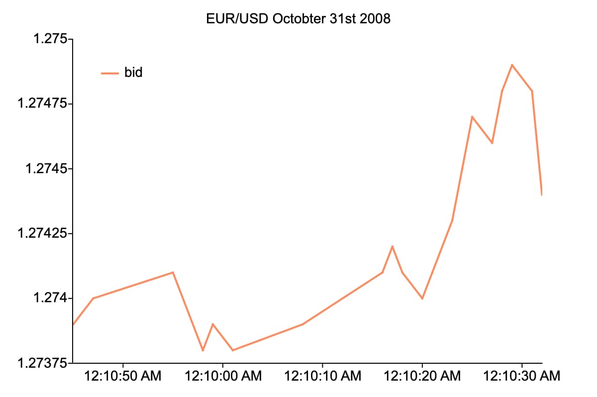
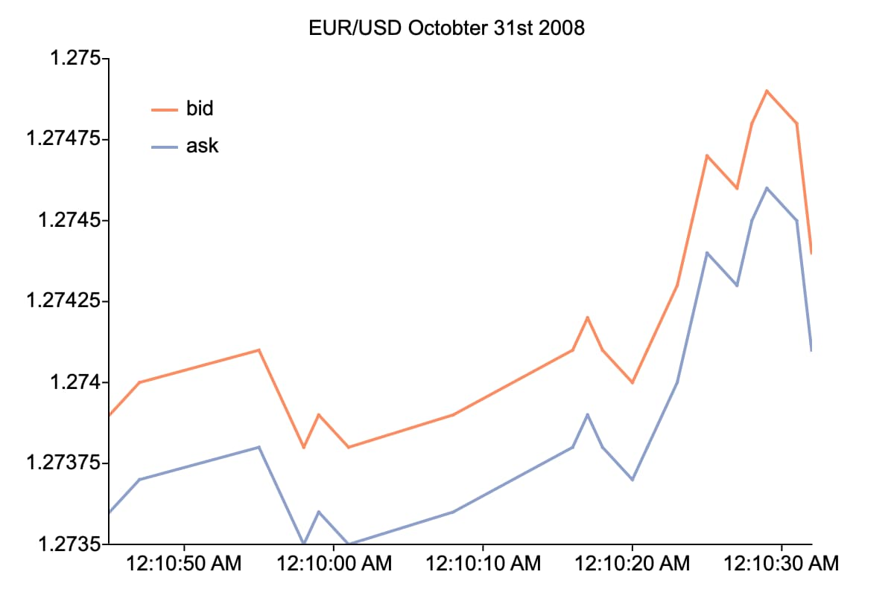

plotAddTSHF
==============================================

Purpose
----------------
Adds high-frequency and irregularly spaced time series data to an already existing plot.

Format
----------------
.. function:: plotAddTSHF([myPlot, ] date_vec, y)

    :param myPlot: Optional argument, a :class:`plotControl` structure.
    :type myPlot: Struct

    :param date_vec: containing the dates for each observation in the *y* . The dates in *date_vec* are **required** to be:

        - In POSIX time/date format i.e. seconds since Jan 1, 1970 (GAUSS dataframe date columns are automatically in this format).
        - Sorted, increasing.

        However, the dates in *date_vec* **may be**:

        - Irregularly spaced

    :type date_vec: Nx1 vector

    :param y: Each column contains the Y values for a particular line.
    :type y: Nx1 or NxM matrix

Examples
----------------

Plot Forex tick data with custom X-tick labels
++++++++++++++++++++++++++++++++++++++++++++++

::

    // Create file name with full path
    file = getGAUSSHome("examples/eurusd_tick.csv");
    
    // Load dates as a string array from the first column of the file
    dt_psx = loadd(file, "date");
    
    // Use first 20 obs only
    dt_psx = dt_psx[1:20];
    
    // Load bid and ask data
    y = loadd(file, "bid + ask");
    y = y[1:rows(dt_psx), .];
    
    // Set the size of the graph
    plotCanvasSize("px", 600 | 400);
    
    // Declare plotControl structure
    // and fill with default settings
    struct plotControl myPlot;
    myPlot = plotGetDefaults("xy");
    
    plotSetFonts(&myPlot, "all", "arial", 14);
    
    plotSetTitle(&myPlot, "EUR/USD Octobter 31st 2008");
    
    // Set legend text
    plotSetLegend(&myPlot, "bid" $| "ask", "top left inside");
    
    // Make legend background transparent
    plotSetLegendBkd(&myPlot, 0);
    
    // Create an X-tick label every 10 seconds
    // Set the first tick label at:
    // October 31st, 2008 at 51 minutes and 50 seconds after midnight
    first_label = asdate("2008-10-31 12:51:50");
    plotSetXTicInterval(&myPlot, 10, first_label, "seconds");   
    
    // Set the format for the tick label.
    // You can add literal text like AM, by 
    // enclosing it in single-ticks
    plotSetXTicLabel(&myplot, "HH:MM:SS 'AM'");
    
    // Draw bids on graph
    plotTSHF(myPlot, dt_psx, "seconds", y[ ., "bid"]);

The above code will produce:

::
    
    // Add asks on graph
    plotAddTSHF(dt_psx, y[., "ask"]);

The above code will add the *ask* data. Notice that it is added to the legend which we set up before the initial graph.
 

Remarks
-------

By default missing values in the *y* variable will be represented as gaps in the line.

.. seealso:: Functions :func:`plotTSHF`, :func:`plotSetXTicLabel`, :func:`plotSetXTicInterval`, :func:`plotScatter`, :func:`plotTS`, :func:`plotTSLog`

