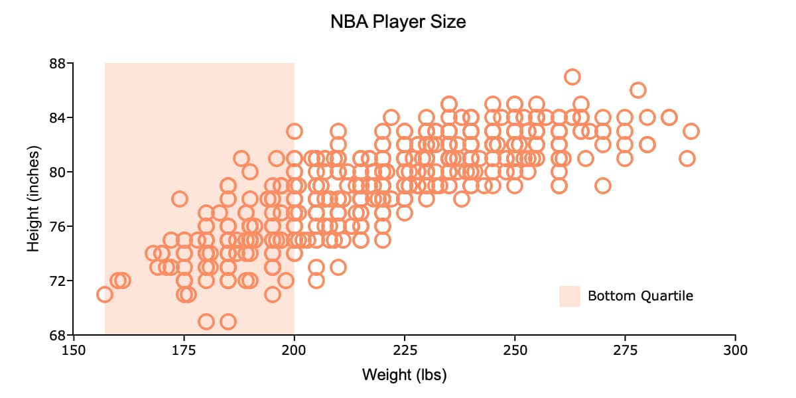
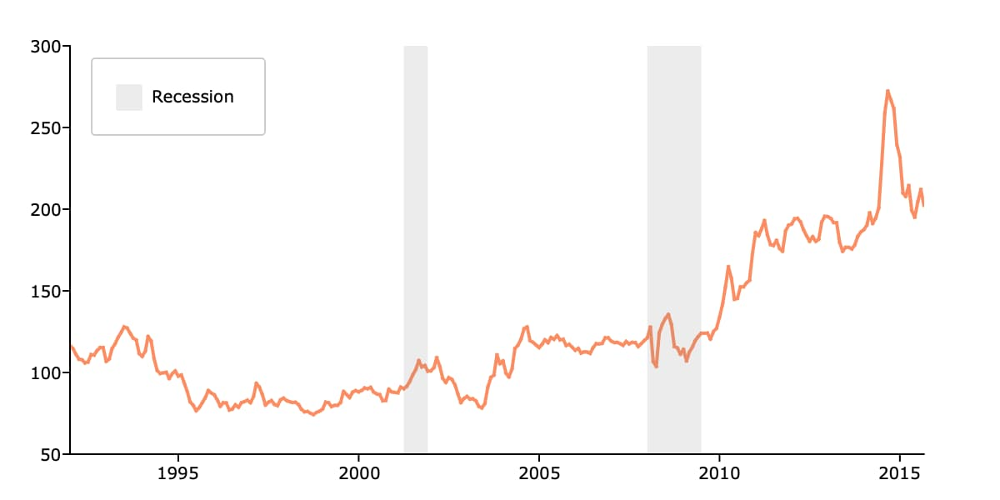

plotAddVBar
==============================================

Purpose
----------------
Adds one or more vertical bars spanning the full extent of the y-axis to an existing graph.

Format
----------------
.. function:: plotAddVBar([myPlot, ], x_start, x_end)
              plotAddVBar([myPlot, ], x_loc)

    :param myPlot: Optional argument, an instance of a :class:`plotControl` structure.
    :type myPlot: struct

    :param x_start: the X coordinate for the start of the bounding box for each respective shape.
    :type x_start: scalar or Nx1 vector

    :param x_end: the X coordinate for the end of the bounding box for each respective shape.
    :type x_end: scalar or Nx1 vector

    :param x_loc: the first column should contain X coordinates. The second column should be a binary vector with a 1 for locations which the bar should be drawn, otherwise a 0.
    :type x_loc: Nx2 vector

Examples
----------------

Add Bar Spanning the Bottom Quartile of X Variable
++++++++++++++++++++++++++++++++++++++++++++++++++++

::

    // Create file name with full path
    dataset = getGAUSSHome("examples/nba_ht_wt.xls");
    
    // Load variables from the Excel file
    nba = loadd(dataset, "Height + Weight");
    
    // Declare plotControl structure and
    // fill with default settings
    struct plotControl plt;
    plt = plotGetDefaults("scatter");
    
    plotSetTitle(&plt, "NBA Player Size", "Arial", 14);
    
    plotSetXLabel(&plt, "Weight (lbs)", "Arial", 12);
    plotSetYLabel(&plt, "Height (inches)");
    
    
    // Draw scatter plot
    plotScatter(plt, nba, "height ~ weight");
    
    /*
    ** Add vertical spanning bar to indicate
    ** bottom quartile
    */
    
    // Compute bottom quartile
    qtls = quantile(nba[.,"Weight"], 0|0.25);
    
    // Overwrite plotControl structure with bar settings
    plt = plotGetDefaults("bar");
    
    // Solid fill that is 25% opaque (or 75% transparent)
    plotSetFill(&plt, 1, 0.25);
    plotSetLegend(&plt, "Bottom Quartile", "bottom right inside");
    
    // Add a vertical bar from x=qtls[1] to x=qtls[2]
    plotAddVBar(plt, qtls[1], qtls[2]);

Add Recession Bars to a Time Series Plot 
+++++++++++++++++++++++++++++++++++++++++++++

This example draws recession bars based on a matrix where the first column is a date and the second column is a binary indicator vector. Where the binary indicator vector is 1, a bar is drawn. The data comes from the FRED USREC dataset.  

::

    /*
    ** Draw time series plot
    */
    
    // Create string with path to examples folder
    path = getGAUSSHome("examples/");
    
    // Load variables from the CSV file
    beef = loadd(path $+ "beef_prices.csv", "date(date) + beef_price");
    
    // Declare plotControl structure
    // and fill with default values
    struct plotControl plt;
    plt = plotGetDefaults("xy");
    
    // Draw x-tick labels every 5 years, starting at 1995
    plotSetXTicInterval(&plt, 5, asdate("1995"));
    
    // Draw time series plot
    plotTSHF(plt, beef[.,"date"], "years", beef[.,"beef_price"]);
    
    /*
    ** Add recession bars
    */
    
    // Load US recession data
    usrec = loadd(path $+ "USREC.csv", "date(date) + USREC");
    
    // Reset plotControl to default bar settings
    plt = plotGetDefaults("bar");
    
    // Bar fill: solid, 15% opaque and gray
    plotSetFill(&plt, 1, 0.15, "gray");
    
    // Add legend item
    plotSetLegend(&plt, "Recession", "top left inside");
    
    // Add vertical bars to any location where
    // the second column of 'usrec' contains a 1 
    plotAddVBar(plt, usrec);

Remarks
-------

:func:`plotAddVBar` will add vertical spanning bars to existing graphs. It will not create a
new graph, however, if one does not already exist.

:func:`plotAddVBar` is not yet supported for surface plots.

.. seealso:: Functions :func:`plotAddHBar`, :func:`plotAddVLine`
