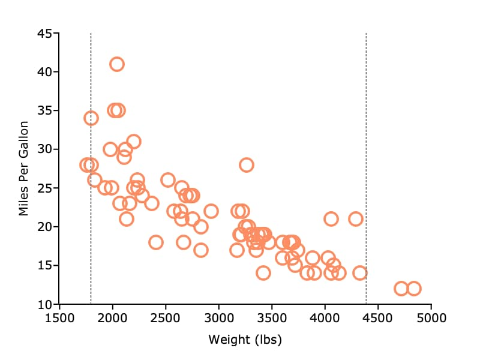

plotAddVLine
==============================================

Purpose
----------------
Adds one or more vertical lines to an existing plot.

Format
----------------
.. function:: plotAddVLine([myPlot, ]x)

    :param myPlot: Optional argument. An instance of a :class:`plotControl` structure.
    :type myPlot: struct

    :param x: the X coordinate(s) specifying where the vertical lines should be added.
    :type x: scalar or Nx1 vector

Examples
----------------

This example creates a scatter plot of two variables and adds vertical lines representing the 95% quantiles for the X variable.

::

    // Create file name with full path
    fname = getgausshome()$+"examples/auto2.dta";

    // Load specified variables
    auto = loadd(fname, "weight + mpg");

    // Declare plotControl structure and
    // fill with default settings for scatter
    struct plotControl plt;
    plt = plotGetDefaults("scatter");

    plotSetXLabel(&plt, "Weight (lbs)");
    plotSetYLabel(&plt, "Miles Per Gallon");

    // Draw scatter plot
    plotScatter(plt, auto[.,"weight"], auto[.,"mpg"]);

    /*
    ** Add vertical line at the 95% confidence interval for weight
    */

    // Compute percentiles of 'weight' variable
    pct = quantile(auto[.,"weight"], 0.025 | 0.975);

    // Set line to be gray, 1 pixel wide
    // and to have 'dot'=3 style
    plotSetLinePen(&plt, 1, "gray", 3);

    // Draw line
    plotAddVLine(plt, pct);

Remarks
-------

- Each set of lines added with a call to :func:`plotAddVline` will have the same line color, thickness and style. 
- If a legend label is added, all lines from a single call to :func:`plotAddVLine` will share one legend entry.
- See the entry for :func:`plotAddHLine` to see an example with more than one line style and legend entry.

Please note that :func:`plotAddVLine` will add lines to existing graphs, it
will not create a new graph if one does not exist. :func:`plotAddVLine` is not
yet supported for surface plots.

.. seealso:: Functions :func:`plotAddHLine`, :func:`plotAddVBar`
