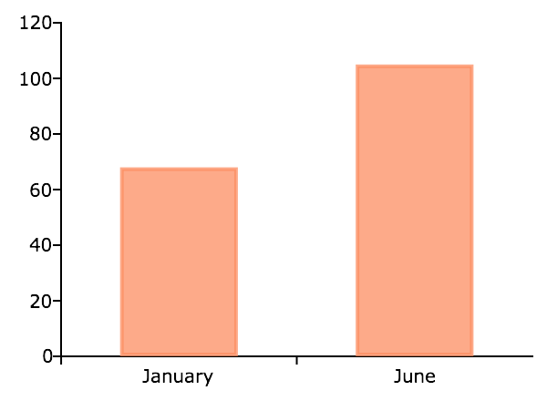
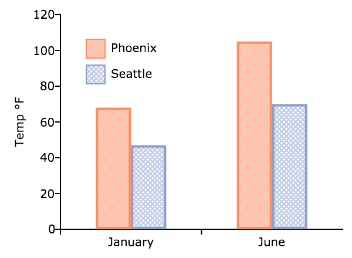

plotBar
==============================================

Purpose
----------------
Generates a bar graph.

Format
----------------
.. function:: plotBar([myPlot, ]labels, height) 

    :param myPlot: Optional argument, a :class:`plotControl` structure
    :type myPlot: struct

    :param labels: bar labels. If scalar 0, a sequence from 1 to ``rows(height)`` will be created.
    :type labels: Nx1 numeric vector or Nx1 string array 

    :param height: bar heights. *K* overlapping or side-by-side sets of *N* bars will be graphed.
    :type height: NxK numeric vector

Examples
----------------

Basic example with string labels
+++++++++++++++++++++++++++++++++

::

    // Create data and labels
    labels = "January" $| "June";
    temp = { 68, 105 };
    
    // Draw bar graph
    plotBar(labels, temp);

Basic example with numeric labels
++++++++++++++++++++++++++++++++++

You may also pass in a numeric vector for the x-axis labels. This example will produce the
a graph which looks the same as the graph above, except for the x-axis labels.

::

    // Create data and labels
    labels = { 4, 5 };
    temp = { 68, 105 };
    
    // Draw bar graph
    plotBar(labels, temp);

Customized horizontal bar plot
++++++++++++++++++++++++++++++++

::

    new;
    
    // Create 2x1 numeric vectors
    seattle = { 47, 70 };
    phoenix = { 68, 105 };
    
    // Create 2x1 string labels
    labels = "January" $| "June";
    
    // Declare 'myPlot' to be a plotControl struct
    // and fill with defaults settings for bar plots
    struct plotControl myPlot;
    myPlot = plotGetDefaults("bar");
    
    // Create legend
    leg_text = "Phoenix" $| "Seattle";
    plotSetLegend(&myPlot, leg_text, "top left inside");
    
    // Set legend border to zero pixels wide
    plotSetLegendBorder(&myPlot, "gray", 0);
    
    // Set Fill to two different fill patterns
    // and 100% opacity
    plotSetFill(&myPlot, 12|13, 1);
    
    // Use HTML to create the degrees symbol
    plotSetYLabel(&myPlot, "Temp &deg;F");
    
    // Concatenate temperature vectors
    // into a 2x2 matrix
    heights =  phoenix ~ seattle;
    
    // Draw the graph
    plotBar(myPlot, labels, heights);

Remarks
-------

To control the color and texture of the bars as well as whether they are
stacked or side by side:

* If you are passing a :class:`plotControl` structure to :func:`plotBar`, you may use
  the function :func:`plotSetFill`.

* If you are not passing a :class:`plotControl` structure, these properties are set
  in the **Preferences**. Select
  :menuselection:`Tools --> Preferences` from the GAUSS main menu. Then choose **Graphics** from
  the left side of the preferences pane and select **Bar** from the list
  of graph **Profiles**.

.. seealso:: Functions :func:`plotBarH`, :func:`plotSetFill`, :func:`plotHist`

