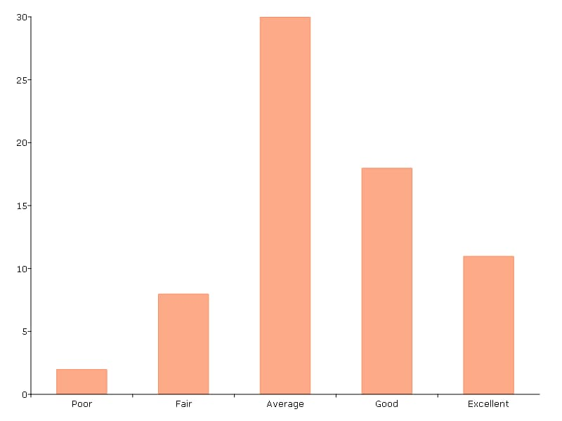

plotFreq
==============================================

Purpose
----------------

Generate frequency plot of categorical data.

Format
----------------
.. function:: plotFreq([myPlot, ] x, column [, sort])

    :param myPlot: Optional argument, a :class:`plotControl` structure.
    :type myPlot: struct

    :param x: data.
    :type x: NxK matrix

    :param column: Categorical variable to be plotted.
    :type column: scalar or string
    
    :param sort: Optional, indicator to sort from most frequent to least frequent categories. Set to 1 to sort. Default = 0.
    :type column: scalar

Examples
----------------

Example 1: Default settings
++++++++++++++++++++++++++++

::

  // Load data
  fname = getGAUSSHome $+ "examples/auto2.dta";
  auto2 = loadd(fname);

  // Frequency plot
  plotFreq(auto2, "rep78");

Example 2: Sorted bars
++++++++++++++++++++++++++++

To create a sorted table, use the optional *sort* input:

::

  // Frequency plot
  plotFreq(auto2, "rep78", 1);

.. figure:: _static/images/plotfreq2.jpg
    :scale: 50 %

Example 3: Adding a title
++++++++++++++++++++++++++++

Any frequency plot can be customized using a ``plotControl`` structure:

::

  // Declare plotControl structure
  struct plotControl myPlt;
  myPlt = plotGetDefaults("bar");
  
  // Set title
  plotSetTitle(&myPlt, "Frequency of `Rep78`");

  // Frequency plot
  plotFreq(myPlt, auto2, "rep78", 1);

.. figure:: _static/images/plotfreq3.jpg
    :scale: 50 %
    
.. seealso:: Functions :func:`plotHist`, :func:`plotHistP`, :func:`plotHistF`
