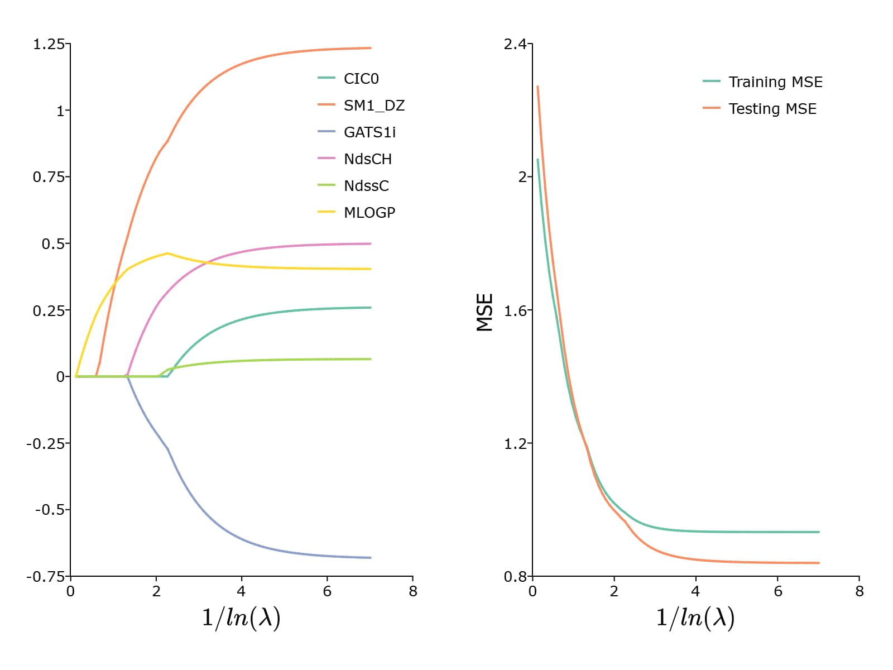

plotLR
==============================================

Purpose
----------------

Generates summary plot of parameter path and mse path over lambda values.

Format
----------------
.. function:: plotLR(mdl [, mse_test])

    :param mdl: A filled instance of either a `lassoModel` or `ridgeModel` structure.
    :type mdl: struct

    :param mse_test: Optional, vector of MSE values for test data.
    :type mse_test: Nx1 vector

Examples
----------------

::

      new;
      library gml;

      // Specify dataset with full path
      dataset = getGAUSSHome("pkgs/gml/examples/qsar_fish_toxicity.csv");

      // Split data into training sets without shuffling
      shuffle = "False";
      { y_train, y_test, X_train, X_test } = trainTestSplit(dataset, "LC50 ~ . ", 0.7, shuffle);

      // Declare 'mdl' to be an instance of a
      // lassoModel structure to hold the estimation results
      struct lassoModel mdl;

      // Estimate the model with default settings
      mdl = lassoFit(y_train, X_train);

      /*
      ** Prediction for test data
      */
      y_hat = lmPredict(mdl, X_test);

      test_mse = meanSquaredError(y_test, y_hat);

      /*
      ** Plot results
      */
      plotLR(mdl, test_mse);

This results in the following plot:

.. seealso:: Functions :func:`lmPredict`, :func:`lassoFit`, :func:`ridgeFit`
