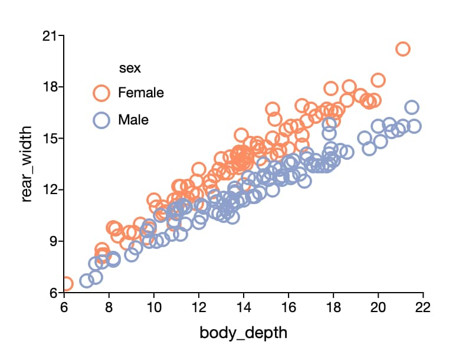
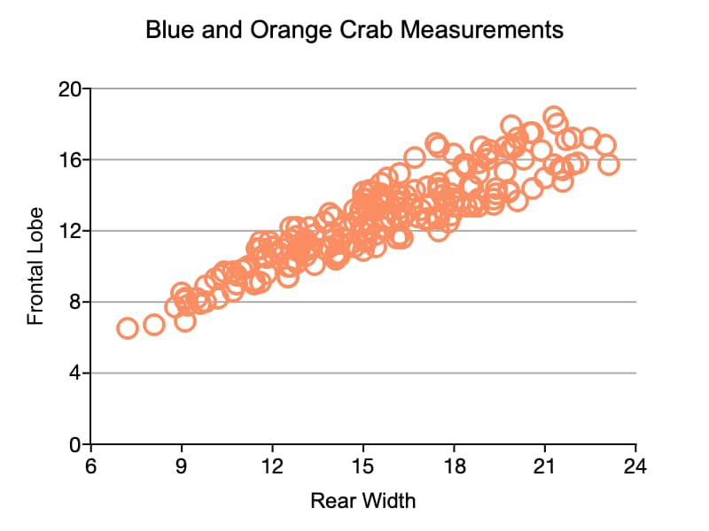

plotScatter
==============================================

Purpose
----------------
Creates a 2-dimensional scatter plot.

Format
----------------
.. function:: plotScatter([myPlot, ]x, y)
              plotScatter([myPlot, ]df, formula)

    :param myPlot: Optional argument, a :class:`plotControl` structure.
    :type myPlot: struct

    :param x: Each column contains the X values for a particular data point.
    :type x: Nx1 or NxM matrix

    :param y: Each column contains the Y values for a particular data point.
    :type y: Nx1 or NxM matrix

    :param df: The data referenced by the formula string.
    :type df: NxM dataframe.

    :param formula: formula string describing which variables to plot.
        E.g ``"mpg ~ weight"``, will plot ``mpg`` along the y-axis and ``weight`` along the x-axis;

        E.g ``"age + education  ~ rating"`` will plot ``age`` and ``education`` along the y-axis against ``rating`` on the x-axis;

        E.g ``"education  ~ rating + by(gender)"`` will split the data by the ``gender`` variable and then plot both groups with ``education`` along the y-axis against ``rating`` on the x-axis;

    :type formula: string

Examples
----------------

Example 1: Formula string with the 'by' keyword
+++++++++++++++++++++++++++++++++++++++++++++++++

We can create the above image with the code below.

::

    // Create file name with full path
    fname = getGAUSSHome("examples/crabs.dta");

    // Load all variables from the dataset
    crabs = loadd(fname);
    
    // Draw the scatter plot using your preference settings
    plotScatter(crabs, "rear_width ~ body_depth + by(sex)");

Note that when using a formula string, the axis labels and legend are filled in automatically.

Example 2: Customized plot without formula string
++++++++++++++++++++++++++++++++++++++++++++++++++++

::

    // Create file name with full path
    fname = getGAUSSHome("examples/crabs.dta");

    // Load all variables from the dataset
    crabs = loadd(fname);

    // Declare plt to be a plotControl structure
    // and fill with default settings for scatter
    struct plotControl plt;
    plt = plotGetDefaults("scatter");
    
    plotSetTitle(&plt, "Blue and Orange Crab Measurements", "arial", 14);
    
    // Axis labels
    plotSetYLabel(&plt, "Frontal Lobe", "arial", 12);
    plotSetXLabel(&plt, "Rear Width");
    
    // Span the Y range from 0 to 20
    plotSetYRange(&plt, 0, 20);
    
    // Draw Y-ticks every 4 units starting at 0
    plotSetYTicInterval(&plt, 4, 0);
    
    // Create grid lines coming from the major ticks
    // on the Y axis and color them dark gray
    plotSetYGrid(&plt, "major", "dark gray");
    
    // Draw plot
    plotScatter(plt, crabs[.,"frontal_lobe"], crabs[.,"rear_width"]);

.. seealso:: Functions :func:`plotXY`, :func:`plotLogLog`, :func:`plotBox`, :func:`plotHistP`
