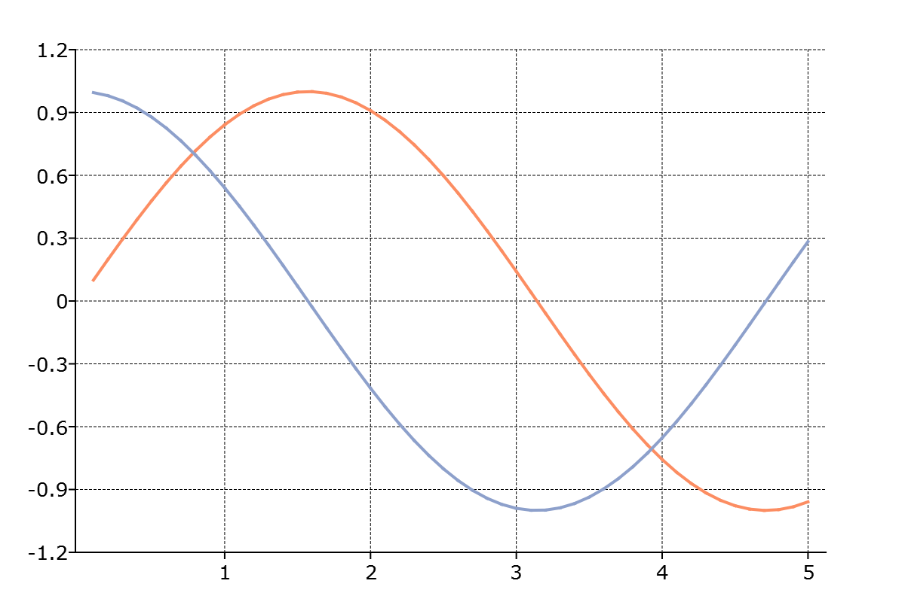

plotSetAxesGridPen
==============================================

Purpose
----------------
Controls the thickness, color, and style for both the x-axis and y-axis grid lines.

Format
----------------
.. function:: plotSetAxesPen(&myPlot, thickness[, clr[, style]])

    :param &myPlot: A :class:`plotControl` structure pointer.
    :type &myPlot: struct pointer

    :param thickness: the thickness of the axes major grid lines in pixels.
    :type thickness: Scalar

    :param clr: Optional argument, name or rgb value of the new color for the axes major grid lines.
    :type clr: string

    :param style: the style of the pen. Options include:

        .. include:: include/plotpenstyletable.rst

    :type style: Scalar

Examples
----------------

::

    // Declare plotControl structure
    struct plotControl myPlot;

    // Initialize plotControl structure
    myPlot = plotGetDefaults("xy");

    // Set axis grid lines to be 0.5 pixel wide, black, and dashed
    plotSetAxesGridPen(&myPlot, 0.5, "black", 2);

    // Create data
    x = seqa(0.1, 0.1, 50);
    y = sin(x)~cos(x);

    // Plot the data with the new line colors
    plotXY(myPlot, x, y);

Remarks
-------
- The x-axis and y-axis grid line properties can be set separately with :func:`plotSetXGridPen` and :func:`plotSetYGridPen`.

.. include:: include/plotattrremark.rst

.. seealso:: Functions :func:`plotGetDefaults`, :func:`plotSetLineSymbol`, :func:`plotSetXGridPen`,  :func:`plotSetYGridPen`
