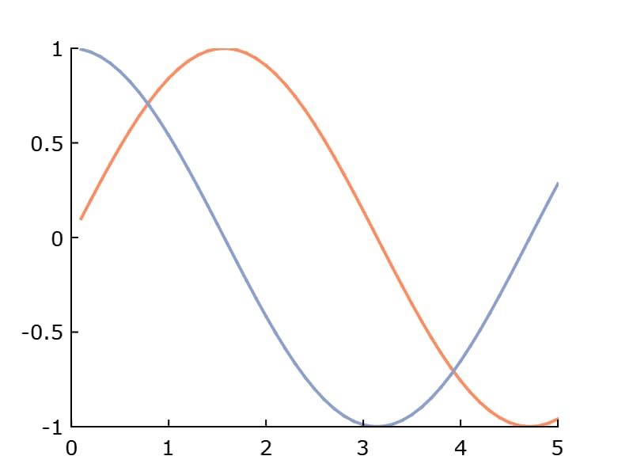

plotSetAxesTicsPosition
==============================================

Purpose
----------------
Controls if the axes tick are inside or outside the axes line.

Format
----------------
.. function:: plotSetAxesTicsPosition(&myPlot, position)

    :param &myPlot: A :class:`plotControl` structure pointer.
    :type &myPlot: struct pointer

    :param position: Position of the ticks. Options: [``"outside"``, ``"inside"``, ``"hidden"``].
    :type position: string

Examples
----------------

::

    // Declare plotControl structure
    struct plotControl myPlot;

    // Initialize plotControl structure
    myPlot = plotGetDefaults("xy");

    // Set ticks to be inside the plot
    plotSetAxesTicsPosition(&myPlot, "inside");

    // Create data
    x = seqa(0.1, 0.1, 50);
    y = sin(x)~cos(x);

    // Plot the data with the new line colors
    plotXY(myPlot, x, y);

Remarks
-------

.. include:: include/plotattrremark.rst

.. seealso:: Functions :func:`plotSetXTicsPosition`, :func:`plotSetYTicsPosition`
