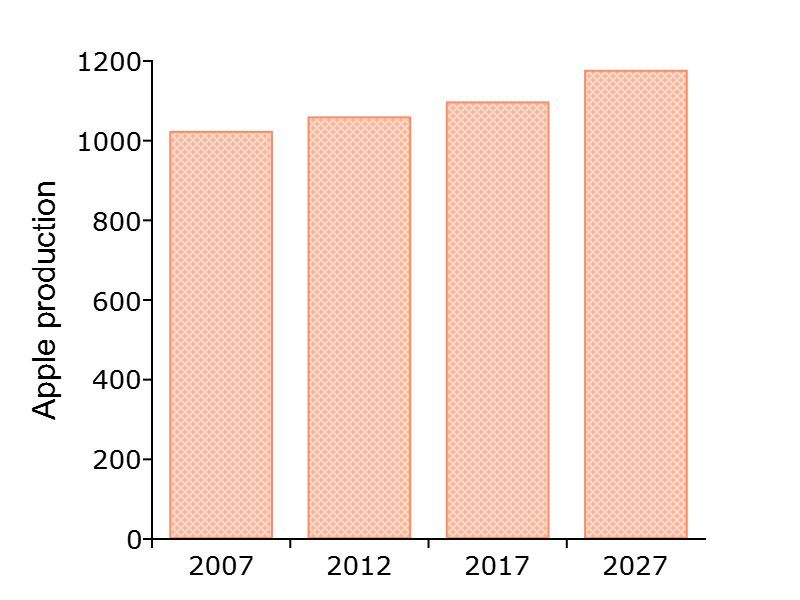

plotSetBarWidth
==============================================

Purpose
----------------
Sets the width of the bars in a histogram or bar graph.

Format
----------------
.. function:: plotSetBar(&myPlot, barWidth)

    :param &myPlot: A :class:`plotControl` structure pointer.
    :type &myPlot: struct pointer

    :param barWidth: Width of the bars in plot set between 0 and 1. Default bar width is 0.5.
    :type barWidth: Scalar

Examples
----------------

::

  new;

  // Adapted from "Washington State Industry Outlook and Freight Transportation Outlook
  // Accessed from http:// www.wsdot.wa.gov/NR/rdonlyres/82357736-0241-43E1-9855-0FDDDFE011E8/0/Washington_Apple_Final.pdf

  years = { 2007, 2012, 2017, 2027 };
  string regions = { "Yakima Valley"};
  y = { 1024.603 ,
      1060.97  ,
      1098.627 ,
      1178     };

  // Declare plotControl structure
  // and fill in default values for bar plot
  struct plotControl myPlot;
  myPlot = plotGetDefaults("bar");

  // Set style of bar fill pattern
  plotSetBarFill(&myPlot, 4);

  // Set title and axis labels
  plotSetYLabel(&myPlot, "Apple production", "Arial", 12);
  plotSetXLabel(&myPlot, "");

  // Set canvas size for plot to 800 px by 620 px
  plotCanvasSize("px", 400 | 300);

  // Adjust bar size from 0.5 default to 0.75
  plotSetBarWidth(&myPlot, 0.75);

  // Draw plot
  plotBar(myPlot, years, y);

  // Set canvas size for next plots to fill available space
  plotCanvasSize("fill");

Remarks
-------

When graphing without the use of a :class:`plotControl` structure, these settings
may be chosen through the :menuselection:`Tools --> Preferences --> Graphics` menu, after
selecting the Bar radio button. See the `GAUSS Graphics chapter <GG-GAUSSGraphics.html>`_ for
more information on the methods available for customizing your graphs.

.. seealso:: Functions :func:`plotBar`, :func:`plotGetDefaults`, :func:`plotHist`, :func:`plotSetBar`
