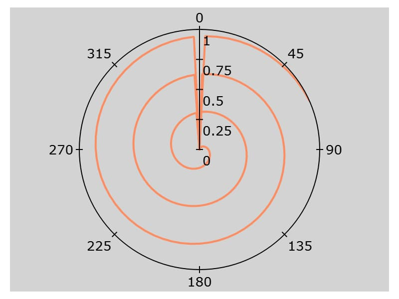

plotSetBkdColor
==============================================

Purpose
----------------
Sets the background color of a graph.

Format
----------------
.. function:: plotSetBkdColor(&myPlot, color)

    :param &myPlot: A :class:`plotControl` structure pointer.
    :type &myPlot: struct pointer

    :param color: name or rgb value of the new color.
    :type color: string

Examples
----------------

::

    // Declare plotControl structure
    struct plotControl myPlot;

    // Initialize plotControl structure
    myPlot = plotGetDefaults("polar");

    // Set new background color to light grey
    plotSetBkdColor(&myPlot, "light grey");

    // Create data
    x = seqa(0.1, 0.1, 200);
    y = x;

    // Create a polar plot of the data with the new background
    // color
    plotPolar(myPlot, x, y);

Remarks
-------

.. include:: include/plotattrremark.rst

.. seealso:: Functions :func:`plotGetDefaults`, :func:`plotSetLineColor`, :func:`plotSetLineSymbol`
